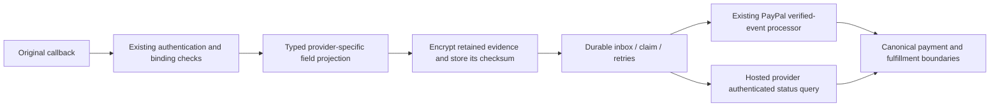

# ADR 0116: Minimize notification evidence before inbox encryption

- Status: proposed implementation; provider activation remains gated.
- Decision date: 2026-09-14, America/Guayaquil (verification continues on 2026-09-15 UTC).
- Depends on: ADR 0115 and payment recovery PR #343.

## Context

PayPal, PlaceToPay and PayPhone currently pass complete callback bodies into the shared
encrypted provider-event inbox. Encryption protects access but does not make arbitrary
retention appropriate. Unused fields can contain customer information, credentials, card
data, descriptions or URLs. A future provider extension or malicious extra field must not
silently expand the retained data set.

The worker already depends on a small subset of each schema. PayPal verifies the original
body before persistence; PlaceToPay verifies the signed session fields and later queries
the provider; PayPhone callbacks are untrusted hints and require an authenticated query.

## Decision

Enforce typed, bounded projections in `ProviderEventStore`, shared by every current inbox
writer. Authentication and merchant/transaction binding checks remain in the existing intake
and worker paths. Reject unsupported inbox providers and invalid retained field types with
fixed error messages. Never return parser input in an error or print decrypted payloads
through their `Show` instance.

| Provider | Retained fields | Trust/processing unchanged |
|---|---|---|
| PayPal, three handled capture events | Envelope `id`, `event_type`, `create_time`; resource `id`, `status`, amount `value`/`currency_code`, payee `merchant_id`, supplementary related `order_id` | Verify the original event with PayPal before storing; worker validates immutable envelope metadata and capture bindings. Refund/reversal events retain the existing reconciliation-exception behavior, not newly implemented refund execution. |
| Other PayPal event types | Envelope identifiers/time and resource ID only | Remain unsupported/ignored. This does not implement disputes, subscriptions, payouts or new event types. |
| PlaceToPay | `requestId`, `signature`, status `status`/`date` | Retain the exact signed strings for local re-verification; only an authenticated provider query may establish financial state. The callback's unsigned `reference`, reason and message are not used by the current worker and are discarded. |
| PayPhone | Canonical `TransactionId`, `ClientTransactionId`, optional `StoreId` | Normalize supported aliases; drop untrusted status and customer fields. The callback remains an untrusted query trigger and cannot establish payment success. |

Strings have bounded sizes and printable ASCII validation; timestamps must parse as RFC 3339.
Transaction IDs must be positive `Int64` values. Arbitrary objects cannot survive in an
allowlisted scalar field. Financial amount strings retain their original decimal representation;
this projection never converts money using floating-point arithmetic.

## Compatibility

No SQL migration, historical deletion, backfill, API route or JSON response change is needed.
`pecRawPayload`/`pepRawPayload` retain their internal names to avoid gratuitous caller churn;
new rows contain projected JSON, while old rows may contain the original complete body.
The checksum always covers the bytes actually encrypted in that row.

On duplicate provider/event identity, compare immutable metadata and either the new projected
checksum or the original incoming-body checksum. This preserves exact redelivery of valid
historical records without rewriting them. Changed financial evidence, resource ID, creation
time, event type or trust classification fails closed. For new rows, changes confined to
discarded fields no longer create conflicting evidence for the same event identity.

Provider event IDs remain unchanged. PlaceToPay's existing ID is a digest of the incoming
body: formatting/unused-field variations can still generate different event IDs. This ADR
does not claim semantic deduplication across different IDs or solve that separate ingress
amplification risk. Downstream canonical binding/idempotency remains mandatory.

Old workers can read the projected standard fields. Nevertheless, deploy all inbox writers
together: an old writer can still retain full bodies. Rolling back to the old storage code
reopens that retention risk; do not treat rollback as a data purge or erase ambiguous payments.

## Consequences and unresolved gates

- Minimized PayPal JSON is not the original signed body and must never be submitted for
  remote signature verification as though it were. Verification uses original bytes before
  projection; the durable record retains verified-evidence provenance and relevant facts,
  not an independently re-verifiable original PayPal transport envelope.
- Historical ciphertext is unchanged. Whether it contains prohibited or unnecessary data is
  **unverified**. Authorized security/PCI and Ecuadorian privacy/legal reviewers must approve
  a retention/remediation process that preserves required financial references. Do not decrypt
  historical bodies into logs, support tickets or research artifacts. No production data was
  inspected or purged for this change.
- This is schema-level minimization, not proof that a provider never puts inappropriate
  content in a legitimate identifier field. Existing upstream authentication, exact binding,
  logging/access controls and data-retention review remain required.
- Native/web checkout behavior, provider activation, credentials, contracts, refund/settlement
  operations and compliant seller payouts are not completed by this storage change.
- The implementation and local synthetic tests do not establish a real provider sandbox
  pass, staging payment success or PCI/legal certification.

## Primary sources

Accessed **2026-09-15 UTC**; high confidence for the documented mechanisms only:

- [PCI SSC FAQ 1319](https://www.pcisecuritystandards.org/faqs/1319/): post-authorization
  storage of card verification codes is prohibited even when encrypted. Encryption therefore
  cannot justify retaining arbitrary callback fields.
- [PlaceToPay notification specification](https://docs.placetopay.dev/en/checkout/notification/):
  SHA-256 verification covers request ID, status and status date with the merchant secret;
  early acknowledgement and asynchronous handling are documented.
- [PayPhone API Sale](https://docs.payphone.app/api-sale): transaction lookup and response
  identifiers support the existing authenticated-query boundary. No cryptographic callback
  authentication or active TDF sandbox account is inferred.
- [PayPal event names](https://developer.paypal.com/api/rest/webhooks/event-names/): capture
  completed/refunded/reversed are documented event categories. The exact retained field set
  is a TDF code-path audit decision, not a claim that it is the provider's complete schema.
