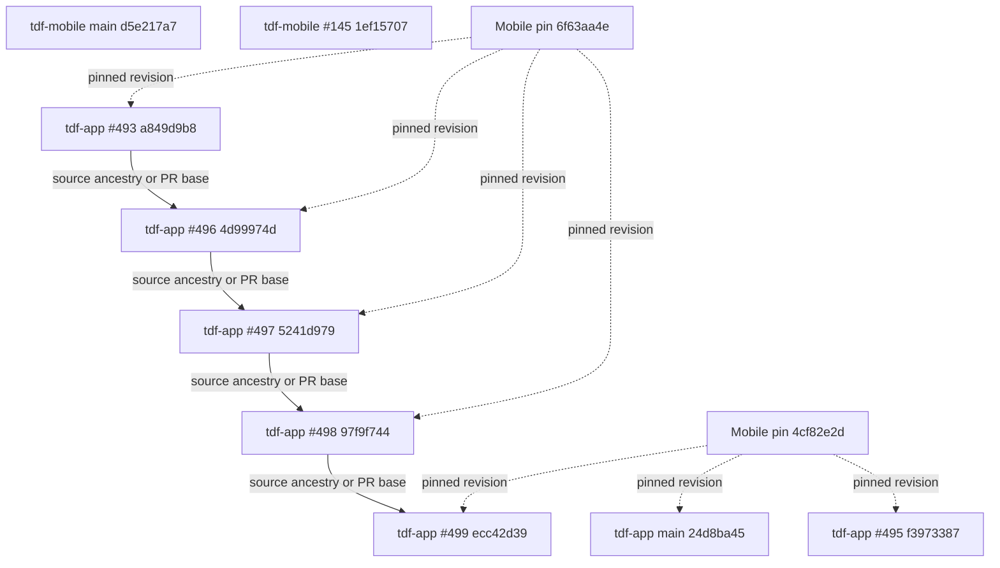

# Current integration dependencies

Snapshot: 2026-10-06T04:54:15.676640+00:00

Solid edges preserve implementation ancestry or an active PR base. Dotted edges identify exact Mobile gitlinks. Main admission is a separate protected scheduling check; an ancestry edge does not imply merge or deployment clearance.

Every retained branch, including recovery refs without PRs, is mapped in the CSV files. Removed refs retain preservation evidence and action attribution.
