# Catalog persistence architecture

## Principles

- Specialized domain tables own identity and relationships. There is no generic `list_items`
  table and no unrestricted business JSON.
- UUIDs are used for new catalog identities. Existing stable numeric IDs may remain during a
  bounded dual-column backfill but are not exposed as the new canonical write contract.
- Internal relationships are foreign keys. Slugs are optional URL aliases only.
- Shared infrastructure is limited to cross-cutting catalog definitions, translations where a
  specialized table does not embed them, slug history, revisions, approvals, audit events,
  imports, usage aggregates, and cache revisions.
- Backend enforcement is authoritative and deny-by-default. Frontend filtering is advisory.
- Security capability codes may remain exhaustive in Haskell for enforcement, but persisted rows
  own labels, ordering, assignments, administration, and grantability.

## Entity relationship overview

```mermaid
erDiagram
  CATALOG_DEFINITION ||--o{ CATALOG_REVISION : governs
  CATALOG_DEFINITION ||--o{ CATALOG_AUDIT_EVENT : audits
  CATALOG_DEFINITION ||--o{ CATALOG_IMPORT_JOB : imports
  CATALOG_DEFINITION ||--o{ CATALOG_CACHE_REVISION : invalidates

  GENRE ||--o{ GENRE : parent
  GENRE ||--o{ ARTIST_GENRE_MEMBERSHIP : classifies_social_artist
  GENRE ||--o{ ARTIST_PROFILE_GENRE_MEMBERSHIP : classifies_core_artist
  GENRE ||--o{ FAN_PROFILE_GENRE_MEMBERSHIP : preferred_by_fan
  GENRE ||--o{ RADIO_STREAM : classifies_stream
  RADIO_STREAM ||--o{ RADIO_STREAM_GENRE_OBSERVATION : records_external_value
  RADIO_STREAM_GENRE_OBSERVATION ||--o{ RADIO_STREAM_GENRE_OBSERVATION_CANDIDATE : considers
  GENRE ||--o{ RADIO_STREAM_GENRE_OBSERVATION_CANDIDATE : candidate_identity
  COUNTRY_REFERENCE ||--o{ RADIO_STREAM : locates_stream
  RADIO_STREAM ||--o{ RADIO_STREAM_COUNTRY_OBSERVATION : records_external_country
  RADIO_STREAM_COUNTRY_OBSERVATION ||--o{ RADIO_STREAM_COUNTRY_OBSERVATION_CANDIDATE : considers
  COUNTRY_REFERENCE ||--o{ RADIO_STREAM_COUNTRY_OBSERVATION_CANDIDATE : candidate_identity
  COUNTRY_REFERENCE ||--o{ USER_LOCALE_PREFERENCE : selected_by_user
  CATALOG_DEFINITION ||--o{ RADIO_AUTO_STOP_OPTION : governs
  RADIO_AUTO_STOP_OPTION ||--o{ CATALOG_SCOPED_DEFAULT : global_broadcast_default
  CATALOG_DEFINITION ||--o{ APPEARANCE_MODE_OPTION : governs
  APPEARANCE_MODE_OPTION ||--o{ CATALOG_SCOPED_DEFAULT : global_application_default
  CATALOG_DEFINITION ||--o{ FEEDBACK_CATEGORY : governs
  CATALOG_DEFINITION ||--o{ FEEDBACK_SEVERITY : governs
  FEEDBACK_CATEGORY ||--o{ CATALOG_SCOPED_DEFAULT : global_category_default
  FEEDBACK_SEVERITY ||--o{ CATALOG_SCOPED_DEFAULT : global_severity_default
  FEEDBACK_CATEGORY ||--o{ FEEDBACK : classifies
  FEEDBACK_SEVERITY ||--o{ FEEDBACK : prioritizes
  INSTRUMENT ||--o{ SESSION_INSTRUMENT : requested
  INSTRUMENT ||--o{ INPUT_ROW : identifies_source
  INSTRUMENT ||--o{ LIVE_SESSION_MUSICIAN : played_by
  ASSET ||--o{ INPUT_ROW : microphone_or_di
  GENRE ||--o{ LIVE_SESSION_INTAKE : primary_genre
  SERVICE_CATEGORY ||--o{ SERVICE_OFFERING : contains
  SERVICE_OFFERING ||--o{ BOOKING : selected_by_id
  SERVICE_OFFERING ||--|| PIPELINE_WORKFLOW_BINDING : selects_workflow
  WORKFLOW_DEFINITION ||--o{ PIPELINE_WORKFLOW_BINDING : applies_to_service
  SERVICE_OFFERING ||--o{ PIPELINE_CARD : classifies
  WORKFLOW_STATE ||--o{ PIPELINE_CARD : positions
  EVENT_TYPE ||--o{ SOCIAL_EVENT : classifies
  EVENT_TYPE ||--o{ CATALOG_SCOPED_DEFAULT : global_social_event_default
  CATALOG_DEFINITION ||--o{ REACTION_TYPE : governs
  REACTION_TYPE ||--o{ EVENT_MOMENT_REACTION : classifies
  EVENT_MOMENT ||--o{ EVENT_MOMENT_REACTION : receives
  VENUE ||--o{ VENUE_EVENT_QUOTE_PROFILE : prices_at
  EVENT_TYPE ||--o{ VENUE_EVENT_QUOTE_PROFILE : applies_to
  SERVICE_OFFERING ||--o{ VENUE_EVENT_QUOTE_PROFILE : packages
  CURRENCY_REFERENCE ||--o{ VENUE_EVENT_QUOTE_PROFILE : denominates

  COUNTRY_REFERENCE ||--o{ SUBDIVISION_REFERENCE : contains
  SUBDIVISION_REFERENCE ||--o{ CITY_REFERENCE : contains
  CURRENCY_REFERENCE ||--o{ DEPLOYMENT_CURRENCY_ENABLEMENT : enables
  LOCALE_REFERENCE ||--o{ DEPLOYMENT_LOCALE_ENABLEMENT : enables
  LANGUAGE_REFERENCE ||--o{ LOCALE_REFERENCE : language

  SECURITY_ROLE ||--o{ PARTY_SECURITY_ROLE : assigned
  SECURITY_ROLE ||--o{ SECURITY_ROLE_ASSIGNMENT_POLICY : target
  SECURITY_ROLE_ASSIGNMENT_POLICY ||--o{ PARTY_SECURITY_ROLE : provenance
  SECURITY_ROLE_ASSIGNMENT_POLICY ||--o{ SECURITY_AUDIT_EVENT : audits
  SECURITY_ROLE ||--o{ ROLE_PERMISSION : grants
  SECURITY_MODULE ||--o{ SECURITY_PERMISSION : groups
  SECURITY_ACTION ||--o{ SECURITY_PERMISSION : qualifies
  SECURITY_PERMISSION ||--o{ ROLE_PERMISSION : granted

  WORKFLOW_DEFINITION ||--o{ WORKFLOW_STATE : defines
  WORKFLOW_STATE ||--o{ WORKFLOW_TRANSITION : from_state
  WORKFLOW_STATE ||--o{ WORKFLOW_TRANSITION : to_state

  DDEX_STANDARD_VERSION ||--o{ DDEX_MESSAGE_TYPE : supports
  DDEX_STANDARD_VERSION ||--o{ DDEX_STANDARD_SUPPORT : deployment_capability
  DDEX_STANDARD_VERSION ||--o{ DDEX_VOCABULARY : versions
  DDEX_VOCABULARY ||--o{ DDEX_CODE : contains
  DDEX_STANDARD_VERSION ||--o{ DDEX_DOCUMENT : identifies_protocol
  DDEX_MESSAGE_TYPE ||--o{ DDEX_DOCUMENT : identifies_message
  WORKFLOW_STATE ||--o{ DDEX_DOCUMENT : lifecycle
  WORKFLOW_STATE ||--o{ DDEX_VALIDATION_RUN : lifecycle
  WORKFLOW_STATE ||--o{ DDEX_IMPORT_PLAN : lifecycle
  WORKFLOW_STATE ||--o{ DDEX_IMPORT_RUN : lifecycle
  WORKFLOW_STATE ||--o{ DDEX_EXPORT : lifecycle
  WORKFLOW_STATE ||--o{ DDEX_JOB : lifecycle
  DDEX_JOB_OPERATION ||--o{ DDEX_JOB : executes
  DDEX_IMPORT_OPERATION ||--o{ DDEX_IMPORT_CHANGE : records
  DDEX_VALIDATION_RESULT ||--o{ DDEX_VALIDATION_RUN : summarizes
  DDEX_VALIDATION_RESULT ||--o{ DDEX_EXPORT : verifies
  DDEX_VALIDATION_SEVERITY ||--o{ DDEX_VALIDATION_ISSUE : prioritizes
  DDEX_VALIDATION_LAYER ||--o{ DDEX_VALIDATION_ISSUE : locates
  DDEX_PARTNER ||--o{ DDEX_PARTNER_STANDARD_VERSION : permits
  DDEX_STANDARD_VERSION ||--o{ DDEX_PARTNER_STANDARD_VERSION : permitted_for
  DDEX_STANDARD_VERSION ||--o{ DDEX_EXPORT : renders_as
  EXTERNAL_PROVIDER ||--o{ EXTERNAL_PROVIDER_CODE : owns

  RECORD_RELEASE ||--o{ RELEASE_RECORDING : contains
  RECORDING ||--o{ RELEASE_RECORDING : appears_in
  RECORDING_SESSION ||--o{ SESSION_RECORDING : produces
  RECORDING ||--o{ SESSION_RECORDING : produced
  EDITORIAL_COLLECTION ||--o{ COLLECTION_RELEASE : orders
  RECORD_RELEASE ||--o{ COLLECTION_RELEASE : featured
  EDITORIAL_COLLECTION ||--o{ COLLECTION_RECORDING : orders
  RECORDING ||--o{ COLLECTION_RECORDING : featured
  EDITORIAL_COLLECTION ||--o{ COLLECTION_SESSION : orders
  RECORDING_SESSION ||--o{ COLLECTION_SESSION : featured
  RECORD_CONTRIBUTOR ||--o{ RELEASE_CONTRIBUTOR : credited_on
  RECORD_RELEASE ||--o{ RELEASE_CONTRIBUTOR : credits
  RECORD_CONTRIBUTOR ||--o{ RECORDING_CONTRIBUTOR : credited_on
  RECORDING ||--o{ RECORDING_CONTRIBUTOR : credits
  RECORD_CONTRIBUTOR ||--o{ SESSION_CONTRIBUTOR : credited_on
  RECORDING_SESSION ||--o{ SESSION_CONTRIBUTOR : credits
  EXTERNAL_PROVIDER ||--o{ RECORD_EXTERNAL_RESOURCE : identifies
  RECORD_EXTERNAL_RESOURCE ||--o{ RELEASE_EXTERNAL_RESOURCE : linked
  RECORD_EXTERNAL_RESOURCE ||--o{ RECORDING_EXTERNAL_RESOURCE : linked
  RECORD_EXTERNAL_RESOURCE ||--o{ SESSION_EXTERNAL_RESOURCE : linked
  RECORD_EXTERNAL_RESOURCE ||--o{ COLLECTION_EXTERNAL_RESOURCE : linked

  CONTENT_TYPE ||--o{ AUTHORED_CONTENT : validates
  AUTHORED_CONTENT ||--o{ CMS_CONTENT : versions_by_id
  PARTY ||--o{ LABEL_PROJECT_NOTE : authors
  SLUG_ALIAS }o--|| RECORD_RELEASE : resolves
  SLUG_ALIAS }o--|| RECORDING : resolves
  SLUG_ALIAS }o--|| RECORDING_SESSION : resolves
```

The Mermaid edges from shared slug/audit infrastructure describe validated references; triggers
restrict the allowed specialized target tables and verify target existence. Business-to-business
relationships use ordinary foreign keys and never polymorphic strings.

## Specialized models

New domain models are grouped as follows:

- Music: `genre`, `instrument`, `release_type_reference`, `recording_type_reference`,
  `record_release`, `recording`, `recording_session`, `record_contributor`,
  `record_external_resource`, their translation/search metadata, and typed, ordered junctions.
  Social artists, core artist profiles, and fan favorite genres each use a specialized ordered
  membership table referencing the same canonical `genre` rows. Their retained text columns are
  read-only migration evidence and historical fallback, never a current write contract.
  Radio streams reference the same genre identity and the governed country identity directly.
  Provider country and provider/ICY genre strings are stored as immutable observations with
  explicit mapped, unresolved, or ambiguous status and candidate relationships; they never create
  or select an identity by guesswork.
  Browser-broadcast auto-stop choices are `radio_auto_stop_option` rows with explicit integer
  durations; codes and labels never drive the timer. A validated `catalog_scoped_default` row
  selects the single global default. Publishing a replacement default updates that relationship
  atomically and records the previous and new option IDs in immutable audit metadata.
  Exact legacy multi-person credit strings are preserved as `credited-ensemble` contributors; the
  migration never guesses individual identities. Spotify and YouTube IDs and URLs are persisted as
  provider-owned resources rather than copied CMS payload fields.
- Studio/services: enhanced `service_catalog` (canonical code and translations),
  `service_category`, `booking_type`, and foreign-key conversion of bookings/orders. Input rows
  separate musical purpose (`instrument_id`) from the physical microphone/DI (`mic_id`); Live
  Session intake and musician rows reference `genre` and `instrument` UUIDs. Their copied text
  columns are retained only as guarded rollback evidence, and new writes cannot populate them.
- Product configuration: `appearance_mode_option` owns bilingual presentation, ordering,
  lifecycle, and availability for theme selection. `catalog_scoped_default` owns the one global
  application default. `system`, `light`, and `dark` remain a closed executable adapter only;
  startup rejects a missing/unknown persisted registry and clients store the canonical option UUID.
- Product feedback: `feedback_category` and `feedback_severity` own bilingual selectable values,
  lifecycle, ordering, replacement, and global defaults. Feedback rows reference both by UUID;
  copied strings survive only as guarded cutover evidence and are rejected on runtime writes.
- Events/editorial: `event_type`, `content_category`, `tag`, `editorial_collection`, and typed,
  ordered membership tables. Social events reference active, effective, published event-type UUIDs;
  their create/update/filter/import paths reject copied labels, codes, slugs, and metadata strings.
  `catalog_scoped_default` owns the one `social-event/global` default. Domo's outstanding pricing
  matrix requires a separate effective-dated `venue_event_quote_profile` joining venue, event type,
  service offering, and currency; global event types must not own venue-specific prices.
  Event-moment reactions reference specialized `reaction_type` UUIDs. Persisted rows own bilingual
  presentation, symbols, ordering, publication, replacement, and usage; the actor/moment relation
  never stores a code, label, emoji, or slug. Fan Club content reactions remain a separately
  inventoried consumer until its aggregate-storage contract is redesigned.
- International reference data: country, subdivision, city, currency, locale, and language tables
  with source/version/effective/deprecation metadata and deployment enablement tables. Countries
  are generated from a dated bilingual UN M49 import plus one explicit ISO 3166/MA supplement;
  runtime consumers read persisted rows, not the generated bootstrap representation. The former
  `Country` Persistent entity and `/countries` DTO endpoint have no remaining callers and are
  removed. Existing physical `country` tables are deliberately left untouched as migration
  evidence and receive no new runtime reads or writes.
- DDEX/integrations: `ddex_standard_version` owns the governed standard identity and official
  provenance; `ddex_standard_support` separately records executable deployment capabilities;
  message types, vocabularies, codes, providers, and strict applicability mappings are typed
  reference entities. Documents relate to standard, executable message type, and the sensitive
  `ddex-document-lifecycle` workflow by foreign key. Partner/version eligibility is an ordered
  junction, and exports store only the standard-version ID. The bootstrap snapshot dated
  2026-08-11 includes ERN 4.3.2, RIN 2.1, MEAD 1.1, and DSR architecture 1.4; only ERN 4.3.2 is
  detection/validation/import/export enabled because that is the only implemented parser/render
  path. A persisted row never enables an unimplemented capability.
  Five sensitive workflow definitions own validation/import-plan/import-run/export/job lifecycle
  states and transitions. The affected operational rows reference state UUIDs; jobs and import
  changes also reference specialized persisted operation registries. Stable executable identifiers
  remain a closed deny-by-default adapter, while database rows own bilingual labels, activation,
  ordering, revisions, and API presentation.
  Validation outcomes, issue severities, and validation layers follow the same model: parser code
  remains exhaustive, while rows and reports reference specialized UUID registries and resolve
  bilingual labels from the database.
- Security: roles, modules, actions, permissions, grants, approval policy, automatic assignment
  policies, immutable assignment provenance, and party assignments. The runtime reads and writes
  `party_security_role`; the old `party_role` table is an explicit backfill/rollback source only
  and is not represented by a Persistent runtime entity.
- Workflow: definitions, states, allowed transitions, scoped defaults, and validated applicability
  predicates. Operational pipelines add one explicit `pipeline_workflow_binding` per service
  offering; cards reference both the offering and a state in the bound workflow. Stored arbitrary
  code and unrestricted expressions are prohibited.
- Authored CMS: `content_type` owns strict versioned schemas; `authored_content` owns canonical
  UUID identity, explicit public routes, and presentation-only current slugs; `cms_content`
  versions reference that UUID. Operational label project notes are separate typed
  `label_project_note` rows with optimistic versions and reversible deactivation.

## Common lifecycle columns

Every applicable specialized catalog table carries an immutable UUID, stable internal code,
Spanish/English names and descriptions, Spanish/English search aliases, optional current slug,
manual sort order, active flag, lifecycle state ID, creator/editor/approver IDs, timestamps,
effective dates, publication revision, deprecation/replacement references, external source/version
metadata, aggregate usage count, and optimistic version. Reference datasets additionally record
standard, source, effective date, deprecation, and last synchronization time.

## API and caching

- Public typed catalog reads are `/catalogs/definitions`, `/catalogs/batch`, and
  `/catalogs/{catalogCode}/items`; protected reads and mutations are mounted under `/catalog/...`.
- The canonical OpenAPI contract covers protected definitions, batched/item reads, draft and
  revision review actions, activation, ordering, merge, usage aggregates, and CSV import/export.
  Both generated TypeScript contracts are regenerated from that file. Content types and their
  versioned strict schemas are exposed only through the capability-protected
  `/catalog/content-types` endpoint.
- Authored-content metadata and localized persisted workflow labels are capability-protected at
  `/catalog/authored-contents` and `/catalog/workflow-states`. The CMS UI no longer owns locale,
  status, schema, sample-payload, or route registries.
- Public Records content is returned by `/records/feed?locale=...` as strict typed collections,
  releases, recordings, sessions, contributors, and external resources. It does not decode schemas
  or entity types from slugs and it preloads the fixed relationship graph in batches.
- Radio search and protected stream/transmission writes accept `countryId` and `genreId` UUIDs.
  Radio responses return those identities plus persisted localized labels; imported external
  codes/labels are observation evidence and are not a write-contract compatibility path.
- `/live-sessions/intake` is a protected, documented multipart write. Its canonical OpenAPI
  components expose `primaryGenreId` and musician `instrumentId`; the JSON-encoded multipart
  collections reject copied genre/instrument/role fields. The web adapter derives its musician,
  song, and wire-field types from the generated contract.
- Public `POST /feedback` requires `categoryId` and `severityId` UUID multipart fields. The
  backend resolves only active published identities in their specialized catalogs and rejects
  legacy copied fields. The web obtains both selectors and global defaults in one public batch.
- Authenticated social-event create/update requires `eventTypeId`; list filtering uses
  `event_type_id`. Responses expose the UUID while web presentation resolves the localized label
  from the shared catalog service. Discovery imports perform the same active/effective/publication
  validation before writing and never persist their inferred code in event metadata.
- Authenticated event-moment reaction writes accept only a published `reactionTypeId`. Responses
  expose code, symbol, and both names as read-only presentation. Web and mobile administer the
  specialized symbol through the normal draft/review/publication workflow; mobile snapshot schema
  v7 synchronizes the catalog and stores offline selections keyed by UUID.
- Authenticated Fan Club post/memory reaction writes accept only a published
  `content-reaction-types` UUID. The former polymorphic target has been split into typed post and
  memory foreign-key tables; responses expose ordered persisted bilingual option metadata. Mobile
  snapshot schema v8 synchronizes this separate catalog without bundling an emergency reaction
  list.
- `/radio/auto-stop-options` returns a strict locale-aware envelope containing the catalog UUID,
  cache revision, typed option UUIDs, durations, and the single effective default. The web timer
  uses the selected UUID and never parses a code or label. Administrative writes use the common
  catalog draft/review/publication endpoints with the discriminated `radioAutoStop` draft schema.
- Public batched catalog pages include strict scoped-default DTOs. `appearance-modes` returns only
  active published UUID options plus exactly one effective global default. Appearance
  administration uses the discriminated `appearanceMode` draft schema; unsupported renderer codes
  and unrelated payload fields are rejected before publication.
- Locale-preference writes accept `localeId`, `currencyId`, and optional `countryId`; copied codes
  are rejected by the strict request schema and cleared by runtime writes. Responses resolve codes
  from their referenced rows for presentation and external-wire consumers. Deployment locale and
  currency restrictions are persisted by ID and synchronized idempotently from backend deployment
  configuration at startup. Regional pages expose the persisted deployment default as scoped UUID
  metadata and incorporate all deployment-enablement versions into their revisions; the batch
  revision is the monotonic sum of requested page revisions so a change in any page invalidates
  its ETag. The web has no separate choice allowlist and requests locales,
  currencies, and countries in one bounded public batch. Mobile persists canonical preference IDs,
  reconciles older code-only settings against a network/last-known-good catalog snapshot, and never
  submits emergency snapshot identities. Snapshot schema v3 added countries; schema v4 added
  appearance modes and defaults; schema v5 adds published event types plus the required
  `social-event/global` UUID default; schema v6 adds a separately versioned and ETagged public
  workflow snapshot, schema v7 adds published event-moment reaction types, and schema v8 adds Fan
  Club content-reaction types. Valid older snapshots upgrade in
  memory with their ETags cleared so the next successful synchronization cannot return a false 304
  for a partial cache. Emergency data contains no invented workflow state or reaction type.
- Batched public retrieval accepts catalog codes but returns a discriminated union of strict typed
  item DTOs.
- Protected pipeline reads require the persisted `pipeline.read` capability. Creation, mutation,
  and hard deletion of unreferenced operational cards require separate persisted
  `pipeline.create`, `pipeline.update`, and `pipeline.delete` capabilities. The snapshot revision
  advances transactionally when a definition, state, transition, default, service binding, or card
  changes, so mobile last-known-good metadata represents the entire payload.
- Protected `/ddex/references` returns one localized, revisioned snapshot of governed standards,
  executable message types, deployment capabilities, and lifecycle states. Document filters and
  all partner/export writes use canonical UUIDs. Backend authorization requires persisted
  `catalog.read`, `catalog.import`, or `catalog.export` permissions and all DDEX write decoders
  reject unknown legacy fields. DDEX is absent from the mobile runtime today, so regeneration adds
  contract types without inventing an offline DDEX authority or a duplicate selector.
- Large catalogs use cursor pagination and indexed remote search.
- Every response carries catalog revision metadata and an ETag. Publication increments the
  revision transactionally; conditional requests may return 304.
- Web uses React Query with stale-while-revalidate and publication invalidation.
- Web and mobile administration both discover their catalog index from protected persisted
  definitions. They supply strict schema-native editors for `appearance_mode_option`,
  `radio_auto_stop_option`, `feedback_category`, and `feedback_severity`; compile-time dispatch is
  an allowlisted rendering boundary, never the authority for which definitions or items exist.
  Other authorized definitions remain visible but deny unsupported writes until their typed editor
  ships. Editors send canonical entity/revision UUIDs through the common draft, submit, approve,
  and reject workflow; backend capabilities, optimistic versions, sensitive self-approval rules,
  and publication validation are unchanged.
- Mobile stores schema-versioned, locale-aware catalog and Records snapshots in AsyncStorage,
  keeps the last-known-good revision, uses conditional ETag refreshes, and refreshes in parallel.
  There are no bundled emergency Records entities. A valid cached feed remains available after a
  transport failure; emergency catalog values are versioned and used only when no valid catalog
  cache exists. Appearance recovery rows are marked `emergency`, never accepted as a v4 network
  snapshot, and replaced after the next successful batch synchronization.

The Records feed returns `ETag: "catalog-<revision>"`, accepts strong, weak, and comma-separated
conditional tokens, and returns 304 when any token matches. Publication and normalized resource
changes advance the shared persisted cache revision.

## Authorization and approval

Capabilities are separated into read, draft, edit, submit, review, approve, publish, reorder,
import, export, merge, replace, restore, audit-read, security-admin, integration-admin, and
emergency-recover. Sensitive changes require a distinct approver. Database and service checks
prevent self-approval, unknown capabilities, self-escalation, and removal of the final coherent
emergency administrator.

Emergency coherence requires an active credential, an active emergency role assignment, and all
seven runtime-critical permissions on an active role/module/action graph. Database triggers guard
assignment revocation, critical grant or registry-row deactivation, credential
deactivation/deletion, and role deactivation or loss of the emergency marker. Runtime capability
checks require active modules and actions, and emergency approval calls the same persisted
coherence predicate. The production release runner checks aggregate readiness before migration and
again in canonical mode after migration but before any application Machine is deployed; production
still requires two independently exercised operator paths.

Automatic assignments are also database-governed. Code recognizes only stable policy/trigger/role
bindings and startup validation requires the persisted set to match exactly. The current policies
cover password and Google account creation, generated accounts, verified artist claims, course
registration, trial inquiries, teacher-subject configuration, teacher-student links, student
creation, and Live Session artist-profile creation. Each assignment stores its policy foreign key
and emits an immutable `system-policy-assigned` audit event. A revoked assignment is never silently
reactivated. Ordinary and sensitive manual grants continue through the distinct-review workflow.

## Migration/cutover outline

1. Create specialized tables, reference rows, workflow/security registries, shared audit/revision
   infrastructure, constraints, and indexes without changing old writers.
2. Dry-run normalized mappings and withhold ambiguous values.
3. Backfill UUID foreign keys in bounded, restartable batches while retaining source text in the
   migration mapping/audit tables.
4. Deploy backend read paths and new typed contracts, then web and mobile clients with snapshot
   support and a minimum-compatible-client revision.
5. Stop legacy writers, validate counts/FKs/translations/defaults/cycles, set new FKs `NOT NULL`,
   and remove arbitrary string/slug writes.
6. Preserve public URL compatibility exclusively through persisted aliases.
7. Remove copied legacy columns only in a later release after rollback retention expires.

The candidate runtime has completed the security cutover portion of steps 1-5: it has no
`PartyRole` model or runtime consumer, rejects caller-selected signup roles, assigns canonical IDs
through persisted policies, and leaves the legacy source table unchanged for rollback. Production
remains on the pre-cutover runtime until the full repository program and rollout gates pass.

The candidate has also completed a bounded Records/CMS cutover slice. Structured Records CMS
create, publish, and delete writes now return 409, startup no longer rewrites those CMS rows, and
the public Records page consumes the typed feed. Existing CMS rows are intentionally preserved for
audit and rollback, while historical URL compatibility is handled separately from API identity.

The authored CMS write contract now accepts only a canonical `authored_content` UUID. It creates
drafts only, validates required payload keys against the referenced persisted content type, blocks
self-approval, archives replaced versions by foreign key, and rejects legacy rows without a
canonical relationship. `fan-hub` and `course-production` remain URL aliases on persisted authored
entities. The former `label-projects` list payload has a deterministic, idempotent SQL cutover to
typed project-note rows; the preserved legacy payload is excluded from CMS reads and writes.

Legacy `service_catalog` identities are never inferred from serial IDs. The reviewed migration map
requires an exact normalized bilingual label and the matching legacy service kind, records the
per-value evidence, and chooses an explicit preference rank only when multiple translated source
rows map to the same canonical offering. Rates and billing values remain migration evidence and are
not identity keys. A rerun can repair an older positional assignment in one transaction without
changing already-correct rows or optimistic versions.

The Records SQL backfill reads the latest published exact containers and supported historical
prefix rows, derives only stable provider identifiers with deterministic evidence, validates URLs,
durations, duplicates, locale conflicts, and canonical URL conflicts, and withholds every unsafe
row. The default unresolved/ambiguous/rejected threshold is zero. It writes per-value provenance,
uses deterministic upserts, bounds execution with an advisory lock and transaction timeouts, and
is safe to rerun.

Rollback restores the pre-cutover application revision and reverses writer selection while keeping
new entities, aliases, translations, and audit history intact. No rollback deletes migrated
business data.
