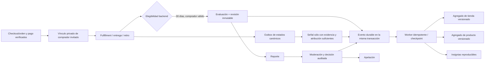

# Reputación comercial para tiendas de merch

Estado: implementación oscura para datos sintéticos locales. Los nueve flags nacen desactivados en `staging` y `production`. No se importan ratings externos, no se envían mensajes y no se modifica el estado financiero o logístico de una orden.

## Límites de dominio

El motor usa sujetos tipados y proyecciones distintas. Nunca existe una suma, copia o herencia entre estos dominios:

| Dominio | Sujeto | Evidencia pública | Agregado |
| --- | --- | --- | --- |
| Comunitario/profesional | persona, artista o banda | interacciones y evidencia de ese dominio | tablas existentes de reputación contextual |
| Comercial | tienda de merch | compras verificadas y operación atribuible a esa tienda | `merch_reputation_aggregate` con `subject_kind=store` |
| Producto | producto de merch | líneas recibidas y verificadas de ese producto | `merch_reputation_aggregate` con `subject_kind=product` |

La vista de artista etiqueta el bloque como “Reputación comercial” y explica que no mide calidad artística, popularidad ni reputación profesional. Una tienda nueva no hereda puntuaciones del artista, propietario, administradores ni otras tiendas. Identidad verificada y antigüedad aparecen como señales objetivas separadas.

Esta extensión se apila sobre el dominio canónico de tiendas de artista de `feat/artist-merch-storefronts` (PR #274). No crea copias de tienda, membresía, producto, orden o línea: los consume mediante vistas adaptadoras `merch_reputation_*_source`. La evaluación completa vive en `merch_reputation_review`, separada de la reseña preliminar de producto `merch_review` del módulo base. Este trabajo no crea ni habilita cobros.

## Modelo y estados

Las fuentes durables son evaluaciones, revisiones inmutables, dimensiones, imágenes referenciadas, respuestas y sus revisiones, evidencia operativa, señales, reportes, decisiones, apelaciones y auditoría. Los agregados y desglose por dimensión son proyecciones reconstruibles.

Estados relevantes:

- Orden comercial canónica: `created`, `confirmed`, `cancelled`, `completed`.
- Fulfillment canónico: `pending`, `preparing`, `ready_for_pickup`, `shipped`, `delivered`, `cancelled`, `return_requested`, `returned`, `problem`; la vista de reputación normaliza retiro y recepción parcial.
- Línea: además admite `replaced`, `returned`, `refunded` y `cancelled`.
- Evaluación: `published`, `hidden`, `limited`, `removed`. Moderación cambia visibilidad, no borra revisiones.
- Publicación del agregado: `new_store`, `unrated`, `published`.
- Confianza: `new`, `limited`, `moderate`, `strong`.
- Caso de moderación: `open`, `in_review`, `awaiting_evidence`, `provisionally_hidden`, `decided`, `appealed`, `closed`.
- Apelación: `open`, `awaiting_evidence`, `upheld`, `reversed`, `closed`.

## Invariantes de elegibilidad

- El autor se toma de la sesión backend y debe coincidir con el comprador canónico o con un vínculo durable creado al validar la capacidad privada de seguimiento de un checkout invitado; el cliente no puede declararlo.
- El vínculo de comprador invitado es idempotente, no muta el snapshot comercial, no persiste el token y responde igual ante orden desconocida, token incorrecto o vínculo con otra cuenta.
- La evidencia nace de orden, pago verificado y entrega/retiro/cancelación registrados en servidor. Un retorno del navegador no verifica una compra.
- Entrega o retiro habilita la evaluación por 30 días desde el evento confirmado.
- Una cancelación permite una evaluación de tienda sólo con comunicación y, si existió problema, resolución. Ninguna línea no recibida puede valorar producto.
- Hay un índice único parcial por evaluación de tienda/orden y otro por evaluación de producto/línea.
- Producto, tienda y línea deben pertenecer a la misma orden. Producto y tienda no son intercambiables.
- Propietarios, administradores, colaboradores, el artista titular y miembros conocidos de su banda son relaciones bloqueadas. No se usa fingerprinting.
- Ediciones usan control optimista de revisión, crean una revisión nueva e inmutable y sólo se aceptan dentro de la ventana.
- Reembolso, disputa o chargeback no borran una experiencia real. Fraude confirmado vuelve la orden inelegible; la moderación decide sobre evidencia ya creada.
- El monto de compra no existe en la entrada de la fórmula ni en una evaluación.
- Las imágenes requieren dueño igual al autor, tipo permitido, tamaño y dimensiones limitados, análisis `safe`, moderación y texto alternativo. Video queda fuera.
- Idempotency keys se bloquean por transacción. Reutilizarlas con otro actor o payload se rechaza.

Tratamiento de órdenes:

| Situación | Tienda | Producto | Señal/agregado |
| --- | --- | --- | --- |
| Entrega parcial | Disponible al confirmarse la entrega/retiro total de la orden | Líneas `delivered`, `picked_up` o `replaced` | Cada línea conserva su evidencia |
| Varios productos | Una evaluación de tienda | Una por línea elegible | Productos se agregan por `product_id` |
| Devolución o reembolso parcial | Se conserva | Se conserva y puede editarse si `delivered_at` prueba que fue recibido | El evento financiero no edita la evaluación |
| Reemplazo | Se conserva | Línea `replaced` usa la entrega confirmada | No crea peso duplicado por cantidad/precio |
| Disputa abierta | Se conserva y puede reportarse | Se conserva | Sólo evidencia atribuida puede crear señal operativa |
| Fraude confirmado | No se habilita nueva evaluación; la evidencia previa no se destruye | No se habilita | Se excluye de vista pública, agregados e insignias hasta una corrección; caso de riesgo separado |
| Fulfillment corregido | Nuevo evento durable; no se sobrescribe evidencia | Se reevalúa elegibilidad antes de enviar | Proyección idempotente reconstruible |
| Producto archivado | Se conserva el snapshot de variante | La valoración sigue vinculada al producto histórico | No se pierde evidencia |

## Flujo de evidencia



Los triggers capturan de forma transaccional y sin PII los estados confiables de fulfillment, shipment, orden e incidencia en `merch_reputation_source_event`. El procesador es idempotente y falla cerrado: si faltan promesa temporal o atribución, conserva el hecho como evidencia insuficiente y no inventa una señal. Si un worker falla, el evento y la evaluación quedan guardados; los checkpoints conservan intentos/error y permiten reintentar sin duplicar. `merch_reputation_projection_alerts` expone eventos sin procesar y fallos reiterados.

## Fórmula comercial v1

Versión: `merch-commercial-bayes-v1`. Todos los parámetros viven juntos en `merch_reputation_formula_version`; una versión activada no puede modificarse en sitio.

Para cada evaluación verificada `i`:

```text
decay_i = 0.5 ^ (edad_en_días / 730)
promedio_compradores = (3.5 × 5 + Σ(rating_i × decay_i)) / (5 + Σ(decay_i))
```

Para señales operativas únicamente atribuibles al vendedor:

```text
peso_j = calidad_evidencia_j × decay_j
promedio_operativo = 1 + 4 × Σ(resultado_j × peso_j) / Σ(peso_j)
puntaje = 0.85 × promedio_compradores + 0.15 × promedio_operativo
```

Si no hay evidencia operativa atribuible, el promedio de compradores se usa completo: no se inventa una señal neutra. Las señales de courier, comprador, plataforma o responsabilidad desconocida quedan registradas pero no penalizan la tienda. El resultado público se limita a 1–5 y se redondea a un decimal.

No se publica número con menos de cinco órdenes evaluables. Con el umbral alcanzado, hace falta al menos una evaluación visible. La vista principal prioriza 365 días, muestra volumen histórico y usa confianza limitada con menos de 10 evaluaciones, moderada entre 10 y 29, y fuerte desde 30.

Sensibilidad inicial, sin señal operativa y con evaluaciones recientes homogéneas:

| Muestra | Todas 1 | Todas 3 | Todas 5 |
| ---: | ---: | ---: | ---: |
| 1 | no se publica si no hay 5 órdenes evaluables; bayesiano 3,1 | 3,4 | 3,8 |
| 5 | 2,3 | 3,3 | 4,3 |
| 20 | 1,5 | 3,1 | 4,7 |

En el peor caso, la rama operativa representa 15 % y no puede eclipsar compradores. La validación pura rechaza menos de 80 % para compradores, más de 20 % operativo, decaimiento inferior a un año, umbral inferior a cinco o contribución de ranking superior a 20 %. Cualquier cambio requiere una nueva versión, pruebas de sensibilidad y aprobación auditable.

## Dimensiones y prioridades

Producto usa `description_accuracy` y `product_quality`. Tienda usa `preparation_dispatch`, `communication`, `packaging` y `problem_resolution` sólo cuando hubo problema. Las dimensiones públicas son gobernadas y versionadas; el vendedor no las escoge, oculta ni pondera.

Las sugerencias se envían de forma idempotente desde web o móvil y viven fuera del puntaje. La normalización bloquea duplicados exactos; el panel administrativo permite marcarlas como duplicadas, ponerlas a prueba, aprobarlas o rechazarlas. Una aprobación exige muestra mínima y snapshots positivos de sesgo y utilidad, queda auditada y aun así no cambia la fórmula activa: incorporar la dimensión requiere una nueva versión gobernada. Las preferencias del usuario crean revisiones inmutables de un orden personal. Web y móvil ofrecen botones subir/bajar accesibles; el agregado no consulta esas tablas y la respuesta declara `affectsPublicScore=false`.

## Insignias

Las definiciones publican texto, JSON de requisitos, muestra mínima, vigencia, versión de fórmula y `evaluator_key`. El job `merch_reputation_recalculate_badges` obtiene o revoca de manera reproducible:

- Identidad verificada: identidad vigente y cinco órdenes evaluables.
- Despacho puntual: 90 % en 20 señales atribuibles al vendedor durante 180 días.
- Comunicación destacada: 4,5 en 20 evaluaciones verificadas durante 180 días.
- Excelente resolución: 4,5 en 10 casos reales durante 365 días.
- Vendedor confiable: 30 evaluaciones, confianza fuerte y al menos 4,0 durante 365 días.

Un índice parcial impide dos premios activos del mismo tipo. No hay endpoint de autoasignación. Obtención, expiración y revocación conservan snapshots de evidencia y pueden crear una notificación opt-in segura.

## Descubrimiento y equidad

El aporte de reputación requiere su flag, recibe el entorno explícito y está limitado al 12 % del score base. El listado canónico compone primero relevancia textual, disponibilidad, categoría y novedad/exploración; luego suma el aporte acotado mediante `merch_reputation_search_contribution`. Ubicación y afinidad podrán añadirse como señales base cuando ese endpoint reciba contexto suficiente, pero la reputación nunca los reemplaza. `new_store` produce aporte neutral, no negativo, y no usa volumen de reseñas como multiplicador.

Las tiendas sin puntuación pública o activadas durante los últimos 90 días reciben un impulso base acotado y una etiqueta accesible `new_store_discovery`/“Descubre una tienda nueva” en web y móvil. `merch_reputation_exposure_daily` registra sólo conteos agregados por tienda/superficie: impresiones, conversiones, condición de tienda nueva y contribución acumulada. Los dashboards deben alertar por concentración de impresiones/ventas, pérdida de visibilidad nueva y bucles de popularidad antes de habilitar `search_influence`.

## Permisos y debido proceso

| Acción | Alcance backend |
| --- | --- |
| Ver resumen/reseñas | Público, contenido visible, flag activo |
| Ver elegibilidad / evaluar / editar | Comprador autenticado de esa orden/línea |
| Ordenar prioridades | Propia cuenta, revisión optimista |
| Relacionar reseña con orden / responder | Miembro activo de esa tienda |
| Reportar | Usuario autenticado; target existente |
| Apelar | Comprador, reportante o miembro afectado |
| Triage, solicitar evidencia u ocultar provisionalmente | `hasStrictAdminAccess`; transición idempotente, motivo, evidencia y auditoría |
| Decidir moderación | `hasStrictAdminAccess`; permiso distinto del vendedor |
| Resolver apelación | `hasStrictAdminAccess`; revisor distinto del apelante y de quien decidió originalmente |
| Medida de riesgo | Política versionada, motivo y evidencia; liquidación exige revisor humano distinto |

Una nota baja no abre casos, no retiene liquidaciones, no despublica, no bloquea, no cancela órdenes y no modifica reputación personal. Riesgo admite sólo fraude, apropiación de pagos, tracking falsificado, incumplimiento reiterado o abuso. La política inicial queda en `draft`; no hay umbrales punitivos activos.

## Threat model y privacidad

| Amenaza | Control |
| --- | --- |
| Autoevaluación/cuentas relacionadas | vínculo por propiedad, membresía y banda comprobable; sin fingerprinting |
| Sybil/brigading/reseñas compradas | sólo orden/pago/fulfillment legítimos, unicidad e idempotencia; métricas de crecimiento anómalo |
| Enumeración de órdenes | UUID, sesión y capacidad privada; el vínculo invitado devuelve el mismo 404 ante orden/token/vínculo inválido y nunca registra el token |
| Acceso cruzado vendedor | `EXISTS` sobre membresía activa por tienda en cada consulta/mutación |
| Alterar score desde cliente | no existe endpoint de score; sólo eventos de fuente confiable y proyección servidor |
| Replay/concurrencia | clave idempotente, hash de request, advisory lock, índices únicos y revisión esperada |
| XSS/PII | límites y controles de caracteres; salida pública no incluye orden, correo, dirección, teléfono, pago, tracking ni despacho |
| Imagen maliciosa | tipos permitidos, 10 MiB, dimensiones, SHA-256, análisis seguro, moderación y alt obligatorio |
| Extorsión/contenido peligroso | reporte tipado, ocultamiento/limitación auditable, evidencia original y apelación |

La identidad pública usa nombre/avatar público sólo si la preferencia lo permite; de otro modo muestra un comprador privado. La eliminación de cuenta debe seudonimizar la presentación y desvincular identificadores no obligatorios, preservando bajo acceso restringido evidencia financiera, fraude, moderación y auditoría durante el plazo legal. No se debe incluir contenido sensible en previews de notificación. Retención concreta, bases jurídicas, exportación y plazos de borrado requieren validación legal/privacidad antes del piloto.

## UX y accesibilidad

- Perfil de artista: bloque comercial claramente separado.
- Storefront/producto: estado nueva/sin evaluaciones/publicada, promedio, conteos, confianza, periodo, dimensiones, historial e insignias.
- Historial/seguimiento: elegibilidad, enviado, edición, expirado, carga, reintento y permiso insuficiente.
- Formulario: 1–5 sin valor preseleccionado, producto/atención/logística separados, resolución condicional, comentario opcional, imágenes preparadas por contrato; no obliga comparación.
- Panel vendedor: enlace privado a orden, respuesta pública sin alterar evaluación.
- Panel admin: reporte, solicitud de evidencia, ocultamiento provisional reversible, decisión motivada, apelación independiente y gobierno de categorías.
- Web y móvil: español/inglés en las nuevas preferencias; etiquetas, fieldsets/radios, foco/teclado, targets táctiles, contraste del tema, reflow responsive y texto ampliado. Video no está incluido.

La comparación por tarjetas permanece detrás de `comparison_cards` y no forma parte del flujo poscompra obligatorio.

## Migración, reconstrucción y rollback

`tdf-hq/sql/2026-09-08_merch_reputation.sql` es aditiva, reejecutable y depende de `2026-09-07_artist_merch_storefronts.sql`. No crea reviews ni scores. Todas las tiendas quedan sin agregado y se muestran como `new_store`; sólo un futuro backfill puede enlazar evidencia histórica inequívoca de orden/comprador. Los procesadores pueden reconstruir señales, agregados e insignias por lotes con checkpoints.

`tdf-hq/sql/2026-09-08_merch_reputation_rollback.sql` sólo elimina una instalación de reputación prístina y nunca elimina tablas comerciales canónicas. Rechaza la operación si existe vínculo de comprador, preferencia, evaluación, fuente, señal, evidencia, reporte, apelación, auditoría, riesgo o notificación durable. En un entorno usado se apagan flags y se corrige hacia adelante.

## Flags, rollout y kill switches

Flags independientes: `store_reviews`, `product_reviews`, `seller_responses`, `review_images`, `badges`, `search_influence`, `comparison_cards`, `moderation`, `notifications`.

Orden obligatorio:

1. Datos sintéticos locales.
2. Staging.
3. Prueba interna con comprador, vendedor y moderador distintos.
4. Tiendas piloto con consentimiento.
5. Evaluaciones visibles sin afectar búsqueda.
6. Insignias.
7. Influencia limitada en recomendaciones con monitoreo.
8. Disponibilidad general sólo tras criterios de salida.

Cada flag es kill switch. La ausencia de un entorno explícito falla como `production`, donde todo nace apagado. No se despliega ni activa nada con este cambio.

## Analítica y alertas

La vista de métricas cubre órdenes elegibles/evaluadas, tiempo hasta evaluar, reportes, tiempos/estados de moderación, apelaciones y reversiones. Se deben derivar sin PII: distribución de puntuaciones, ediciones después de resolución, abuso confirmado, conversión, concentración, visibilidad nueva, insignias y diferencias anómalas por categoría/grupo.

Alertas mínimas: evento sin proyección, tres fallos de proyección, divergencia evento/agregado, crecimiento inusual de reviews, concentración de exposición, tasa anómala por cuenta relacionada y cambios bruscos de insignias.

## Validación y pendientes de salida

La correspondencia uno a uno entre los 22 criterios de aceptación, sus controles y su evidencia está en [`merch-reputation-acceptance.md`](./merch-reputation-acceptance.md). Esa matriz distingue pruebas automatizadas, controles inspeccionados y resultados que sólo pueden validarse en staging o durante un piloto autorizado.

La prueba de migración usa exclusivamente actores, tiendas, productos, órdenes y evaluaciones sintéticas. Aplica primero el esquema canónico y luego reputación, ambos dos veces. Comprueba reclamo privado de checkout invitado, reejecución, flags oscuros, umbral sin cuentas relacionadas, coherencia, autoevaluación, historial, devolución/reembolso, exclusión reversible por fraude, media segura, courier, captura automática de estados confiables, reconstrucción, versión de fórmula, prioridades, sugerencias gobernadas, moderación por etapas, apelación, alcance vendedor y revisión financiera independiente.

Antes de un piloto quedan como validaciones externas, no autorizadas por este cambio:

- fusionar primero el PR base #274 y mantener esta extensión apilada hasta entonces;
- ejecutar en staging el flujo checkout invitado → vínculo autenticado → entrega/cancelación → evaluación sin activar tiendas reales;
- conectar el uploader con antivirus/CDR y almacenamiento firmado;
- ejecutar E2E con servicios de staging y tres identidades separadas;
- revisión de copy, sesgo, accesibilidad asistida, retención y base jurídica;
- dashboards/alertas en la plataforma operativa elegida;
- revisión conjunta de producto, riesgo, soporte y cumplimiento para activar una nueva fórmula o política.
