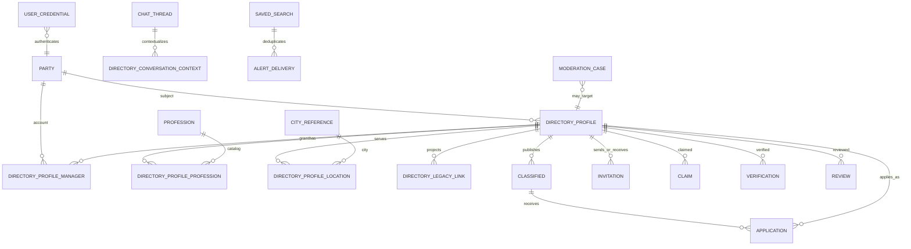
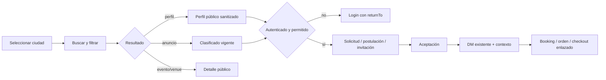
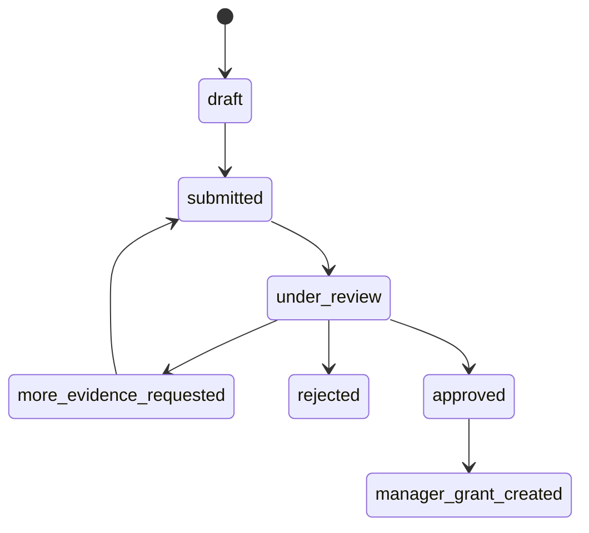

# Diagramas de datos y flujos

## Modelo lógico

```mermaid
erDiagram
  USER_CREDENTIAL }o--|| PARTY : authenticates
  PARTY ||--o{ DIRECTORY_PROFILE : subject
  PARTY ||--o{ DIRECTORY_PROFILE_MANAGER : account
  DIRECTORY_PROFILE ||--o{ DIRECTORY_PROFILE_MANAGER : grants
  DIRECTORY_PROFILE ||--o{ DIRECTORY_PROFILE_PROFESSION : has
  PROFESSION ||--o{ DIRECTORY_PROFILE_PROFESSION : catalog
  DIRECTORY_PROFILE ||--o{ DIRECTORY_PROFILE_LOCATION : serves
  CITY_REFERENCE ||--o{ DIRECTORY_PROFILE_LOCATION : city
  DIRECTORY_PROFILE ||--o{ DIRECTORY_LEGACY_LINK : projects
  DIRECTORY_PROFILE ||--o{ CLASSIFIED : publishes
  CLASSIFIED ||--o{ APPLICATION : receives
  DIRECTORY_PROFILE ||--o{ APPLICATION : applies_as
  DIRECTORY_PROFILE ||--o{ INVITATION : sends_or_receives
  CHAT_THREAD ||--o{ DIRECTORY_CONVERSATION_CONTEXT : contextualizes
  SAVED_SEARCH ||--o{ ALERT_DELIVERY : deduplicates
  DIRECTORY_PROFILE ||--o{ CLAIM : claimed
  DIRECTORY_PROFILE ||--o{ VERIFICATION : verified
  DIRECTORY_PROFILE ||--o{ REVIEW : reviewed
  MODERATION_CASE }o--|| DIRECTORY_PROFILE : may_target
```

## Búsqueda a contacto

```mermaid
flowchart LR
  A[Seleccionar ciudad] --> B[Buscar y filtrar]
  B --> C{Resultado}
  C -->|perfil| D[Perfil público sanitizado]
  C -->|anuncio| E[Clasificado vigente]
  C -->|evento/venue| F[Detalle público]
  D --> G{Autenticado y permitido}
  E --> G
  G -->|no| H[Login con returnTo]
  G -->|sí| I[Solicitud / postulación / invitación]
  I --> J[Aceptación]
  J --> K[DM existente + contexto]
  K --> L[Booking / orden / checkout enlazado]
```

## Claim

```mermaid
stateDiagram-v2
  [*] --> draft
  draft --> submitted
  submitted --> under_review
  under_review --> more_evidence_requested
  more_evidence_requested --> submitted
  under_review --> rejected
  under_review --> approved
  approved --> manager_grant_created
```

El grant aparece únicamente en la transacción final de aprobación.
