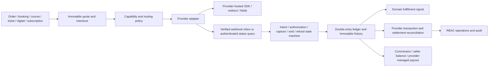

# TDF payment platform: Ecuador market research, audit and delivery record

**Verification date:** 2026-09-09 (America/Guayaquil)  
**Audience:** engineering, product, security, operations, finance, and qualified Ecuadorian legal/accounting reviewers  
**Scope:** online payments for an Ecuadorian S.A.S., buyers in Ecuador and abroad, primarily USD  
**Evidence rule:** “documented” means an official source supports a capability; “verified” means TDF actually exercised it in the stated environment. Those are not interchangeable.

## Executive decision

TDF should use the smallest portfolio that covers the materially distinct rails and failure domains required by the product:

1. **Datafast** — retain as the primary Ecuador card acquirer for domestic/international cards and issuer-approved local installments. The existing integration is useful but remains production-disabled until merchant, certification, credential, security-scan and sandbox evidence gates are complete.
2. **PayPal Checkout** — retain for the international PayPal wallet and cross-border reach. PayPal Multiparty is the clearest documented provider-managed connected-seller option for an Ecuador business seller, but TDF must first become an approved partner and obtain the required product entitlement.
3. **PlaceToPay/Evertec** — add as the preferred second local gateway: Ecuador sandbox, signed notifications, server status, cards, bank/DeUna redirect, links, refunds, and authorization/capture are documented. Every commercial capability—including dispersion—must remain disabled until the Ecuador merchant contract confirms it.
4. **PayPhone** — add as a narrow local availability/conversion rail for the distinct PayPhone wallet, links/QR and a third card path. Its public notification is not documented as cryptographically signed, so no notification may fulfill an order without an authenticated status query.

This is four providers because PayPal and PayPhone each contribute a distinct wallet rail, Datafast contributes the strongest local acquiring/installment path already present in the codebase, and PlaceToPay contributes signed event handling plus bank/DeUna and delayed-capture capability. Kushki is a credible substitution candidate if commercial terms or PlaceToPay onboarding fail, but adding it now would duplicate most local coverage. Stripe cannot directly onboard an Ecuador merchant under its published country list.

No TDF-managed “escrow,” pooled seller funds, or improvised split settlement is approved. Marketplace money must remain provider-managed through contracted connected accounts/dispersion, or the transaction must use a merchant-of-record/direct-seller alternative reviewed by Ecuadorian counsel and accounting.

## 1. Capability and access report

| Capability | Result | Evidence / limitation |
|---|---|---|
| Repository and default branch | Available | GitHub repository is visible; default branch `main`; implementation was rebased onto inspected commit `1157258b6a6551d49708fa9eb21ab893b6a051f1`. |
| Commit history and relevant remote branches | Available | Fetched origin/tags and searched all refs for payment, checkout, refund, settlement, payout, Stripe, PayPal and Datafast work. |
| Issues, PRs and CI | Available | GitHub CLI authenticated as repository administrator. Branch protection requires one approval, stale-review dismissal and resolved conversations. |
| Branch/worktree changes | Available | Work is isolated in `/private/tmp/tdf-payment-platform-20260909` on `feat/canonical-payment-platform-20260909`; the human's dirty primary checkout was not modified. |
| Push and draft PR | Available and verified | Core branch pushed and draft PR [#326](https://github.com/diegueins680/tdf-app/pull/326) opened; generated mobile contract branch pushed and draft PR [TDF-mobile #76](https://github.com/diegueins680/TDF-mobile/pull/76) opened. Neither PR is merged. |
| Current official internet sources | Available | Research used provider, BCE, SPDP, SRI, consumer-authority, Apple/Google and PCI SSC sources only for material claims. |
| Provider public sandboxes/docs | Partially available | Public sandbox procedures exist for Datafast (credentials on request), PayPal, PlaceToPay, PayPhone controlled tests, Kushki UAT, Nuvei and dLocal. A documented sandbox is not a credentialed TDF test. |
| Provider merchant contracts/accounts | Unverified | No contract or portal entitlement was inspected. Account onboarding, reserves, acquiring bank, enabled products and pricing require provider confirmation. |
| Local development | Available | Node 24.8.0, npm 11.6.0, Stack 3.7.1/GHC 9.10.3, PostgreSQL client 16.10, Docker with approved test access. |
| Staging | Reachable but payment credentials absent | `tdf-hq-studio-audit-staging` has a running Fly machine and passing health check. Its secret-name listing contains only `DATABASE_URL`; no provider credentials. No staging deploy or transaction was performed. |
| Production visibility | Read-only inspection performed | `tdf-hq` is deployed. Secret **names only** show PayPal and legacy Stripe configuration, but no Datafast secrets, `PAYPAL_WEBHOOK_ID`, or `COMMERCE_EVENT_ENCRYPTION_KEY`. Values were neither displayed nor extracted. Presence is not validity. |
| Production deployment / live charge | Prohibited | Not performed. |

### Baseline before changes

| Layer | Command / environment | Result |
|---|---|---|
| Backend | `stack test`, GHC 9.10.3, local | 2,480 examples, 0 failures. |
| Web | `npm run quality:ui`, local | lint/typecheck/build passed; 188 suites, 1,769 tests passed. Existing React/MUI and large-chunk warnings remain. |
| Mobile | `REQUIRE_MOBILE_WORKSPACE=1 npm run quality:mobile`, local | first concurrent run: 317/318, one 5s ticket-checkout timeout; isolated rerun passed; full sequential rerun: 64 suites, 318 tests passed. Classified as load-sensitive test flake, not provider evidence. |
| Repository | `npm run quality:repo`, local | passed; 8,969 audit findings: 0 critical, 0 errors, 322 warnings, 8,647 informational; supporting repository contract suites passed. |
| Existing payment migrations | repository scripts, disposable PostgreSQL 16 | unified core, provider inbox/refunds, provider operations, service, marketplace sale/rental, marketplace operations, booking, course, ticket and Domo quote suites passed. |
| Provider sandboxes | none | Not executed: no sandbox credentials were available. |
| Staging payment flows | none | Not executed: staging has no provider credential names. |

Baseline capture completed at `2026-09-10T00:04:02Z` (`2026-09-09` local), before payment changes.

## 2. Existing system and pending-work audit

### Relevant merged history

| PR | Finding and reuse decision |
|---|---|
| #108 | Removed placeholder PayPal values and documented secret handling. It does not prove that PayPal works. Preserve. |
| #120 | Introduced a pre-canonical service “escrow” concept held by TDF. Do not rely on its custody language; later canonical ledger/provider-managed settlement controls supersede the operating assumption. |
| #146 | Created immutable checkout/provider binding, verified payment evidence, inbox, refunds/disputes, receipts, ledger, holds, audit, idempotency, reconciliation and production gates. This is the foundation, not work to duplicate. |
| #149 | Extended canonical checkout to marketplace, bookings, courses and tickets with Datafast/PayPal/manual methods. Explicitly recorded that credentialed sandboxes were not run. Reuse. |
| #166/#168/#169 | Refund visibility and correctness fixes. Preserve. |
| #186 | Added signature-verified PayPal asynchronous capture recovery for courses and tickets and late-capture reconciliation. Preserve. |
| #256/#257/#259 | Migration checksum and staging compatibility repairs. Never edit the historical migration bytes. |
| #311 | Added ticket fee/tax/terms/refund disclosures before consent and synchronized clients. Preserve. |

### Open/dependent branches

| PR / branch | State | Payment overlap decision |
|---|---|---|
| #274 `feat/artist-merch-storefronts` | Draft, checks unstable | Owns the physical merchandise domain, shipping, order lifecycle and a canonical checkout link; payment adapters remain gated. Do not duplicate that domain. Merge the payment core first, then rebase/cherry-pick the merch work and connect it to the capability API. |
| #291 `feat/merch-reputation` | Draft, based on #274 | Reputation only; depend on #274 and avoid payment-core edits. |
| #309 guest booking stack | Draft | Preserve guest-continuity work; capability/API integration must rebase after its parent stack. |
| stale migration/ticket remote branches | Unmerged refs | Changes already superseded or represented by merged commits; do not cherry-pick blindly. |

### Code truth before this delivery

| Area | Classification | Finding |
|---|---|---|
| Canonical checkout, attempt, binding, inbox, refund, dispute, receipt, ledger, hold, audit | Existing and verified locally | Strong foundation; integer `Int64`/`BIGINT`, immutable bindings and production evidence gates. |
| Datafast create/status | Existing but incomplete | Hosted checkout and server status verification exist. No TDF sandbox evidence, production secrets, token/recurring, link, authorization/capture or automated settlement evidence. |
| PayPal create/capture/webhook/refund | Existing but incomplete | Orders v2 capture, verified webhook inbox/recovery and dual-control refund exist. No verified sandbox; no webhook ID/encryption key in visible deployed secret names; no subscriptions, authorization/void, multiparty onboarding, settlement or payout runtime. |
| Stripe | Existing legacy, not viable for Ecuador entity | Mature legacy tests and Connect code exist, but direct Ecuador onboarding fails the published-country gate. Preserve historical references and gate use to a separately eligible legal entity. |
| Manual bank transfer/cash/POS | Existing manual evidence | Staff-reviewed evidence exists. It is not an automated bank payment button and must not trigger fulfillment from customer submission alone. Cash is out of implementation scope. |
| Checkout capability presentation | Defective | Product endpoints hard-code method arrays. Unsupported operations can be exposed inconsistently and there was no transaction-specific routing contract. |
| Authorization/capture/void | Missing | Attempt operations existed but no canonical amount-aware authorization/capture/void model. |
| Settlement/provider fees/withholding | Missing | Ledger exists, but provider settlement batches/allocations and actual fee/withholding reconciliation were absent. |
| Connected seller, commission, balance, payout | Incomplete/domain-specific | Ticket organizer liability and marketplace bookkeeping exist, but there was no provider-connected account or canonical payout model. |
| Admin | Incomplete | Provider-event replay and service refunds are present; unified readiness, transactions, disputes, settlement, commission and payout surfaces are missing. |
| Adapter boundary | Incomplete | Verification primitives are strong but provider calls remain repeated across product modules. |

## 3. Ecuador payment-method matrix

All rows were checked on 2026-09-09. “Quote” means the public sources do not establish TDF's exact commercial terms.

| Method | Ecuador customer / international coverage | USD | Viable route | Important limits | Decision |
|---|---|---:|---|---|---|
| Ecuador-issued credit/debit cards | Broad local Visa/Mastercard plus acquirer-dependent Amex/Diners/Discover/UnionPay | Yes | Datafast primary; PlaceToPay backup; PayPhone fallback | Network/acquirer and debit support are contract-specific. | Implement selected providers behind verified gates. |
| Foreign-issued cards | Documented by Datafast and PayPhone; PlaceToPay contract-dependent | Yes | Same hosted routes | Datafast documents foreign cards as current payment, not local installments. | Implement; show installments only for eligible Ecuador issuer/BIN response. |
| Local installments | Datafast bank/acquirer plans; PayPhone 3/6/9/12 with published restrictions; PlaceToPay and Kushki contract-dependent | Yes | Datafast; PayPhone backup | Never promise term, interest or eligibility before issuer/acquirer confirmation. Consumer disclosure must show cash price, rate, schedule and total. | Implement capability-gated selection. |
| Traditional bank redirect/button | Available through Kushki; PlaceToPay commercial method set must be confirmed | Yes | PlaceToPay selected; Kushki substitution | Bank list, min/max, expiry and settlement vary. | Adapter disabled until contract/sandbox. |
| DeUna QR/deep link/code | Available directly and through PlaceToPay/Kushki | Yes | PlaceToPay selected | Direct DeUna adds another vendor and public sandbox evidence is insufficient; Kushki route is credible backup. | Implement via selected PSP, not direct initially. |
| PayPhone wallet | Local distinct balance/wallet rail | Yes | PayPhone | Public webhook lacks documented signature; authoritative query required. | Implement narrow adapter. |
| PayPal wallet | International alternative available to Ecuador business sellers | Yes | PayPal | High published fee; local withdrawal delay/fee; product entitlements vary. | Retain and repair. |
| Apple Pay / Google Pay buyer wallets | Apple and Google list Ecuador consumer availability and participating issuers | Yes | No selected Ecuador PSP entitlement proved | Kushki Apple Pay beta excludes Ecuador in its current configuration page; merchant acquiring support is not implied by consumer wallet availability. | Blocked pending a provider contract that explicitly supports Ecuador merchant wallet tokens. |
| Shareable payment links | Datafast Datalink, PlaceToPay links/microsites, PayPhone Links, Kushki Smartlinks | Yes | PlaceToPay + PayPhone | Link authentication, expiry, recurrence and fees differ. Never mark paid from redirect alone. | Implement selected hosted links. |
| Saved cards / tokenization | Datafast, PlaceToPay, PayPhone box; provider/account approval varies | Yes | Datafast/PlaceToPay; PayPhone contract-specific | Explicit consent, revocation/removal and provider vault only. Never store PAN/CVV. | Canonical mandate model; enable only after credentialed contract test. |
| Recurring subscriptions | PayPal Subscriptions; Datafast merchant-scheduled token charges; PlaceToPay recurring/tokenization; PayPhone commercial subscriptions | Yes | PayPal + Datafast/PlaceToPay | API entitlement and cancellation mechanics unverified for TDF. Same-channel cancellation and renewal notice required. | Canonical mandate model; adapters remain disabled. |
| Preauthorization/delayed capture/void | PayPal and PlaceToPay documented; Datafast not publicly evidenced for TDF model | Yes | PlaceToPay; PayPal | Holds expire; partial capture and void semantics are provider-specific. | Canonical lifecycle implemented; adapter operations next. |
| Full/partial refund | PayPal and PlaceToPay documented; other providers have method-specific reversal/refund limits | Yes | Provider of original capture only | Never cross-provider refund. Same-day reversal is not the same as post-settlement refund. | Existing PayPal flow retained; provider adapters require contract tests. |
| Connected sellers/split/payout | PayPal Multiparty supports Ecuador business sellers for approved partners; PlaceToPay dispersion is documented but local liability terms are not public; Kushki third-party commissions are beta and globally applied when enabled | Yes | PayPal primary; PlaceToPay possible backup | Provider onboarding/KYC, fund ownership, disputes, fees and payout liability must be contracted. | Blocked until approved partner/commercial/legal review; no TDF custody. |
| Cash collection | Kushki documents voucher/reference collection | Yes | Research only | User explicitly excluded implementation. Higher fraud/expiry/fulfillment complexity. | Do not implement without separate authorization. |
| Cryptoassets | BCE says cryptoassets are not legal tender or an authorized payment method; VASPs have UAFE obligations | No approved payment rail | None | Legal/regulatory and volatility risk. | Research only; do not implement. |

## 4. Provider evaluation

### Mandatory viability gates

| Provider | Ecuador company onboarding | USD settlement | Maintained integration | Sandbox/equivalent | Security controls | Classification |
|---|---:|---:|---:|---:|---:|---|
| Datafast | Yes, contract/underwriting | Yes | Yes | Yes, credentials on request and certification phases | Hosted PCI widget, 3DS/OTP, server status | Existing but incomplete; selected. |
| PayPal | Yes for Ecuador business PayPal Checkout; Multiparty business-seller onboarding listed | Yes | Yes | Yes | Hosted wallet, OAuth, verified webhooks, disputes | Existing but incomplete; selected. |
| PlaceToPay | Ecuador endpoints/onboarding; final merchant approval quote | Yes | Yes | Yes | Hosted Checkout, SHA-256 notification, status polling | Missing; selected. |
| PayPhone | Yes, RUC/identity/contract | Yes | Yes | Controlled test users/environment | PCI claim, tokens; no public signed-event scheme found | Missing; selected as narrow fallback. |
| Kushki | Yes, BCE authorized | Yes | Yes | UAT | Hosted fields/buttons, OTP/Sift, 3DS only under documented models | Viable but redundant/substitution candidate. |
| Medianet | Yes, published legal-document list and acquirer contract | Yes | Public REST/manual | Public usable sandbox not established | PCI/gateway claim, details contract-dependent | Viable local card fallback but lower priority. |
| Nuvei/Paymentez | Local Ecuador merchant product appears available | Yes | Yes | Yes | Hosted/token SDKs; direct API requires PCI | Marketplace platform beta/EC eligibility unconfirmed; redundant. |
| dLocal | Ecuador is a processing market | Yes | Yes | Yes | Signed APIs/hosted methods | Direct onboarding of an Ecuador S.A.S. as platform/merchant not evidenced; blocked by Sales. |
| PagoPlux | Ecuador product marketed | Yes | Public resources | Usable public sandbox not verified | Claims PCI/tokenization | Blocked by verification/contract evidence. |
| direct DeUna | Yes | Yes | Business API advertised | Public equivalent not verified | Provider status/refund APIs advertised | Viable but redundant through selected PSP. |
| PeiGo direct | QR merchant product | Yes | No maintained public merchant API established | No | Not established | Fails integration/sandbox gates. |
| Stripe | **No** under published supported-country list | N/A for EC entity | Yes | Yes | Strong | Not viable for direct TDF Ecuador merchant. Preserve legacy only. |
| Mercado Pago | **No Ecuador in official country availability** | N/A | Yes elsewhere | Yes elsewhere | Strong elsewhere | Not viable. |

### Weighted score

Scoring is 1–5, multiplied by the weight: method/geography 25%, expected authorization/conversion 15%, required features 15%, total cost 10%, settlement 10%, local support 10%, reliability/fallback 10%, maintenance effort 5%. Scores compare technical/commercial fit; a failed mandatory gate still excludes a high scorer. Unknown fees are neutral (3), never guessed.

| Provider | Coverage | Conversion | Features | Cost | Settlement | Local support | Reliability | Effort | Weighted /100 | Outcome |
|---|---:|---:|---:|---:|---:|---:|---:|---:|---:|---|
| PlaceToPay | 5 | 4 | 5 | 3 | 3 | 4 | 4 | 3 | 83 | Select; contract-gated. |
| Kushki | 5 | 4 | 4 | 3 | 3 | 4 | 4 | 3 | 80 | Substitution/backup; current model docs conflict on 3DS and auth/capture. |
| Datafast | 4 | 5 | 3 | 3 | 4 | 5 | 4 | 3 | 79 | Retain as primary local cards. |
| PayPhone | 4 | 4 | 3 | 4 | 4 | 4 | 3 | 4 | 75 | Select narrowly for distinct wallet and fallback. |
| PayPal | 4 | 4 | 5 | 2 | 2 | 3 | 4 | 4 | 73 | Retain for international wallet/marketplace path. |
| Nuvei | 4 | 4 | 5 | 2 | 3 | 3 | 4 | 2 | 73 | Blocked marketplace/EC platform entitlement; redundant. |
| dLocal | 4 | 4 | 5 | 2 | 3 | 2 | 4 | 2 | 71 | Fails proven Ecuador-entity onboarding gate. |
| direct DeUna | 2 | 5 | 2 | 4 | 5 | 5 | 4 | 3 | 70 | Redundant through PSP. |
| Medianet | 3 | 4 | 2 | 4 | 4 | 5 | 3 | 2 | 67 | Lower-priority local card backup. |
| PagoPlux | 3 | 3 | 3 | 3 | 3 | 4 | 2 | 3 | 60 | Fails sandbox/evidence gate. |

### Commercial and operating facts

- **Datafast:** pricing, MDR, reserves, refund/chargeback costs and setup are quote/acquirer dependent. Datalink public pages conflict between published monthly figures, so treat all Datalink pricing as quote-required. Developer FAQs indicate roughly 24 hours for Banco Guayaquil/Pacífico, 48 hours for Pichincha/Diners/Discover, and approximately seven days or special schedules for installments; contract terms control.
- **PayPal Ecuador:** the published commercial rate is 5.40% plus the currency fixed fee (USD 0.30), with approved volume tiers; refund initiation has no extra fee but original transaction fees are not returned. Ecuador local-bank withdrawal is published as 0.50% with USD 10 minimum and can take up to seven business days. USD withdrawal to a US bank is 3%; currency conversion and dispute/chargeback charges vary by transaction. Verify the current merchant agreement before activation.
- **PayPhone:** public business pricing states 5% plus IVA on the PayPhone commission, no monthly fee, wallet balance availability immediately and free bank transfer. Contract, tax invoice and dispute terms still control.
- **PlaceToPay, Kushki, Nuvei, dLocal, PagoPlux:** exact Ecuador fees, taxes on fees, setup/monthly charges, reserves, refund/chargeback costs, FX and settlement schedules require a commercial quote.
- **Medianet:** its published 2026 tariff lists USD 11.99 plus IVA monthly and 1.50% transaction platform cost; acquiring-bank MDR and exact scope must be confirmed.

## 5. Target architecture and ADR

### ADR-0200 — canonical payment core before provider/UI work

**Status:** accepted for implementation.  
**Decision:** product modules own orders, inventory/holds, fulfillment and invoices; the commerce core owns payment intents, attempts, immutable provider bindings, authorizations, captures, voids, refunds, disputes, fees, commissions, settlements, seller balances, mandates and payouts. Provider adapters translate only at the boundary.

### Invariants

1. All money is signed integer minor units plus ISO currency; provider decimal strings are parsed/serialized only in adapters.
2. A browser return, app resume, redirect query, mock or customer screenshot is never payment evidence.
3. Provider, environment, merchant, internal order, provider resource, amount and currency are immutable bindings.
4. `authorized` is not `captured`; `voided` is not `refunded`; fulfillment begins only after authoritative capture and domain checks.
5. Only one successful attempt may settle a checkout. A transport timeout or unknown response is ambiguous and freezes cross-provider fallback until reconciled.
6. Refund uses the provider/capture of origin. Partial totals cannot exceed captured funds.
7. Marketplace funds remain with a contracted provider-managed account structure; TDF records liabilities but does not invent custody.
8. Payout request and approval actors differ. Paid requires a bound provider payout ID and completion evidence.
9. Raw PAN, track data and CVV never enter TDF APIs, databases or logs. Vault references are not reusable as credentials outside the provider contract.
10. Payment and payout history, amount components, settlement allocations and audit evidence are append-only.

### State model

`requires_payment_method → requires_customer_action | processing → authorized → partially_captured | captured → partially_refunded | refunded`

Additional terminal/exception paths: `voided`, `failed`, `cancelled`, `disputed`, `chargeback`. Partial capture and refund transitions carry the minor-unit amount and enforce cumulative bounds. Checkout/order state remains separate.

## 6. Business-flow coverage

| Flow | Technical route | Current production truth |
|---|---|---|
| Shipped merchandise | canonical checkout; Datafast/PlaceToPay/PayPhone cards; PayPal wallet; shipping fulfillment after capture | Merchandise domain is in draft PR #274. Provider core must merge first. All new rails disabled. |
| Studio booking/service/course/deposit/balance | manual capture or deposit intent; PayPal/Datafast now, PlaceToPay delayed capture planned | Existing Datafast/PayPal runtime locally tested with mocks only. No real sandbox. |
| Event tickets | hold + canonical capture + issuance; existing PayPal webhook recovery; Datafast status; new routing contract | Production rollout previously used PayPal only, but this audit did not run a transaction. Datafast remains gated. |
| Digital product/license | order and private fulfillment grant only after capture; refund can revoke subject to terms | Canonical product flow added; product-specific delivery still required. |
| Subscription/membership | explicit mandate/consent, provider schedule or approved merchant scheduler, cancellation and renewal notice | Canonical mandate table added; no provider subscription adapter is enabled. |
| Hybrid marketplace | connected seller + commission + provider-managed split/disbursement + seller balance/payout evidence | Canonical accounting model added. Actual funds movement is blocked pending PayPal partner or contracted equivalent and legal/accounting review. |

## 7. Security, privacy, consumer and tax review

### PCI scope

Use provider-hosted redirects or complete hosted fields. PCI SSC says every payment-page field must originate inside the compliant provider iframe for SAQ A; direct-post forms are generally SAQ A-EP. PCI DSS 4.0.1 also adds script-attack controls for embedded payment pages. The acquirer determines TDF's actual validation obligation. TDF cannot claim SAQ eligibility or certification until the final flow and provider attestations are reviewed.

Required controls: strict CSP with nonces/hashes, dependency/SRI governance where compatible, iframe origin restrictions, no PAN/CVV logging or analytics capture, quarterly ASV scans if required, annual scope review, and provider AOC responsibility evidence.

### Ecuador data protection

LOPDP applies to payer, seller and transaction personal data. Provider access must be governed by controller/processor terms with purpose, security, confidentiality and deletion/return requirements. International transfers require the applicable LOPDP/regulation safeguards. Run a documented risk analysis and DPIA before production marketplace, profiling/fraud orchestration, recurring mandates or large-scale cross-border processing. Keep purpose/retention schedules, data-subject request handling, incident records, least privilege and breach-notification procedures. The SPDP—not this report—determines compliance.

### Consumer rights

Display the final price including taxes/recargos before acceptance. Do not default to passing card-provider fees to the buyer: Ecuador's consumer law requires card price treatment consistent with cash. For installments, disclose cash price, total interest/rate, count/frequency and total payable. Deliver the electronic contract copy, give advance automatic-renewal notice, and permit cancellation through the same modality/channel. Apply return/cancellation rights to the actual product/service and documented statutory exceptions; counsel must approve terms.

### SRI / accounting

Payment confirmation is not an SRI invoice. Generate authorized electronic invoices and credit/debit notes through the approved invoicing system and link—not conflate—their keys with receipts/refunds. Ecuador's general IVA rate is currently 15%, but item classification can produce 0% or temporary/special rates; calculate tax from versioned product/tax rules, not a provider or global constant. Reconcile card/acquirer/intermediary withholdings separately from provider fees. An Ecuadorian accountant must approve marketplace commission invoices, seller gross/net presentation, withholding responsibilities, revenue recognition and payout liability.

### Payment-system / marketplace boundary

BCE authorizes payment-system administrators, gateways and aggregators and expects applicable KYC/UAFE, PCI, risk, continuity, complaint and liquidity controls. TDF must contract an authorized provider for aggregation/dispersion rather than receive and redistribute third-party funds by software design. Counsel must determine whether TDF is marketplace agent, commissionaire, reseller, merchant of record or another role for each flow.

## 8. Threat model

| Threat | Control / required evidence | Residual blocker |
|---|---|---|
| Amount/currency/order manipulation | server-authoritative quote; immutable bindings; exact provider comparison; integer minor units | Adapter contract tests and each sandbox. |
| Duplicate charge / double submit | client lock, server idempotency, unique attempt keys, one-success constraint | Product UIs still need common component adoption. |
| Ambiguous timeout followed by fallback | explicit ambiguity state; no cross-provider fallback until authenticated query/webhook reconciliation | Provider-specific status semantics. |
| Webhook forgery | exact raw body, provider signature verification, HTTPS, allowlisted algorithms/hosts, encrypted inbox | PayPal webhook ID/event key absent; PayPhone has no public signature evidence and requires status query. |
| Replay / duplicate / reordering | provider event unique key, payload hash, persistent inbox, claim/retry/dead-letter, state transition guard | New adapters need event implementations. |
| Authorization bypass / IDOR | guest lookup capability hashes, strict Admin for money operations, domain ownership checks | Run cross-domain API tests for every new route. |
| Refund abuse | reason catalog, available-balance reservation, requester/approver separation, provider-of-origin | Extend unified admin and provider adapter coverage. |
| Seller payout fraud | provider KYC, provider-managed funds, immutable connected ID, balance allocations, dual approval | No provider product entitlement yet. |
| Secret exposure | environment secret manager; startup validation; redaction; never return config DTOs publicly | Rotate if any historical leak is found; add new provider secrets only after contract. |
| Sensitive logs/payloads | encrypted raw inbox; hashes in diagnostics; redacted summaries; retention policy | Verify centralized log/backup access and deletion policy. |
| Reconciliation failure | immutable exception queue, settlement/allocation records, daily zero-variance checks | Provider settlement feed formats/credentials unavailable. |
| Client-side skimming | hosted redirect/fields, CSP, script inventory/change detection, dependency controls | Final PCI scope/acquirer approval. |

## 9. Implemented in the canonical-core slice

- Typed method/flow/capability profiles for the selected portfolio.
- Runtime activation requires matching environment plus feature, credential-validation and contract-approval gates.
- Deterministic routing and explicit safe-fallback certainty model.
- Public transaction-specific capability endpoint; it returns no secret, merchant or onboarding metadata.
- Versioned OpenAPI contract and regenerated web/mobile clients.
- Amount-aware payment intent state machine with authorization, partial capture, void and cumulative refund bounds.
- Additive migration for provider accounts/capabilities, intents, authorizations, captures, voids, state history, amount components, connected sellers, commissions, settlements/allocations, seller balances, payouts/allocations, mandates and payment links.
- Immutable external provider references, provider-managed-funds constraint and dual-control payout constraints.
- PlaceToPay and PayPhone enum compatibility without modifying historical migration files.
- All new providers and production capabilities default disabled.

## 10. Test and verification record

| Time / commit | Command | Evidence class | Result |
|---|---|---|---|
| 2026-09-09 local / base `32d618a` | `stack test` | local automated baseline | 2,480/2,480 passed. |
| same | `npm run quality:ui` | local automated baseline | 1,769/1,769 plus lint/typecheck/build passed. |
| same | sequential `REQUIRE_MOBILE_WORKSPACE=1 npm run quality:mobile` | local automated baseline | 318/318 plus lint/typecheck passed after one separately documented concurrent timeout. |
| same | existing payment migration scripts | disposable PostgreSQL integration | all listed suites passed. |
| 2026-09-09 local / pre-rebase equivalent tree `e7a071b` | `stack test --test-arguments=--match=provider-neutral` | local unit/property | 19 examples, 0 failures. Earlier invalid test arguments and compile errors are not counted; both were repaired before this pass. |
| 2026-09-10 local / post-rebase `b01ab3c` | `stack test --test-arguments='--format=progress'` | local full backend | 2,494/2,494 passed on GHC 9.10.3. Existing Cabal/module and linker warnings remain. |
| 2026-09-09 local / pre-rebase equivalent tree `e7a071b` | `npm run quality:ui` | local web regression | lint/typecheck/build passed; 188 suites and 1,769 tests passed. Existing React/MUI and chunk-size warnings remain. |
| 2026-09-09 local / mobile `b08f0c6` | `REQUIRE_MOBILE_WORKSPACE=1 npm run quality:mobile` | local mobile regression | lint/typecheck passed; 64 suites and 318 tests passed. |
| 2026-09-09 local / pre-rebase equivalent tree `e7a071b` | `npm run quality:repo` | local repository policy/formal/CI | passed; 8,972 findings: 0 critical, 0 errors, 322 warnings, 8,650 informational; all supporting suites passed. |
| 2026-09-10 local / post-rebase `b01ab3c` | `npm run test:production-release` | local release-manifest tests | 60/60 passed, including immutable introduction-commit anchoring for the canonical migration. |
| 2026-09-10 local / post-rebase `b01ab3c` | `npm run test:canonical-payment-lifecycle-migration` | disposable PostgreSQL 16 integration | passed reapply, clean rollback, gates, money constraints, immutability, provider-managed funds, commission, dual-control payout, and evidence-preserving rollback tests. |
| 2026-09-09 local / generated from the versioned OpenAPI contract | `npm run generate:api` | contract generation | web and mobile generation completed successfully; regenerated files had no uncommitted drift. |
| none | Datafast/PayPal/PlaceToPay/PayPhone sandbox | provider sandbox | not executed—credentials/contracts missing. |
| none | staging checkout | staging | not executed—provider credential names absent. |

Mocked/local tests are not proof of a provider sandbox or merchant entitlement.

## 11. Blockers and shortest human path

### Datafast

1. Confirm signed Ecuador merchant/acquirer contract, legal entity and USD settlement bank.
2. Obtain sandbox entity ID/bearer and merchant/acquirer metadata through the official developer process.
3. Confirm exact cards, foreign cards, debit, installments, recurring/token, reversal/refund, 3DS and status-query entitlements.
4. Register approved URLs, complete Datafast certification and required vulnerability/PCI evidence.
5. Store credentials in staging secrets, activate sandbox provider account only, execute recorded tests, then seek separate production approval.

### PayPal

1. Identify the legal business account/app and confirm USD receiving/withdrawal/limitations.
2. Create a sandbox app and merchant accounts; register webhook; add `PAYPAL_WEBHOOK_ID` and a 32+ character `COMMERCE_EVENT_ENCRYPTION_KEY` to staging secrets.
3. Exercise create/approve/capture/pending/decline/cancel/refund/webhook/retry/reorder scenarios.
4. Apply for PayPal Multiparty approved-partner and delayed-disbursement/platform-fee capabilities; confirm Ecuador seller onboarding and dispute liability in writing.
5. Confirm Subscriptions entitlement and same-channel cancellation API before enabling mandates.

### PlaceToPay

1. Obtain Ecuador merchant agreement, login/secret, acquiring banks/methods, settlement schedule, refund/preauth/recurring/link/DeUna and dispersion entitlements.
2. Confirm SHA-256 notification registration, status polling limits and notification non-retry behavior.
3. Add sandbox secrets only after the adapter lands; run contract and full flow tests.
4. Obtain written legal/commercial responsibility for dispersion/connected sellers before marketplace activation.

### PayPhone

1. Complete RUC/business agreement and obtain development token/store ID and controlled test users.
2. Confirm the authoritative transaction-query lifecycle, refund after settlement, tokenization/subscription product, disputes and foreign-card coverage.
3. Obtain written webhook-authentication details. Until then, treat notifications only as a prompt to query the authenticated API.
4. Do not use PayPhone split for marketplace: the documented immediate-final split/refund coordination does not meet the canonical liability/refund model.

### Legal/accounting/PCI

Qualified Ecuadorian reviewers must approve seller contractual role, fund-flow diagram, aggregation/custody conclusion, KYC/UAFE allocation, commission/IVA/withholding invoices, refund/cancellation terms, recurring consent/renewal notice, LOPDP roles/transfers/DPIA/retention, provider DPAs and PCI scope. This project does not provide certification or legal advice.

## 12. Delivery and merge order

Verified remote delivery at 2026-09-10 local:

- Core draft PR [tdf-app #326](https://github.com/diegueins680/tdf-app/pull/326), branch `feat/canonical-payment-platform-20260909`; core commits `329c1c83a`, `9acea472d`, `b3007f580`, `b01ab3caf`, with test-evidence follow-up `90b225a90`.
- Generated mobile contract draft PR [TDF-mobile #76](https://github.com/diegueins680/TDF-mobile/pull/76), branch `feat/payment-capabilities-contract-20260909`, commit `b08f0c600468773f13e9c1b8c2701df5b7673467`; depends on #326.

1. Canonical payment core, dated research, ADR, lifecycle, migrations, compatibility and generated contracts.
2. Existing-provider repairs plus disabled PlaceToPay/PayPhone adapters and provider contract tests.
3. Shared web/mobile checkout surfaces consuming the capability endpoint; then rebase the merch/booking stacks.
4. Admin readiness, transaction timeline, refund/dispute, settlement, commission, seller balance and payout views.
5. Credentialed sandbox/staging evidence PRs and only then separately authorized activation changes.

No PR may claim a sandbox, staging, deploy, charge, refund or payout that its evidence section does not contain.

## Official sources

Every source below was accessed 2026-09-09. Confidence is **high** for the statement directly shown by the source, **medium** where a commercial contract or fast-changing product matrix can narrow it.

### Regulation, privacy, consumer, tax and PCI

- **High:** [BCE auxiliary payment systems](https://www.bce.fin.ec/sistema-de-pagos/sistema-auxiliar-de-pagos/) and [authorization requirements](https://www.bce.fin.ec/servicios-y-tramites/calificacion-y-autorizacion-a-entidades-financieras-entidades-publicas-no-financieras-sistemas-auxiliares-de-pago-y-agentes-economicos/requerimiento-de-autorizacion-de-entidades-como-administradoras-de-los-sistemas-auxiliares-de-pago/) — authorization, operational/risk/KYC/PCI expectations.
- **High:** [BCE authorized-entity register, updated 2026-01-12](https://www.bce.fin.ec/storage/BCE/sistemas_auxiliares/Catastro-PSAD-SEDPE-autorizadas.pdf) — Datafast, Kushki, Medianet, PlaceToPay/Publipromueve and other registered roles.
- **High:** [BCE payment-system codification](https://www.bce.fin.ec/storage/BCE/RML/BCE-GG-024-2024.pdf) — authorized operators and payment-system rules.
- **High:** [Official LOPDP publication](https://www.registroficial.gob.ec/quinto-suplemento-al-registro-oficial-no-459/), [SPDP 2026 interpretations](https://spdp.gob.ec/consultas2026/), [international-transfer rule](https://spdp.gob.ec/wp-content/uploads/2025/07/SPSP-SPD-2025-0024-R-Normativa-General-Aplicacion-de-la-LOPDP-y-su-Reglamento55-signed.pdf), [risk/DPIA guide](https://spdp.gob.ec/wp-content/uploads/2026/03/ggrispdp2026v2.pdf), and [contract-clause resolution](https://spdp.gob.ec/wp-content/uploads/2025/05/06.01.01-SPDP-SPD-2025-0006-R-clausulas-para-contratos-en-Ecuador-signed.pdf).
- **High:** [Ecuador consumer-law compilation](https://www.produccion.gob.ec/wp-content/uploads/2025/03/LEY-ORGANICA-DE-DEFENSA-DEL-CONSUMIDOR_2022_02_11.pdf) — price, card parity, installments, electronic contracts, renewal and cancellation disclosures.
- **High:** [SRI electronic invoicing](https://www.sri.gob.ec/facturacion-electronica), [IVA](https://www.sri.gob.ec/impuesto-al-valor-agregado-iva), [2026 tax circular](https://www.sri.gob.ec/o/sri-portlet-biblioteca-alfresco-internet/descargar?id=ee088145-61f4-4926-8f32-646ec8369f79&nombre=NAC-DGECCGC26-00000002.pdf), and [withholding rules](https://www.sri.gob.ec/normativa-para-agentes-de-retencion-y-contribuyentes-especiales).
- **High:** PCI SSC [SAQ A embedded-form script criterion](https://www.pcisecuritystandards.org/faqs/1588/), [iframe eligibility](https://www.pcisecuritystandards.org/faqs/1438/), [direct-post SAQ A-EP distinction](https://www.pcisecuritystandards.org/faqs/1291/), and [PCI DSS v4 SAQ changes](https://blog.pcisecuritystandards.org/pci-dss-v4-whats-new-with-self-assessment-questionnaires).
- **High:** [BCE cryptoasset notice](https://www.bce.fin.ec/los-criptoactivos-no-son-una-moneda-de-curso-legal-ni-un-medio-de-pago-autorizado-en-ecuador/) and [UAFE obligated-sector resolutions](https://www.uafe.gob.ec/resoluciones-sujetos-obligados/).

### Providers and payment methods

- **High technical / medium commercial:** Datafast [developer portal](https://developers.datafast.com.ec/index.aspx), [developer support](https://www.datafast.com.ec/Soporte/Desarrolladores), [mobile SDK](https://developers.datafast.com.ec/msdk.aspx), [recurring payments](https://developers.datafast.com.ec/pagos_recurrentes.aspx), [merchant terms](https://www.datafast.com.ec/Tienda/Politicas), [FAQ](https://www.datafast.com.ec/Soporte/PreguntasFrecuentes), and [Datalink manual](https://servicios.datafast.com.ec/COMPROBANTES/PHPCD/Manual-Datalink-Desktop.php).
- **High:** PayPal [Ecuador merchant fees](https://www.paypal.com/ec/business/paypal-business-fees), [REST API/sandbox](https://developer.paypal.com/api/rest/), [sandbox testing](https://developer.paypal.com/sandbox-testing/overview/), [webhooks](https://developer.paypal.com/api/rest/webhooks/rest/), [subscriptions](https://developer.paypal.com/subscriptions/integrate/), [authorization void](https://developer.paypal.com/checkout/void-authorized-payment/), and [refund](https://developer.paypal.com/checkout/refund-payment/).
- **High technical / medium entitlement:** PayPal [seller-onboarding countries](https://developer.paypal.com/platforms/seller-onboarding), [after-payment onboarding](https://developer.paypal.com/platforms/seller-onboarding/after-payment), [delayed disbursement](https://developer.paypal.com/platforms/checkout/delayed-disbursement/), and [multiparty disputes](https://developer.paypal.com/docs/multiparty/disputes-chargebacks/integrate-disputes/).
- **High technical / medium commercial:** PlaceToPay [documentation](https://docs.placetopay.dev/), [Ecuador test integration](https://docs.placetopay.dev/en/checkout/test-your-integration/), [Core API](https://docs.placetopay.dev/core/), [session creation](https://docs.placetopay.dev/en/checkout/create-session/), [refund](https://docs.placetopay.dev/en/checkout/refund/), [session cancel](https://docs.placetopay.dev/en/checkout/cancel-session/), [notification signature](https://docs.placetopay.dev/en/checkout/notification/), [gateway transaction types](https://docs.placetopay.dev/en/gateway/transaction-types/), [onboarding](https://docs.placetopay.dev/en/onboarding), and [DeUna redirect](https://docs.placetopay.dev/en/payments/external-redirects/deuna/).
- **High technical / medium commercial:** PayPhone [business product/pricing](https://payphone.app/para-negocios), [terms effective 2026-04-10](https://payphone.app/terminos-y-condiciones), [credentials/environment](https://docs.payphone.app/configuracion-de-ambiente-y-credenciales), [API Sale](https://docs.payphone.app/api-sale), [payment button](https://docs.payphone.app/boton-de-pago), [links](https://docs.payphone.app/links-de-pago), [reversal](https://docs.payphone.app/api-reverse), [token box](https://docs.payphone.app/cajita-de-pagos), [subscriptions](https://payphone.app/soluciones/suscripciones), and [external notification](https://docs.payphone.app/notificacion-externa).
- **High technical / medium commercial:** Kushki [Ecuador model matrix](https://docs.kushki.com/ec/en/card-payments/model/), [recurring model](https://docs.kushki.com/ec/en/recurring-payments/model/), [external subscriptions](https://docs.kushki.com/ec/en/recurring-payments/external-subscriptions/), [transfer/DeUna](https://docs.kushki.com/ec/transfer-payments/accept-a-payment/), [transfer overview](https://docs.kushki.com/ec/transfer-payments/overview/), [bank/wallet limits](https://docs.kushki.com/ec/transfer-payments/bank-list/), [payment button](https://docs.kushki.com/ec/payment-forms-and-buttons/payment-button/overview/), [third-party commissions](https://docs.kushki.com/ec/card-payments/split-payments/), [3DS](https://docs.kushki.com/ec/card-payments/3d-secure/3ds-overview/), and [Smartlinks](https://docs.kushki.com/ec/smartlnks/smartlink/).
- **High technical / medium entitlement:** Nuvei Ecuador [developer page](https://www.nuvei.com.ec/desarrolladores/) and [marketplace beta](https://docs.nuvei.com/documentation/marketplaces-stub/overview/).
- **High market coverage / low Ecuador-entity onboarding confidence:** dLocal [FAQ/markets](https://www.dlocal.com/faqs/), [credentials](https://docs.dlocal.com/docs/get-api-credentials), [test payment](https://docs.dlocal.com/docs/make-a-test-payment), and [Platforms onboarding](https://docs.dlocal.com/docs/onboarding-process-platforms).
- **High local onboarding/pricing:** Medianet [e-commerce instructions](https://www.medianet.com.ec/ayuda_instructivo_ecommerce.php), [FAQ](https://www.medianet.com.ec/faqs.php), and [2026 tariff](https://www.medianet.com.ec/pdfs/contratos/Anexo_7_Tarifas_de_Productos_y_Servicios.pdf).
- **Medium:** PagoPlux [payment button](https://www.plux.ec/boton-de-pagos/) and [resources](https://www.plux.ec/recursos/) — public claims exist, but sandbox/security/contract evidence was insufficient for selection.
- **Medium:** direct DeUna [business/API offer](https://www.deuna.ec/negocios/empresas) — public commercial claims, but selected PSP coverage avoids another integration.
- **High:** [PayPhone QR/wallet](https://payphone.app/para-negocios) and [PeiGo merchant QR](https://www.peigo.com.ec/comercios-cobrar-con-billetera-virtual-peigo) for market existence; PeiGo lacks the public integration evidence required by the gate.
- **High:** [Stripe global availability](https://stripe.com/global) and [Mercado Pago country availability](https://www.mercadopago.com.br/developers/en/docs/getting-started) — Ecuador is not listed for direct merchant availability.
- **High consumer availability / medium merchant-acquiring applicability:** Apple [country availability](https://support.apple.com/en-eg/102775) and [participating Latin American banks](https://support.apple.com/es-la/109524); Google [web/app country availability](https://support.google.com/googlepay/answer/12429287) and [Ecuador supported cards/banks](https://support.google.com/wallet/answer/12059326?co=GENIE.CountryCode%3DEC).
