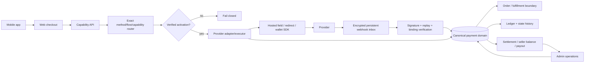
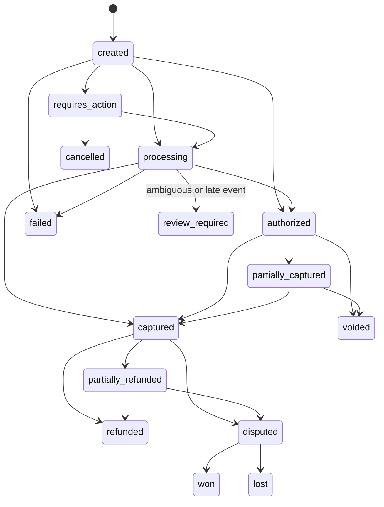

# TDF payment platform: Ecuador market decision, implementation audit, and activation record

**Market verification date:** 2026-09-14 (America/Guayaquil)
**Implementation update:** 2026-09-14; current PlaceToPay and PayPhone execution sources were rechecked on that date

**Entity assumption:** an Ecuadorian S.A.S.; merchant and tax status must be confirmed by counsel/accounting

**Commercial scope:** Ecuador and international buyers; charges and settlement primarily in USD
**Evidence rule:** `documented` means an official public source supports a statement. `locally verified` means a repository test was run. `sandbox verified` means a credentialed provider sandbox was exercised. These labels are never interchangeable.

This is an engineering and market-research record, not legal, accounting, PCI, tax, or regulatory certification.

## 1. Outcome and honest readiness boundary

The minimum target portfolio is:

1. **Datafast** for the existing Ecuador card route and issuer/acquirer-approved installments.
2. **PayPal Checkout** for the distinct international PayPal wallet. PayPal Multiparty is the preferred documented marketplace path, but it is a separate approval and contract gate.
3. **PlaceToPay** for a second Ecuador gateway/failure domain, bank and DeUna redirects, links, signed notifications, and documented delayed-capture operations.
4. **PayPhone** for its distinct local wallet/QR/link ecosystem and an additional local card conversion path.

Four providers are justified because each adds a non-redundant rail or failure domain. Kushki is the preferred substitution candidate if PlaceToPay contracting fails, but adding it to the initial set duplicates local coverage. No provider may be activated merely because its capabilities appear in documentation.

**Operational provider set through the 2026-09-14 update: none.** Datafast and PayPal have repaired runtime paths but no TDF credentialed sandbox result. PlaceToPay and PayPhone now have public create/status/notification endpoints, authenticated-query reconciliation, exact capability-gated web controls, durable browser/app-switch recovery, safe return handling, and mobile paid-ticket handoff in addition to adapter contracts. They still have no TDF credentials, method/site configuration, or provider sandbox result. All production account/capability records default disabled. The public capability API and every checkout surface fail closed.

The marketplace checkout is deliberately unavailable until a provider verifies connected accounts, split settlement, and seller payouts for TDF's Ecuador contract. TDF must not pool seller funds, describe an internal balance as escrow, or simulate a split with later manual transfers.

The 2026-09-14/15 reconciliation continuation repairs caller-owned transaction
atomicity and adds database-backed query contract tests; see [ADR 0119](../adr/0119-atomic-provider-query-application.md)
and [verification](reconciliation-atomicity-2026-09-14.md). A separate 2026-09-15
continuation adds disabled, durable missed-callback recovery and shared callback/
scheduled query budgets; see [ADR 0120](../adr/0120-durable-provider-query-recovery.md)
and [query recovery evidence](query-recovery-2026-09-15.md). The
source review also identified PayPhone's inherited canceled-as-declined mapping;
its history-preserving compatibility fix remains open. No new operational
provider or staging qualification is claimed by this continuation.

## 2. Capability and access report

| Capability | Result on 2026-09-11 | Evidence and limitation |
|---|---|---|
| Repository/default branch/history | Available | `diegueins680/tdf-app`, default `main`; work began from fetched `17a33eca11d585d84435af85340beece9b51d14e` in an isolated worktree. Full local and remote history was searched for payment/provider work. |
| Issues/open PRs | Available | Current parent payment PRs #331 (canonical platform) and #332 (hosted-provider execution), their files/checks, and historical payment PRs/branches were inspected. In `TDF-mobile`, draft PRs #64, #76, and #78 were inspected; #78 is the current canonical paid-ticket branch and supersedes generated-only #76. No parallel unpublished provider branch was duplicated. |
| CI | Available/read-only | Default-branch history and every check on #331/#332 were inspected; both dependency PRs are now `CLEAN` with every reported check successful. At the 2026-09-14 12:30 America/Guayaquil post-push check, #334 had Vercel checks successful while GitHub, catalog, safe-install, and Cloudflare checks were queued or running. No pending check is represented as passing. |
| Repository writes/push/PR | Available | Authenticated GitHub permission is `ADMIN`. Branch and commits exist locally. Push and draft-PR outcomes are recorded only after those operations are performed. |
| Official internet sources | Available | Provider, BCE, SPDP, SRI, consumer-law, UAFE, and PCI SSC sources in §15 were accessed on the verification date. |
| Provider documentation/public test procedures | Partly available | Datafast, PayPal, PlaceToPay, PayPhone, Kushki, Nuvei, and dLocal publish APIs or test procedures. Public documentation does not grant TDF merchant entitlement. |
| Provider accounts/contracts/credentials | Unavailable | No TDF merchant contract, portal entitlement, sandbox credential, reserve term, acquiring-bank schedule, or settlement statement was available. No values were displayed, extracted, or invented. |
| Repository secret names | Available/read-only | GitHub repository secret names contain deployment/social credentials but no payment-provider secret names. Secret values are not readable and were not requested. |
| Configured GitHub environments | Available/read-only | `copilot`, `Preview`, `Production`, and `production-the-dream-factory/tdf` exist; no environment-level payment secret names were present. Their existence does not prove payment configuration. |
| Local toolchain | Available | Node/npm, Stack/GHC, PostgreSQL, repository migration scripts, web/mobile generators, and test suites are available. |
| Fly staging/production session | Unavailable | The local Fly session has no usable token. No app secrets, logs, deployment, or staging payment flow were inspected in this run. |
| Production deploy/live transaction | Not authorized | Not performed. |

The original checkout at `/Users/diegosaa/GitHub/tdf-app` contained user changes and was left untouched. Runtime work was audited in `/Users/diegosaa/GitHub/tdf-app-payments`; the dependent checkout implementation is isolated in `/Users/diegosaa/GitHub/tdf-app-payment-checkout`.

## 3. Existing-system audit and reuse decisions

The repository already had a substantial canonical commerce base: checkout sessions, provider attempts/bindings, verified payment evidence, an encrypted provider-event inbox, refunds/disputes, receipts, ledger entries, holds, idempotency, reconciliation, role checks, and audit rows. Merged parent payment work was reused rather than duplicated. Current draft parent PRs #331 and #332 and mobile PRs #64, #76, and #78 were inspected before this dependent implementation; generated-only mobile #76 is superseded by #78, and the dependency/overlap is explicit in the delivery topology.

| Area | 2026-09-11 classification | Finding / action |
|---|---|---|
| Canonical checkout and evidence | Existing, locally verified | Preserved. New payment intents bind to attempts and immutable provider resources. |
| Money | Existing and extended | `Int64`/`BIGINT` minor units are authoritative. The canonical schema separates amount, tax, provider fee, commission, refund, and net components. No new floating-point money was introduced. |
| State/audit | Existing and extended | Explicit intent, authorization, capture, refund, dispute, settlement, balance, and payout states plus append-only history/ledger records. |
| Datafast | Existing but incomplete; repaired | Hosted widget create and authenticated server status exist across service, booking, course, event, quote, and marketplace-era modules. Configuration validation/redaction, attempt binding, exact capability routing, and public visibility were hardened. No sandbox proof. |
| PayPal | Existing but incomplete; repaired | Orders create/capture, verified webhook processing, late/ambiguous capture reconciliation, and refund primitives exist. Runtime visibility now additionally requires webhook ID and inbox encryption configuration. No sandbox proof, subscription runtime, or approved Multiparty entitlement. |
| Stripe | Historical integration; not viable for direct Ecuador entity | References and history are preserved. Public marketplace UI already hides its option. It is not admitted to canonical routing because Ecuador is absent from Stripe's published direct merchant country list. |
| Manual bank/cash/POS | Existing evidence workflows | Bank transfer remains a manually verified pending method only where instructions and exact runtime capability are enabled. Cash/POS remain historical/out of online scope. Customer evidence never fulfills an order by itself. |
| Provider boundary | Previously incomplete; implemented for selected adapter contracts | Stable create/query/cancel/authorize/capture/void/refund/reversal types, safe transport, redacted errors, capability profiles, and exact method-capability evidence are present. Product-specific remote calls remain technical debt. |
| PlaceToPay | Missing operational credentials; shared executor and client recovery implemented disabled | Create/status endpoint, exact account method restriction, signed notification, authenticated query, fixed hosts, redirect allowlist, amount/currency/reference binding, durable ambiguous-operation handling, exact server-offered controls, safe return/app-switch recovery, and mocked tests exist. No TDF credentials or sandbox evidence. |
| PayPhone | Missing operational credentials; shared executor and client polling implemented disabled | API Sale create/status, authenticated reconciliation, official external-notification aliases, exact binding, fixed host, exact server-offered wallet control, phone validation, polling, app-switch recovery, and mocked tests exist. Browser/external notification is never payment evidence. No TDF credentials or controlled-test evidence. |
| Checkout method display | Defective; repaired where compliant | Ticket, course, booking, Domo quote, and mixing/mastering service surfaces now consume exact canonical readiness labels and the shared hosted executor. Merch and marketplace remain limited to their existing gated rails because compliant connected-account/split/payout entitlement is not established. No optimistic browser-key visibility. |
| Mobile paid tickets | Defective/duplicated; repaired | Native legacy Stripe was removed from the paid flow. Mobile opens the canonical web ticket checkout with only validated tier/quantity context; free tickets retain the no-charge server path. |
| Admin operations | Previously fragmented; implemented read-only overview | Strict-admin endpoint/UI show redacted provider readiness, canonical payment totals, attempts, refunds, disputes, reconciliation, settlements, commissions, seller balances, payouts, and audit history. Secret/provider payload fields are excluded. |
| Marketplace custody | Noncompliant risk; blocked | Attempt creation now requires connected accounts + split settlement + seller payouts. Datafast and manual transfer cannot pass. PayPal remains disabled until contract approval. |

### Known implementation boundary

- Existing Datafast and PayPal remote calls are not yet consolidated into the new adapter executor; the shared runtime gate prevents bypass, but consolidation remains follow-up work.
- PlaceToPay and PayPhone shared execution, notification/query reconciliation, web return/app-switch/polling/restore, and mobile paid-ticket handoff are implemented. A tab-scoped pending-creation record is written before transmission; if the response is interrupted, only the exact same provider/method and idempotency key can recover it. Their labels remain invisible unless exact database, contract, credential, runtime, method, flow, and capability gates pass; credentialed tests are still required.
- Recurring mandates, saved-card removal, payment-link issuance, authorization/capture executors, connected-account onboarding, and payout execution have canonical data models/capabilities but no production-ready provider workflow.
- The current `ZZ` buyer-country route is an unknown-country input until a hosted provider supplies billing country. It cannot grant a country-specific capability.

## 4. Ecuador payment-method matrix

| Method | Ecuador/international coverage | USD | Viable selected route | Material constraints | Decision |
|---|---|---:|---|---|---|
| Ecuador-issued credit/debit cards | Local Visa/Mastercard; Amex/Diners/Discover depend on provider/acquirer | Yes | Datafast; PlaceToPay backup; PayPhone fallback | Exact debit, BIN, foreign-card, 3DS, and network acceptance are contractual. | Implement only exact verified capability. |
| Foreign-issued cards | Datafast and PayPhone document international-card acceptance; PlaceToPay entitlement is contract-specific | Yes | Same hosted routes | Local installments generally do not apply. FX may be charged by issuer/provider. | Supported target; unverified for TDF. |
| Local installments | Datafast issuer/acquirer plans; PayPhone publishes 3/6/9/12 interest-bearing terms | Yes | Datafast primary; PayPhone fallback | PayPhone: minimum USD 50 and published issuer exclusions. Datafast term eligibility must come from acquirer response. | Never pre-promise eligibility/rate. |
| Bank redirect/button | PlaceToPay method set contract-specific; Kushki documents Ecuador transfer redirect | Yes | PlaceToPay; Kushki substitution | Bank list, expiry, amount limits, refunds, and settlement differ. | Selected but blocked by contract/sandbox. |
| DeUna QR/deep link/reference | PlaceToPay and Kushki document DeUna redirect/reference flows | Yes | PlaceToPay | A consumer wallet's existence is not merchant API entitlement. | Selected but blocked. |
| PayPhone wallet/QR | Distinct Ecuador wallet and merchant QR | Yes | PayPhone | No public cryptographic notification scheme was found; authenticated query is mandatory. | Backend and client polling/recovery implemented disabled; provider verification blocked. |
| PayPal wallet | Ecuador business accounts appear in PayPal's merchant fee market; broad international buyer wallet | Yes | PayPal | Product/withdrawal/limitation terms and reserve are account-specific. | Existing path; disabled pending verification. |
| Apple Pay / Google Pay | Consumer availability exists in Ecuador | Yes | None proved | Consumer issuer support does not prove Ecuador merchant acquiring/token entitlement. | Blocked; quote/contract required. |
| Shareable payment links | Datafast Datalink, PlaceToPay, PayPhone API Link, Kushki Smartlinks | Yes | PlaceToPay + PayPhone | Authenticate status server-side; link expiry, refunds, fees, recurring use vary. | Model present; separate link API executors remain blocked. |
| Saved cards/tokenization | Documented by Datafast, PlaceToPay, Kushki and PayPhone products | Yes | Datafast/PlaceToPay | Provider vault only; explicit consent and deletion; never PAN/CVV. | Blocked until exact entitlement and UX. |
| Recurring/subscriptions | PayPal Subscriptions; Datafast merchant-scheduled token charging; PlaceToPay/Kushki recurring; PayPhone commercial subscription product | Yes | PayPal + Datafast/PlaceToPay | Mandate, cancellation, retry/dunning, notice, tax, and credential-on-file rules differ. | Canonical model only; no runtime claim. |
| Preauthorization/delayed capture/void | PayPal and PlaceToPay document authorization lifecycle | Yes | PlaceToPay + PayPal | Hold expiry/partial capture/void semantics are provider-specific. | Canonical states only; executor blocked. |
| Full/partial refunds | PayPal and PlaceToPay document refunds; other provider behavior is method/settlement-specific | Yes | Original provider only | Same-day reversal differs from post-settlement refund. Refund fees are quote/account-specific. | PayPal primitive exists; others blocked. |
| Connected sellers/split/payout | PayPal Multiparty documents Ecuador business-seller onboarding for approved partners; PlaceToPay dispersion needs written Ecuador terms; Kushki split is beta/global configuration | Yes | PayPal preferred | KYC, reserve, fees, dispute loss, tax invoice, beneficial owner, and payout liability require contract/legal review. | Marketplace blocked; no TDF custody. |
| Cash voucher/collection | Exists in the market | Yes | None | Fraud, expiry, reconciliation, and fulfillment risk. | Research only; user did not authorize implementation. |
| Cryptoassets | BCE states cryptoassets are not legal tender or an authorized payment method in Ecuador | N/A | None | Additional UAFE/VASP and volatility concerns. | Research only; do not implement. |

## 5. Provider viability and commercial matrix

`Quote required` means the exact TDF price, tax treatment, setup fee, monthly fee, refund/chargeback fee, reserve, FX spread, settlement timing, or bank condition is not established by a public source.

The complete BCE register dated 2026-07-10 was screened, including 62 auxiliary-payment participants and both listed SEDPEs. Registration as a switch, processor, remittance company, or public-resource collector is not itself a merchant acquiring product. Providers below are the merchant-facing candidates for which an API/product could be identified, plus every newly authorized gateway/aggregator. Alignet Ecuador, Cardtech, Etiko's, Micropagos, Paggo, Paymóvil, and Pagoseguro appear in gateway/aggregation/processing roles but had no official public evidence set establishing all five mandatory gates—direct Ecuador S.A.S. onboarding, USD settlement, maintained merchant API, usable sandbox, and suitable security controls—so they are grouped as **not currently viable pending vendor evidence**, not silently omitted. Switch-only, compensation-only, remittance-only, and public-collection-only entities fail the intended merchant-acceptance use case.

| Provider | Ecuador S.A.S. onboarding / conditions | Coverage and USD | Fees / settlement / reconciliation | Lifecycle/security/API | Marketplace/links/support | Classification |
|---|---|---|---|---|---|---|
| **Datafast** | Ecuador merchant/acquirer contract, active bank account in the merchant's name, RUC/activity, legal docs, underwriting, credentials-on-request, technical certification; exact reserve quote required | Local/international cards, contract-dependent networks, issuer-approved installments; USD documented | Exact pricing/tax/setup/monthly/refund/chargeback/reserve/FX remains **quote required**. The developer portal publishes indicative credit timings by acquirer/plan (24h, 48h, 7 days, or twice monthly), but TDF's contractual settlement schedule remains unverified. No customer surcharge is implemented; any future surcharge needs written acquirer and Ecuador counsel approval. | Hosted PCI widget, TLS 1.2/SHA-2, 3DS/OTP and authenticated status; token/recurring documentation; refunds/auth-capture entitlements unproved | Datalink exists; no public compliant connected-account marketplace capability established; local support | Existing but incomplete; selected primary card route |
| **PayPal** | Ecuador appears in applicable merchant-fee market; business account/app underwriting and limitations apply; Multiparty requires approved-partner/product approval | PayPal wallet and cross-border buyers; USD receive/fixed fee published | EC domestic/international commercial: 5.40% + USD 0.30 published; volume tiers require approval; withdrawal, FX, dispute, refund, reserve, settlement terms depend on account | OAuth REST, sandbox, idempotent request IDs, verified webhook API, auth/capture/void/refund/disputes/subscriptions documented | Multiparty seller onboarding/delayed disbursement/platform fee documented but contract-blocked; international support | Existing but incomplete; selected wallet and prospective marketplace route |
| **PlaceToPay** | Ecuador test/production endpoints and onboarding documented; merchant/acquirer contract/legal docs/underwriting **quote required** | Cards, bank/DeUna redirects and links depend on Ecuador contract; USD target | Pricing/tax/setup/monthly/refund/chargeback/reserve/FX/settlement **quote required**; authenticated session queries aid reconciliation | Sandbox, versioned docs, WebCheckout, SHA-256 signed notifications, query/cancel/refund; gateway auth/capture/void operations documented; exact partial operations depend on method | Links/microsites and dispersion are documented generally; Ecuador marketplace liability must be confirmed; regional support | Selected backup/bank/DeUna; one-time execution and client recovery implemented but disabled pending exact method IDs, credentials, and sandbox evidence |
| **PayPhone** | Ecuador business signup uses identity/RUC and agreement; store/token/test users required | Visa/Mastercard/Diners/Discover, debit/credit, PayPhone wallet, QR, link; USD | Public 5% + IVA on commission, no monthly fee; wallet balance appears in seconds and bank transfer advertised free; refunds/chargebacks/reserve/FX quote required | PCI DSS 4.0 claim; API Sale/query/cancel/reversal docs; controlled tests; external notification lacks a public signature scheme found in review | Link/button/QR/API; collaborator transfers are not a compliant marketplace split; local support | Selected distinct local rail; API Sale backend and client polling/recovery implemented but disabled pending credentials, approval, and controlled-test evidence |
| **Kushki** | BCE-listed Ecuador entity; merchant onboarding/underwriting/contract quote required | Cards, transfer redirect, DeUna, Smartlinks, recurring | All TDF commercial fees/settlement/reserve/FX quote required | UAT and maintained docs; hosted tokenization/OTP; 2026 EC model matrix marks 3DS and auth/capture unavailable in the documented aggregator/acquirer models | Third-party commissions beta in EC/MX and globally applied once enabled; written marketplace fit required | Viable substitute/redundant; not implemented |
| Medianet | Local merchant/acquirer documents and published tariff exist | Ecuador card acquiring/USD | Public tariff exists; exact TDF bundle, taxes, settlement, refunds, reserves quote required | REST/manual integration claimed; a usable public sandbox was not established | No public connected-account evidence | Viable local card fallback, lower priority |
| Nuvei/Paymentez | Ecuador merchant offering appears available; underwriting/contract required | Cards/token routes/USD | Quote required | Maintained SDK/API/sandbox; direct card API affects PCI scope | Marketplace product is beta and Ecuador entitlement not established | Viable but redundant; marketplace blocked |
| dLocal | Ecuador is a processing market, but direct Ecuador S.A.S. onboarding as merchant/platform was not proved | Broad cross-border/local methods | Quote required | API, hosted flows, test credentials, webhooks | Platforms onboarding is sales-led | Blocked by entity/onboarding evidence |
| PagoPlux | Ecuador product marketed; S.A.S. contract conditions not verified | Local card/link claims/USD | Quote required | Public resources exist; sandbox/security evidence insufficient | Marketplace evidence insufficient | Fails verification/sandbox gate |
| Payválida | BCE lists Ecuador aggregation; the provider publishes Ecuador merchant/developer material, but the exact S.A.S. contract and underwriting remain quote-required | Ecuador links, QR, wallet, collection, transfer, subscription/card-enrolment, payout, and SFTP reconciliation APIs are documented; its Ecuador page explicitly marks card acceptance unavailable in Ecuador | Pricing, tax, reserve, FX, and settlement quote required | Versioned developer docs and PCI DSS 4.0 claim exist; a self-service TDF-usable sandbox and exact webhook/idempotency evidence were not established | Cashout/payout APIs exist, but connected-account split/liability evidence is insufficient | Viable future link/collection/recurring candidate; blocked by sandbox/contract and redundant for selected initial rails |
| Bpay | BCE lists payment aggregation (authorization dated 2026-07-09) | Exact methods/coverage/settlement not publicly established | Quote required | No maintained public merchant API and usable sandbox were established | No connected-account evidence | Fails API/sandbox and evidence gates |
| Truepay | BCE lists payment gateway operation (authorization dated 2026-05-22) | Exact methods/coverage/settlement not publicly established | Quote required | No maintained public merchant API and usable sandbox were established | No connected-account evidence | Fails API/sandbox and evidence gates |
| PayRetailers EC | BCE lists the Ecuador entity as a payment switch; global PayRetailers docs publish REST/sandbox pay-in/payout products | Ecuador availability in global docs is bank-transfer-specific; direct local merchant entitlement and USD settlement were not proved | Quote required | Maintained global API/sandbox exists, but the local authorized role and merchant contract must match the intended flow | Platform/payout entitlement not proved for TDF | Blocked by Ecuador entity/onboarding/settlement evidence |
| Direct DeUna | Ecuador business product | DeUna wallet/QR/USD | Quote required | Business API advertised; public equivalent test process insufficient | No marketplace evidence | Viable but redundant through selected PSP |
| PeiGo direct | Ecuador merchant QR exists | Wallet/QR/USD | Quote required | No maintained public merchant API and sandbox established | No marketplace evidence | Fails API/sandbox gate |
| Stripe | Ecuador absent from published supported merchant countries | Not applicable to direct EC entity | Not applicable | Strong API/sandbox/security elsewhere | Connect cannot cure entity eligibility | Not viable for direct TDF Ecuador merchant |
| Mercado Pago | Ecuador absent from official country product availability | Not applicable | Not applicable | Maintained elsewhere | Not applicable | Not viable |

Customer support reliability and authorization/conversion are qualitative until TDF obtains provider acceptance data, incident SLAs, and at least 90 days of production evidence. No unsupported authorization-rate claim is made.

## 6. Weighted provider selection

Scores are 1 (weak/unknown) through 5 (strong). Publicly unverified commercial terms score 3 or below. Total = sum of `score × weight` divided by 100.

| Criterion | Weight | Datafast | PayPal | PlaceToPay | PayPhone | Kushki |
|---|---:|---:|---:|---:|---:|---:|
| Payment-method/geographic coverage | 25% | 4 | 4 | 5 | 4 | 5 |
| Expected authorization/conversion | 15% | 5 | 4 | 4 | 3 | 4 |
| Required lifecycle/platform features | 15% | 3 | 5 | 4 | 3 | 3 |
| Total cost transparency/value | 10% | 3 | 1 | 3 | 3 | 3 |
| Settlement/reconciliation | 10% | 4 | 2 | 4 | 5 | 4 |
| Ecuador operational support | 10% | 5 | 2 | 4 | 5 | 4 |
| Reliability/fallback value | 10% | 4 | 4 | 4 | 3 | 4 |
| Integration/maintenance effort | 5% | 4 | 4 | 3 | 4 | 3 |
| **Weighted total / 5** | **100%** | **4.00** | **3.45** | **4.10** | **3.70** | **3.95** |

The matrix is not a simple winner-takes-all ranking. Datafast retains existing local acquiring work, PayPal adds the only selected global wallet and prospective compliant marketplace route, PlaceToPay adds bank/DeUna and another failure domain, and PayPhone adds its own wallet/QR. Kushki scores well but overlaps PlaceToPay; it is the substitution candidate, not a fifth initial integration.

## 7. Canonical architecture and routing decision

The governing ADR is [ADR 0115](../adr/0115-provider-neutral-payment-routing.md). Existing ADRs 0100–0114 remain authoritative for domain-linked checkout, verified payment evidence, money/holds, guest capabilities, immutable ledger, marketplace custody, services, courses, and tickets.

Core invariants:

- An order is not a payment, and a browser redirect is not provider evidence.
- Every money value is an integer minor unit paired with an immutable uppercase currency.
- Provider references are immutable after binding.
- The adapter declares exact method-operation capabilities; APIs and UI do not expose unsupported actions.
- Retries reuse stable idempotency keys. A different provider is allowed only after authoritative `no charge` evidence; timeout/transport loss is ambiguous and requires reconciliation.
- Fulfillment, invoicing, settlement, seller liability, and payout are separate transitions.
- A marketplace attempt requires verified provider-managed connected accounts, split settlement, and payouts.

## 8. Canonical payment state model

Every transition is validated and recorded with actor/source, prior/new state, time, idempotency/correlation reference, and redacted reason. Out-of-order events are stored before application. A terminal or economically inconsistent event goes to reconciliation/review rather than silently rewriting history.

## 9. Security and threat model

| Threat | Required control / implementation status |
|---|---|
| Amount/currency/order manipulation | Server-authoritative order totals; exact provider amount/currency/reference binding; integer minor units. Implemented in canonical/runtime and adapter verification. |
| Duplicate charge/double submission | Client busy state; stable idempotency keys; DB uniqueness; provider request IDs; no cross-provider fallback on ambiguity. Implemented for repaired flows. |
| Webhook forgery | Provider signature verification where documented, environment-specific host/certificate constraints, and authenticated provider status query. PayPhone notification alone is never evidence. |
| Replay/duplicate event | Persistent inbox, provider/event unique keys, digest, processing status, attempt count, replay metadata, and idempotent application. Existing and preserved. |
| Out-of-order event | Store first; compare provider occurrence/effective state; reject invalid transition or queue reconciliation. Existing/canonical behavior. |
| IDOR/guest-order takeover | Random lookup token stored hashed, constant-time verification, no token in query URLs, and admin role checks. Existing flows preserved; mobile forwards no PII/token. |
| Authorization/refund bypass | Capability gate plus strict admin authorization, idempotency, original-provider constraint, dual-control lifecycle, immutable audit. Read-only overview added; not all provider refund executors exist. |
| Seller payout fraud | Provider-managed funds, connected-account binding, balance constraints, preparer/approver separation, immutable payout destination reference, reconciliation before execution. Schema/gates present; executor blocked. |
| Secret exposure/SSRF | Environment secret mechanism; no secrets in source; fixed HTTPS provider hosts; redirects disabled; time/body limits; redacted request/error/log types. Implemented in adapter transport. |
| PAN/CVV leakage | Hosted provider UI/tokenization only; canonical DTOs contain no PAN/CVV/magnetic-stripe fields; payload/log redaction. Never store prohibited authentication data. |
| Sensitive provider payload logging | Encrypted inbox payload, digest/index metadata, redacted admin DTOs and public errors. Verify retention/access policy before production. |
| Reconciliation failure | Canonical expected vs observed transaction/settlement records, exceptions, immutable ledger/history, operational dashboard. Models/UI exist; scheduled provider import remains blocked. |
| Availability/provider outage | Priority routing by exact method; health/config gates; safe fallback only on conclusive no-charge result. PlaceToPay/PayPhone add target resilience after activation. |

**Transport follow-up, 2026-09-15 UTC:** the initial adapter body-size check ran
after full buffering, and legacy Datafast/PayPal helpers did not share its
controls. [ADR 0117](../adr/0117-shared-bounded-payment-transport.md) repairs those
gaps with streaming limits, a total deadline and a separate no-implicit-retry
payment manager. Datafast retains its validated `oppwa.com` origin family;
other selected providers use exact API hosts. This supersedes any inference that
the initial transport already enforced a streaming/body deadline everywhere.
[Execution evidence](http-boundary-2026-09-14.md) distinguishes tests from the
still-unverified merchant sandboxes and staging payments. Historical encrypted
payload retention remains subject to the [notification minimization boundary](notification-minimization-2026-09-14.md).

**Identity follow-up, 2026-09-15 UTC:** [ADR 0118](../adr/0118-signed-payment-notification-identity.md)
replaces raw-body-derived PlaceToPay IDs with signed-evidence identities for new
rows. Concurrent formatting and unsigned-field variants converge; exact old
redelivery preserves the original inbox reference. A reformatted pre-upgrade
event may create one canonical query-trigger row, so this is not historical
cleanup. See [verification and remaining limits](notification-identity-2026-09-14.md).

## 10. PCI, privacy, consumer, tax, and regulated fund flow

### PCI DSS

Hosted redirects or fully provider-hosted iframe elements minimize scope, but do not eliminate merchant obligations. PCI SSC states that every card-capture element must remain inside the TPSP iframe for SAQ A eligibility, and its June 2026 FAQ confirms ASV scanning applies to SAQ A e-commerce pages even when redirecting or embedding an iframe. Datafast's script widget and any future provider script must be isolated, inventoried, CSP-restricted, integrity/change monitored as applicable, and reviewed by TDF's acquirer/QSA. Direct API PAN capture is prohibited.

### Ecuador personal data

The LOPDP requires a lawful basis, transparency, purpose/data minimization, security, processor/controller allocation, data-subject rights, incident handling, retention rules, and controls for international transfers. Provider DPAs, subprocessor locations, support access, webhook payload fields, and transfer mechanisms require privacy review. High-risk profiling/fraud decisions, identity documents, connected sellers, and payment histories require a documented risk/DPIA determination. TDF should store only provider tokens/references and minimum contact/invoice data.

### Consumer and recurring disclosures

Before consent the checkout must show merchant identity, goods/service, total and currency, customer-paid fee/tax, delivery/deposit terms, installment cash/financed price and schedule, renewal cadence, cancellation/refund rules, and an accessible record. Saved-method consent and subscription consent must be separate, explicit, revocable, and supported by a direct cancellation route. Provider success does not override Ecuador consumer remedies or TDF's stated policy.

### SRI and accounting

Provider receipt, order receipt, and SRI electronic invoice are distinct artifacts. Accounting must decide invoice issuer for TDF sales versus third-party seller sales; IVA base/rate/exemptions; commissions and provider service invoices; withholding; refunds/credit notes; deposits/deferred revenue; foreign-provider services; and seller liabilities. Canonical ledger categories support separation but do not encode a legal tax conclusion.

### Aggregation, custody, and marketplace

BCE authorization categories and provider terms make fund possession/settlement structure material. Before activation, Ecuador counsel must approve the fund-flow diagram and determine TDF's role, whether any PSAP/SEDPE/payment-aggregation restriction applies, the provider's regulated role, KYC/beneficial-owner allocation, reserve/chargeback liability, and UAFE obligations. The only currently accepted technical architecture is provider-managed seller onboarding and settlement. An internal ledger tracks liabilities; it does not authorize custody.

## 11. Configuration and activation gates

Every environment needs a database provider-account row with all three gates true—feature enabled, credentials validated, contract approved—plus exact verified methods and method-capability evidence. Code defaults keep production disabled.

Additional runtime gates:

- Datafast: valid environment-specific HTTPS host, entity/authorization configuration, certified return/status flow.
- PayPal: environment-matched client credentials, `PAYPAL_WEBHOOK_ID`, and a `COMMERCE_EVENT_ENCRYPTION_KEY` of at least 32 characters.
- Manual bank: explicit instructions plus independent verifier process.
- PlaceToPay: requires login/secret, HTTPS return/notification URLs, at least one exact site payment-method mapping, ready account/contract/credential rows, exact verified capabilities, and notification/worker flags. Backend and client recovery exist; exposure still requires credentialed sandbox evidence and explicit exact-method activation.
- PayPhone: requires token/store/response URL, ready account/contract/credential rows, exact verified wallet capabilities, and notification/worker flags. The backend executor, `NotificacionPago` compatibility route, client polling, and app-switch recovery exist; exposure still requires controlled-test evidence and explicit activation.

See [operator runbooks](operator-runbooks.md) for configuration, sandbox, webhook, reconciliation, refund, dispute, settlement, payout, rollback, and incident steps. Secret values must use the approved environment secret manager and must never enter source, migrations, logs, screenshots, issue bodies, or PR text.

## 12. Migration, compatibility, and rollback

- Historical payment/order/provider references are preserved; no destructive production data operation was performed.
- Canonical lifecycle and capability migrations are additive and registered in the release manifest.
- Provider catalogs are documentation-only; activation is a separate exact-evidence migration and defaults disabled.
- Rollback scripts refuse to discard financial evidence. The provider catalog rollback removes only rows with exact migration-owned source tags.
- Before rollout: back up, compare row counts/sums by currency/provider/domain, apply to a disposable production-schema fixture, re-run idempotently, and reconcile provider bindings.
- After rollout: repeat counts/sums, verify unmatched legacy references, and keep old API/state compatibility until all consumers and generated clients are deployed.
- Roll back application code/feature flags before schema. Never delete evidence, ledger, refund, dispute, settlement, seller-balance, payout, or inbox rows to make rollback succeed.

## 13. Test matrix and evidence boundary

The complete local regression was recorded at `2026-09-12T06:34:46Z` (`2026-09-12T01:34:46-05:00`, America/Guayaquil) against parent code commit `2eac48e2b4b0588ad162fe7fd44808b799261567` and mobile commit `c1ae3e34b53f8e709d361677d20b9778bdf87d61`. Subsequent delivery-gate repairs refreshed catalog governance, exposed an existing-account signup exit, aligned the merch HTTP fixture with the canonical schema, registered an omitted public-booking idempotency migration, and removed a PostgreSQL bootstrap race. Each repair received a focused local regression; GitHub's final code/evidence run verified parent commit `ac018a3f1afed8e59c8f7d3c4188ecc01e709e72`. The local environment was macOS 14.7.7 (23H723), Node 24.8.0, npm 11.6.0, Stack 3.7.1 x86_64, and PostgreSQL 16.10/17 in disposable containers. No provider environment was used. The timestamp is the complete-regression evidence-recording time immediately after the original command set; later corrective commands and hosted timestamps are recorded below rather than misrepresented as provider evidence.

| Scope | Evidence class | Result |
|---|---|---|
| Provider-neutral route/money/state/adapter tests | Local mocked/unit/property | 24 examples, 0 failures after exact-method/runtime changes. Mock payloads are sanitized documentation examples. |
| Hosted-provider execution update | Local compiled mocked/unit | On 2026-09-14, `stack test --fast --test-arguments='--match=provider'` passed 76 examples after adding durable create/query reconciliation, exact PlaceToPay method restriction, and PayPhone notification parsing. This is not provider sandbox evidence. |
| Hosted checkout surfaces and interruption recovery | Local compiled/static/mocked web | At parent commits `df92012aa` and `fa11c3044`, `stack test --fast --test-arguments='--match provider'` passed 77 examples; six focused Jest suites passed 23 tests; full UI lint, typecheck, production build, and the 378,243-byte gzip initial-JS budget passed. The tests cover exact labels, safe redirects, pre-response/post-response recovery, authoritative release, alternate-rail locking, and an event integration. No provider environment was used. |
| Checkout catalog authority | Local deterministic governance audit | The first #334 hosted scan correctly rejected nine new/changed client payment lists and one stale predecessor. Each was reviewed against the canonical database authority; `npm run test:catalog-list-audit && npm run audit:catalog-lists` then passed across 1,411 files and 1,122 candidates with zero unreviewed or stale decisions. |
| Provider execution migration | Disposable PostgreSQL 16 | Apply twice, one-create-per-attempt, encrypted redirect/no plaintext, immutable provider resource and trust type, production untrusted-callback retention, rollback refusal with evidence, preservation of operator-modified flags, clean rollback, and reapply passed. |
| Provider execution automatic-release path | Disposable PostgreSQL 17 and compiled backend | On 2026-09-14, the complete manifest including `2026-09-13_provider_execution_runtime` applied to the production-schema fixture, the backend became healthy, release-schema verification passed, and a second startup produced the same schema checksum. No production or provider environment was used. |
| Canonical payment lifecycle/catalog migration | Disposable PostgreSQL 16 | Apply, constraints, activation gates, reapply, catalog rollback, and intentional evidence-preserving rollback refusal passed. |
| Automatic production-schema startup | Disposable PostgreSQL 16 | Full registered migration startup and a second idempotent startup passed; the disposable database was then stopped and removed. No production data was read or changed. |
| Admin operations view | Local web unit | 2 tests passed; generated OpenAPI web types refreshed. |
| Service capability visibility | Local web unit | 3 tests passed, including fail-closed no-route behavior. |
| Capability client | Local web unit | 2 tests passed, including marketplace connected/split/payout requirements. |
| Backend complete regression | Local compiled/unit/integration with mocked provider boundaries | `stack test --fast`: 2,544 examples, 0 failures. This is not a provider sandbox result. |
| Web complete quality gate | Local lint/typecheck/unit/build | `npm run quality:ui`: lint and typecheck passed; 207/207 suites and 1,870/1,870 tests passed; production Vite build passed; initial-JS budget passed at 378,245 gzip bytes against the 419,840-byte limit. Non-fatal pre-existing test warnings remain documented in terminal output. |
| Signup recovery repair | Local focused unit/E2E | Login-page unit tests passed 3/3; the exact Chromium `anonymous RSVP survives signup` persona test passed 1/1 at parent commit `669bb70e06ddfb146658546905e6a1a5be54cde5`. |
| Merch canonical-schema fixture repair | Local disposable PostgreSQL 16 and hosted PostgreSQL 17 | The first local attempt exposed the missing intent-binding migration and failed before test execution; after aligning the full migration order, `test-artist-merch-runtime.sh` passed 1/1 at `207be3a3042e06a16210e2a5cefab7252652c7d8`. Hosted run `34749197695` and final run `34770799230` both passed this exact HTTP runtime step. |
| Public-booking migration/concurrency repair | Local disposable PostgreSQL 17 and hosted PostgreSQL 17 | Two initial local setup attempts failed while the official image performed its bootstrap restart; after adding a bounded second readiness check and registering `2026-09-09_public_booking_tentative_idempotency`, automatic migrations were idempotent and the live HTTP harness passed: equal replay 200/200, changed-payload reuse 409, overlapping resource 200/409, and no orphan party/receipt/resource rows. Final hosted run `34770799230` passed the same migration and concurrency steps. |
| Mobile paid/free ticket routing | Local mobile lint/typecheck/unit/regression | `npm run quality:mobile`: 68/68 suites and 329/329 tests passed at mobile commit `c1ae3e34b53f8e709d361677d20b9778bdf87d61`; OpenAPI types were regenerated afterward with no diff. Non-fatal SafeAreaView deprecation and disabled-PostHog notices are not payment failures. |
| Generated API clients | Local deterministic generation | The web generator and the same `openapi-typescript` 7.10.1 command for mobile regenerated both clients with no diff. The checkout worktree's aggregate mobile script reported the submodule install as incomplete, so no claim is made that this wrapper ran; the generated mobile file itself was reproduced and mobile commit `90a08f56` passed typecheck in its installed worktree. |
| Repository invariants | Local repository test gate | `npm run quality:repo` passed: generated audit artifacts had no diff; 8 studio-audit tests, 42 auto-loop tests, 4 formal-audit tests, 60 production-release tests, 19 CI-pipeline tests, 2 visual-artifact tests, and 3 persona-program tests passed. Formal audit reported 0 critical and 0 error findings (351 advisory warnings). |
| Final pull-request verification | GitHub Actions and preview checks | At `ac018a3f1afed8e59c8f7d3c4188ecc01e709e72`, [run 34770799230](https://github.com/diegueins680/tdf-app/actions/runs/34770799230) and associated checks completed with 17/17 passing: backend, UI, mobile, repository, API contracts, migrations, production-migration aggregate, persona E2E, catalog authority, clean install, Datadog build, Vercel, and Cloudflare. This is hosted CI evidence, not a provider sandbox or staging payment result. |
| Datafast provider sandbox | Provider sandbox | **Not executed:** credentials/account/certification unavailable. |
| PayPal provider sandbox | Provider sandbox | **Not executed:** app/webhook/account credentials unavailable. |
| PlaceToPay provider sandbox | Provider sandbox | **Not executed:** login/secret/merchant contract unavailable. |
| PayPhone controlled test | Provider sandbox/equivalent | **Not executed:** token/store/test users unavailable. |
| Staging flows/deploy | Staging | **Not executed:** no authorized Fly session/provider credentials. |

Local mocks establish code behavior, not provider availability, authorization performance, settlement, or contractual entitlement.

Corrective history is retained rather than hidden: run `34697890582` failed because the isolated merch fixture lacked `commerce_provider_account`; run `34749197695` then proved the merch repair but exposed the unregistered booking migration, while a separate repository install lost its npm cache connection and timed out downloading a native prebuild. A fresh runner passed the unchanged lockfile. Run `34769935245` was superseded after catalog authority correctly required one refreshed decision. Final run `34770799230` passed after these repairs.

Required credentialed cases before activation: approved/declined/cancelled/pending/timeout/3DS, redirect/app switch/network interruption, duplicate submit/idempotent replay, signed and forged webhook, duplicate/reordered webhook, late capture, full/partial refund, void, dispute, settlement mismatch, mandate cancellation, and—only after marketplace approval—seller onboarding/split/fee/refund/dispute/payout.

## 14. Blockers and shortest concrete path

### Datafast

1. Execute an Ecuador merchant/acquirer agreement and confirm USD account, enabled networks/debit/foreign cards/installments, 3DS, token/recurring, auth/capture, reversal/refund/dispute, fees/tax/reserve/settlement/reconciliation.
2. Obtain sandbox entity ID and authorization material through Datafast's official process; register URLs.
3. Store credentials in staging secrets, activate only exact sandbox method-capability rows, complete Datafast certification/security evidence, and run the credentialed matrix.

### PayPal

1. Confirm the Ecuador business account's USD receive/withdrawal status, limits, reserve, fees, disputes, and Subscriptions entitlement.
2. Create sandbox app/accounts, register webhook, add client credentials, webhook ID, and inbox encryption key to staging secrets.
3. Run create/approve/capture/pending/decline/cancel/refund/webhook/replay/reorder/reconciliation tests.
4. Apply for approved-partner Multiparty/platform-fee/delayed-disbursement capabilities and obtain written Ecuador seller eligibility/liability before marketplace activation.

### PlaceToPay

1. Obtain Ecuador contract/login/secret/acquirer terms and exact cards, bank, DeUna, link, recurring, auth/capture/void/refund/dispersion entitlements, pricing and settlement.
2. Configure the implemented shared executor with the exact site payment-method IDs, register return/notification URLs, and activate exact sandbox rows only. Verify the implemented web/mobile return and restore UX against the real sandbox.
3. Run signed/forged notification, authoritative query, timeout/ambiguity, method restriction, refund, void, link, and bank/DeUna tests. Marketplace dispersion requires separate written legal/commercial approval.

### PayPhone

1. Complete business/RUC agreement and obtain development token, store ID, and controlled test users.
2. Confirm notification authentication, post-settlement refund, dispute/chargeback, token/subscription, foreign-card, fee, reserve, and settlement behavior in writing.
3. Register the implemented `/NotificacionPago` notification compatibility path, verify the implemented app-switch/polling UX with controlled users, and run API Sale/query/cancel/reversal/timeout/duplicate/notification tests. Do not treat collaborator transfers as split settlement.

### Human reviews before production

- Ecuador counsel: entity/provider contracts, consumer/recurring terms, LOPDP/DPA/transfers/DPIA, marketplace fund flow/aggregation/custody/KYC/UAFE, seller/dispute/refund liability.
- Ecuador accounting/tax: invoice issuer, IVA/withholding/credit notes, commissions/provider fees, deposits/deferred revenue, seller liabilities/payouts, foreign services.
- Acquirer/QSA/security: PCI scope/SAQ, ASV scans, hosted component boundaries, CSP/script controls, incident/retention/access controls.
- Finance/operations: bank ownership, dual control, daily reconciliation, settlement exceptions, dispute SLAs, refund approval, payout destinations.

## 15. Official source register

All sources were accessed or revalidated **2026-09-14**. Confidence is **high** for a fact directly stated in the source and **medium** where an individual contract, underwriting, issuer, or fast-changing product matrix can narrow it.

### Ecuador authorities, privacy, tax, consumer, PCI

- **High:** [BCE authorized PSAD/SEDPE register, displayed update 2026-07-10](https://www.bce.fin.ec/storage/BCE/sistemas_auxiliares/Catastro-PSAD-SEDPE-autorizadas.pdf) — complete authorized-role screening source, including Datafast, PlaceToPay, Kushki, Medianet, Bpay, Payválida, Truepay, PayRetailers EC, Ecuapayphone, and Plux; a register entry does not prove a TDF contract, merchant product, API, or sandbox.
- **High:** [BCE auxiliary payment systems](https://www.bce.fin.ec/sistema-de-pagos/sistema-auxiliar-de-pagos/) and [authorization requirements](https://www.bce.fin.ec/servicios-y-tramites/calificacion-y-autorizacion-a-entidades-financieras-entidades-publicas-no-financieras-sistemas-auxiliares-de-pago-y-agentes-economicos/requerimiento-de-autorizacion-de-entidades-como-administradoras-de-los-sistemas-auxiliares-de-pago-y-agentes-economicos/) — regulated roles and authorization expectations.
- **High:** [BCE payment-system codification](https://www.bce.fin.ec/storage/BCE/RML/BCE-GG-024-2024.pdf) — payment-system framework.
- **High:** [BCE cryptoasset notice](https://www.bce.fin.ec/los-criptoactivos-no-son-una-moneda-de-curso-legal-ni-un-medio-de-pago-autorizado-en-ecuador/) and [UAFE obligated-sector resolutions](https://www.uafe.gob.ec/resoluciones-sujetos-obligados/) — crypto/payment status and sector obligations.
- **High:** [Official LOPDP publication](https://www.registroficial.gob.ec/quinto-suplemento-al-registro-oficial-no-459/), [SPDP international-transfer rule](https://spdp.gob.ec/wp-content/uploads/2025/07/SPSP-SPD-2025-0024-R-Normativa-General-Aplicacion-de-la-LOPDP-y-su-Reglamento55-signed.pdf), and [SPDP contract clauses](https://spdp.gob.ec/wp-content/uploads/2025/05/06.01.01-SPDP-SPD-2025-0006-R-clausulas-para-contratos-en-Ecuador-signed.pdf).
- **High:** [Ecuador consumer-law compilation](https://www.produccion.gob.ec/wp-content/uploads/2025/03/LEY-ORGANICA-DE-DEFENSA-DEL-CONSUMIDOR_2022_02_11.pdf) — price, credit/installment, electronic-contract, renewal, cancellation, and remedy rules.
- **High:** [SRI electronic invoicing](https://www.sri.gob.ec/facturacion-electronica), [IVA](https://www.sri.gob.ec/impuesto-al-valor-agregado-iva), and [withholding rules](https://www.sri.gob.ec/normativa-para-agentes-de-retencion-y-contribuyentes-especiales).
- **High:** PCI SSC [iframe SAQ A eligibility](https://www.pcisecuritystandards.org/faqs/1438/), [direct-post SAQ A-EP distinction](https://www.pcisecuritystandards.org/faqs/1291/), [embedded-form script criterion](https://www.pcisecuritystandards.org/faqs/1588/), and [June 2026 SAQ A ASV requirement](https://www.pcisecuritystandards.org/faqs/1604/).

### Providers and wallets

- **High technical / medium commercial:** Datafast [developer portal](https://developers.datafast.com.ec/index.aspx), [mobile SDK](https://developers.datafast.com.ec/msdk.aspx), [recurring payments](https://developers.datafast.com.ec/pagos_recurrentes.aspx), [developer support](https://www.datafast.com.ec/Soporte/Desarrolladores), and [Datalink](https://servicios.datafast.com.ec/COMPROBANTES/PHPCD/Manual-Datalink-Desktop.php).
- **High published price/product:** PayPal [Ecuador merchant fees, updated 2026-05-28](https://www.paypal.com/ec/business/paypal-business-fees), [REST/sandbox](https://developer.paypal.com/api/rest/), [webhooks](https://developer.paypal.com/api/rest/webhooks/rest/), [authorization/capture](https://developer.paypal.com/v5/checkout/auth-capture/), [refund](https://developer.paypal.com/checkout/refund-payment/), and [subscriptions](https://developer.paypal.com/subscriptions/integrate/).
- **High technical / medium entitlement:** PayPal [seller onboarding](https://developer.paypal.com/platforms/seller-onboarding), [delayed disbursement](https://developer.paypal.com/platforms/checkout/delayed-disbursement/), and [Multiparty disputes](https://developer.paypal.com/docs/multiparty/disputes-chargebacks/integrate-disputes/).
- **High technical / medium commercial:** PlaceToPay [Ecuador test integration](https://docs.placetopay.dev/en/checkout/test-your-integration/), [session creation](https://docs.placetopay.dev/en/checkout/create-session/), [notification](https://docs.placetopay.dev/en/checkout/notification/), [refund](https://docs.placetopay.dev/en/checkout/refund/), [transaction types](https://docs.placetopay.dev/en/gateway/transaction-types/), [onboarding](https://docs.placetopay.dev/en/onboarding), and [DeUna redirect](https://docs.placetopay.dev/en/payments/external-redirects/deuna/).
- **High published price/product / medium entitlement:** PayPhone [business product and fee](https://payphone.app/para-negocios), [terms effective 2026-04-10](https://payphone.app/terminos-y-condiciones), [credentials](https://docs.payphone.app/configuracion-de-ambiente-y-credenciales), [API Sale](https://docs.payphone.app/api-sale), [notification](https://docs.payphone.app/notificacion-externa), [reversal](https://docs.payphone.app/api-reverse), [API Link](https://payphone.app/soluciones/api-link), and [subscriptions](https://payphone.app/soluciones/suscripciones).
- **High technical / medium commercial:** Kushki [Ecuador card model, updated 2026-02-19](https://docs.kushki.com/ec/card-payments/model/), [transfer/DeUna, updated 2026-09-02](https://docs.kushki.com/ec/transfer-payments/accept-a-payment/), [third-party commissions](https://docs.kushki.com/ec/card-payments/split-payments/), and [Smartlinks](https://docs.kushki.com/ec/smartlnks/smartlink/).
- **High technical / medium entitlement:** Nuvei Ecuador [developer page](https://www.nuvei.com.ec/desarrolladores/) and [marketplace beta](https://docs.nuvei.com/documentation/marketplaces-stub/overview/).
- **High market / low Ecuador-entity onboarding confidence:** dLocal [markets/FAQ](https://www.dlocal.com/faqs/), [test payment](https://docs.dlocal.com/docs/make-a-test-payment), and [Platforms onboarding](https://docs.dlocal.com/docs/onboarding-process-platforms).
- **High local / medium integration:** Medianet [e-commerce instructions](https://www.medianet.com.ec/ayuda_instructivo_ecommerce.php), [FAQ](https://www.medianet.com.ec/faqs.php), and [tariff](https://www.medianet.com.ec/pdfs/contratos/Anexo_7_Tarifas_de_Productos_y_Servicios.pdf).
- **Medium:** PagoPlux [payment button](https://www.plux.ec/boton-de-pagos/) and [resources](https://www.plux.ec/recursos/); direct DeUna [business/API offer](https://www.deuna.ec/negocios/empresas); PeiGo [merchant QR](https://www.peigo.com.ec/comercios-cobrar-con-billetera-virtual-peigo).
- **High product / medium entitlement:** Payválida [Ecuador availability](https://payvalida.com/ecuador/), [developer portal](https://payvalida.com/desarrolladores/), and [API overview](https://docs.payvalida.com/index) — links, QR, wallet/collection, subscriptions, cashout, reconciliation, and the explicit Ecuador card limitation; exact merchant contract and sandbox access remain unverified.
- **High global technical / low Ecuador entitlement:** PayRetailers [developer documentation](https://docs.payretailers.com/) — maintained global API/sandbox evidence; the BCE register lists the Ecuador entity as a switch only, so direct local merchant settlement/platform entitlement remains unproved. No Ecuador-specific official API or sandbox for Bpay or Truepay was found; similarly named foreign services were rejected as non-evidence.
- **High:** [Stripe global merchant availability](https://stripe.com/global) and [Mercado Pago country availability](https://www.mercadopago.com.br/developers/en/docs/getting-started).
- **High consumer availability / medium merchant relevance:** Apple [country availability](https://support.apple.com/en-eg/102775) and [Latin American banks](https://support.apple.com/es-la/109524); Google [payment country availability](https://support.google.com/googlepay/answer/12429287) and [Ecuador banks/cards](https://support.google.com/wallet/answer/12059326?co=GENIE.CountryCode%3DEC).

## 16. Delivery topology

The intended review order is:

1. Baseline correctness repair.
2. Canonical intent/capability/runtime routing, additive migrations, research, and ADR.
3. Redacted admin operations and generated web contract.
4. Checkout visibility and mobile canonical ticket handoff.
5. A later credentialed provider evidence/activation PR for each provider; activation must never be bundled with unverified adapter code.

The current dependent delivery is:

1. [tdf-app draft PR #331](https://github.com/diegueins680/tdf-app/pull/331), branch `codex/payment-platform-20260911`: canonical platform, migrations, research, ADR, operations UI, and earlier quality repairs.
2. [tdf-app draft PR #332](https://github.com/diegueins680/tdf-app/pull/332), branch `codex/payment-provider-execution-20260913`: PlaceToPay/PayPhone durable backend execution, notification inbox, authoritative query, and reconciliation.
3. [tdf-app draft PR #334](https://github.com/diegueins680/tdf-app/pull/334), branch `codex/payment-checkout-surfaces-20260914`, based on #332: executable-label/OpenAPI commit `df92012aa`, checkout/recovery commit `fa11c3044`, and this evidence update.
4. [TDF-mobile draft PR #78](https://github.com/diegueins680/TDF-mobile/pull/78), branch `codex/provider-neutral-ticket-checkout-20260911`, head `90a08f56fcd8df08dac2effd9253bceeb2c3e9a8`: canonical paid-ticket web handoff and the current generated contract. It supersedes generated-only #76 and retains its #64 ancestry.

No branch was merged and no staging or production deployment occurred.
