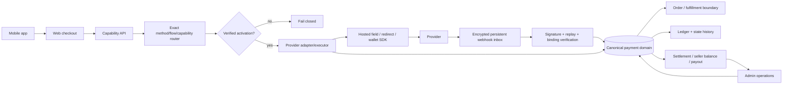
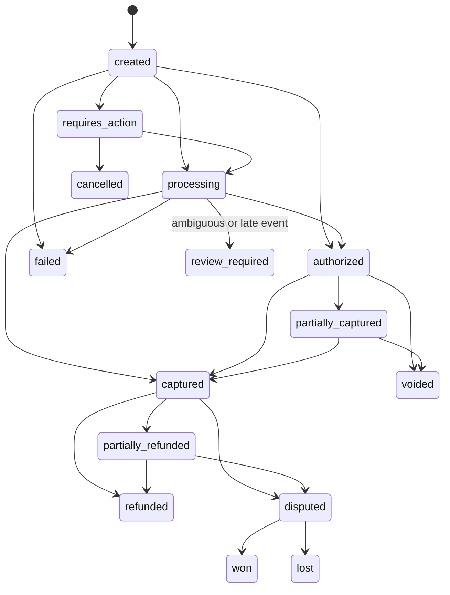

# TDF payment platform: Ecuador market decision, implementation audit, and activation record

**Verification date:** 2026-09-11 (America/Guayaquil)  
**Entity assumption:** an Ecuadorian S.A.S.; merchant and tax status must be confirmed by counsel/accounting  
**Commercial scope:** Ecuador and international buyers; charges and settlement primarily in USD  
**Evidence rule:** `documented` means an official public source supports a statement. `locally verified` means a repository test was run. `sandbox verified` means a credentialed provider sandbox was exercised. These labels are never interchangeable.

This is an engineering and market-research record, not legal, accounting, PCI, tax, or regulatory certification.

## 1. Outcome and honest readiness boundary

The minimum target portfolio is:

1. **Datafast** for the existing Ecuador card route and issuer/acquirer-approved installments.
2. **PayPal Checkout** for the distinct international PayPal wallet. PayPal Multiparty is the preferred documented marketplace path, but it is a separate approval and contract gate.
3. **PlaceToPay** for a second Ecuador gateway/failure domain, bank and DeUna redirects, links, signed notifications, and documented delayed-capture operations.
4. **PayPhone** for its distinct local wallet/QR/link ecosystem and an additional local card conversion path.

Four providers are justified because each adds a non-redundant rail or failure domain. Kushki is the preferred substitution candidate if PlaceToPay contracting fails, but adding it to the initial set duplicates local coverage. No provider may be activated merely because its capabilities appear in documentation.

**Operational provider set on 2026-09-11: none.** Datafast and PayPal have repaired runtime paths but no TDF credentialed sandbox result. PlaceToPay and PayPhone have disabled adapter contracts only, not public end-to-end executors. All production account/capability records default disabled. The public capability API and all repaired checkout surfaces fail closed.

The marketplace checkout is deliberately unavailable until a provider verifies connected accounts, split settlement, and seller payouts for TDF's Ecuador contract. TDF must not pool seller funds, describe an internal balance as escrow, or simulate a split with later manual transfers.

## 2. Capability and access report

| Capability | Result on 2026-09-11 | Evidence and limitation |
|---|---|---|
| Repository/default branch/history | Available | `diegueins680/tdf-app`, default `main`; work began from fetched `17a33eca11d585d84435af85340beece9b51d14e` in an isolated worktree. Full local and remote history was searched for payment/provider work. |
| Issues/open PRs | Available | GitHub reports open issues #128 and #130 and no open PRs. Neither issue concerns payments. Historical payment PRs and their merged code were inspected. |
| CI | Available/read-only | Recent default-branch workflow results and failing job logs were inspected. No check was represented as passing unless run locally or reported successful by GitHub. |
| Repository writes/push/PR | Available | Authenticated GitHub permission is `ADMIN`. Branch and commits exist locally. Push and draft-PR outcomes are recorded only after those operations are performed. |
| Official internet sources | Available | Provider, BCE, SPDP, SRI, consumer-law, UAFE, and PCI SSC sources in §15 were accessed on the verification date. |
| Provider documentation/public test procedures | Partly available | Datafast, PayPal, PlaceToPay, PayPhone, Kushki, Nuvei, and dLocal publish APIs or test procedures. Public documentation does not grant TDF merchant entitlement. |
| Provider accounts/contracts/credentials | Unavailable | No TDF merchant contract, portal entitlement, sandbox credential, reserve term, acquiring-bank schedule, or settlement statement was available. No values were displayed, extracted, or invented. |
| Repository secret names | Available/read-only | GitHub repository secret names contain deployment/social credentials but no payment-provider secret names. Secret values are not readable and were not requested. |
| Configured GitHub environments | Available/read-only | `Preview`, `Production`, and `production-the-dream-factory/tdf` exist. Their existence does not prove payment configuration. |
| Local toolchain | Available | Node/npm, Stack/GHC, PostgreSQL, repository migration scripts, web/mobile generators, and test suites are available. |
| Fly staging/production session | Unavailable | The local Fly session has no usable token. No app secrets, logs, deployment, or staging payment flow were inspected in this run. |
| Production deploy/live transaction | Not authorized | Not performed. |

The original checkout at `/Users/diegosaa/GitHub/tdf-app` contained user changes and was left untouched. Work is isolated in `/Users/diegosaa/GitHub/tdf-app-payments`.

## 3. Existing-system audit and reuse decisions

The repository already had a substantial canonical commerce base: checkout sessions, provider attempts/bindings, verified payment evidence, an encrypted provider-event inbox, refunds/disputes, receipts, ledger entries, holds, idempotency, reconciliation, role checks, and audit rows. Merged payment PRs were reused rather than duplicated. No open payment PR existed to conflict with this branch.

| Area | 2026-09-11 classification | Finding / action |
|---|---|---|
| Canonical checkout and evidence | Existing, locally verified | Preserved. New payment intents bind to attempts and immutable provider resources. |
| Money | Existing and extended | `Int64`/`BIGINT` minor units are authoritative. The canonical schema separates amount, tax, provider fee, commission, refund, and net components. No new floating-point money was introduced. |
| State/audit | Existing and extended | Explicit intent, authorization, capture, refund, dispute, settlement, balance, and payout states plus append-only history/ledger records. |
| Datafast | Existing but incomplete; repaired | Hosted widget create and authenticated server status exist across service, booking, course, event, quote, and marketplace-era modules. Configuration validation/redaction, attempt binding, exact capability routing, and public visibility were hardened. No sandbox proof. |
| PayPal | Existing but incomplete; repaired | Orders create/capture, verified webhook processing, late/ambiguous capture reconciliation, and refund primitives exist. Runtime visibility now additionally requires webhook ID and inbox encryption configuration. No sandbox proof, subscription runtime, or approved Multiparty entitlement. |
| Stripe | Historical integration; not viable for direct Ecuador entity | References and history are preserved. Public marketplace UI already hides its option. It is not admitted to canonical routing because Ecuador is absent from Stripe's published direct merchant country list. |
| Manual bank/cash/POS | Existing evidence workflows | Bank transfer remains a manually verified pending method only where instructions and exact runtime capability are enabled. Cash/POS remain historical/out of online scope. Customer evidence never fulfills an order by itself. |
| Provider boundary | Previously incomplete; implemented for selected adapter contracts | Stable create/query/cancel/authorize/capture/void/refund/reversal types, safe transport, redacted errors, capability profiles, and exact method-capability evidence are present. Product-specific remote calls remain technical debt. |
| PlaceToPay | Missing; selected adapter contract implemented disabled | Signed notification, authenticated query, fixed hosts, redirect allowlist, amount/currency/reference binding, and mock contract tests exist. No public executor/return flow or credentials. |
| PayPhone | Missing; narrow adapter contract implemented disabled | API Sale/query/cancel/same-day reversal contracts, fixed host, exact binding, and mock tests exist. Browser notification is never payment evidence. No public executor or credentials. |
| Checkout method display | Defective; repaired | Ticket, course, booking, Domo, merch, service, and legacy marketplace presentation now depend on canonical environment/method/flow/capability readiness. No optimistic browser-key visibility. |
| Mobile paid tickets | Defective/duplicated; repaired | Native legacy Stripe was removed from the paid flow. Mobile opens the canonical web ticket checkout with only validated tier/quantity context; free tickets retain the no-charge server path. |
| Admin operations | Previously fragmented; implemented read-only overview | Strict-admin endpoint/UI show redacted provider readiness, canonical payment totals, attempts, refunds, disputes, reconciliation, settlements, commissions, seller balances, payouts, and audit history. Secret/provider payload fields are excluded. |
| Marketplace custody | Noncompliant risk; blocked | Attempt creation now requires connected accounts + split settlement + seller payouts. Datafast and manual transfer cannot pass. PayPal remains disabled until contract approval. |

### Known implementation boundary

- Existing Datafast and PayPal remote calls are not yet consolidated into the new adapter executor; the shared runtime gate prevents bypass, but consolidation remains follow-up work.
- PlaceToPay and PayPhone adapters are pure contracts plus mock tests. They cannot be exposed until shared execution endpoints, return flows, webhook/status handling, and credentialed tests exist.
- Recurring mandates, saved-card removal, payment-link issuance, authorization/capture executors, connected-account onboarding, and payout execution have canonical data models/capabilities but no production-ready provider workflow.
- The current `ZZ` buyer-country route is an unknown-country input until a hosted provider supplies billing country. It cannot grant a country-specific capability.

## 4. Ecuador payment-method matrix

| Method | Ecuador/international coverage | USD | Viable selected route | Material constraints | Decision |
|---|---|---:|---|---|---|
| Ecuador-issued credit/debit cards | Local Visa/Mastercard; Amex/Diners/Discover depend on provider/acquirer | Yes | Datafast; PlaceToPay backup; PayPhone fallback | Exact debit, BIN, foreign-card, 3DS, and network acceptance are contractual. | Implement only exact verified capability. |
| Foreign-issued cards | Datafast and PayPhone document international-card acceptance; PlaceToPay entitlement is contract-specific | Yes | Same hosted routes | Local installments generally do not apply. FX may be charged by issuer/provider. | Supported target; unverified for TDF. |
| Local installments | Datafast issuer/acquirer plans; PayPhone publishes 3/6/9/12 interest-bearing terms | Yes | Datafast primary; PayPhone fallback | PayPhone: minimum USD 50 and published issuer exclusions. Datafast term eligibility must come from acquirer response. | Never pre-promise eligibility/rate. |
| Bank redirect/button | PlaceToPay method set contract-specific; Kushki documents Ecuador transfer redirect | Yes | PlaceToPay; Kushki substitution | Bank list, expiry, amount limits, refunds, and settlement differ. | Selected but blocked by contract/sandbox. |
| DeUna QR/deep link/reference | PlaceToPay and Kushki document DeUna redirect/reference flows | Yes | PlaceToPay | A consumer wallet's existence is not merchant API entitlement. | Selected but blocked. |
| PayPhone wallet/QR | Distinct Ecuador wallet and merchant QR | Yes | PayPhone | No public cryptographic notification scheme was found; authenticated query is mandatory. | Narrow adapter; disabled. |
| PayPal wallet | Ecuador business accounts appear in PayPal's merchant fee market; broad international buyer wallet | Yes | PayPal | Product/withdrawal/limitation terms and reserve are account-specific. | Existing path; disabled pending verification. |
| Apple Pay / Google Pay | Consumer availability exists in Ecuador | Yes | None proved | Consumer issuer support does not prove Ecuador merchant acquiring/token entitlement. | Blocked; quote/contract required. |
| Shareable payment links | Datafast Datalink, PlaceToPay, PayPhone API Link, Kushki Smartlinks | Yes | PlaceToPay + PayPhone | Authenticate status server-side; link expiry, refunds, fees, recurring use vary. | Model present; executor blocked. |
| Saved cards/tokenization | Documented by Datafast, PlaceToPay, Kushki and PayPhone products | Yes | Datafast/PlaceToPay | Provider vault only; explicit consent and deletion; never PAN/CVV. | Blocked until exact entitlement and UX. |
| Recurring/subscriptions | PayPal Subscriptions; Datafast merchant-scheduled token charging; PlaceToPay/Kushki recurring; PayPhone commercial subscription product | Yes | PayPal + Datafast/PlaceToPay | Mandate, cancellation, retry/dunning, notice, tax, and credential-on-file rules differ. | Canonical model only; no runtime claim. |
| Preauthorization/delayed capture/void | PayPal and PlaceToPay document authorization lifecycle | Yes | PlaceToPay + PayPal | Hold expiry/partial capture/void semantics are provider-specific. | Canonical states only; executor blocked. |
| Full/partial refunds | PayPal and PlaceToPay document refunds; other provider behavior is method/settlement-specific | Yes | Original provider only | Same-day reversal differs from post-settlement refund. Refund fees are quote/account-specific. | PayPal primitive exists; others blocked. |
| Connected sellers/split/payout | PayPal Multiparty documents Ecuador business-seller onboarding for approved partners; PlaceToPay dispersion needs written Ecuador terms; Kushki split is beta/global configuration | Yes | PayPal preferred | KYC, reserve, fees, dispute loss, tax invoice, beneficial owner, and payout liability require contract/legal review. | Marketplace blocked; no TDF custody. |
| Cash voucher/collection | Exists in the market | Yes | None | Fraud, expiry, reconciliation, and fulfillment risk. | Research only; user did not authorize implementation. |
| Cryptoassets | BCE states cryptoassets are not legal tender or an authorized payment method in Ecuador | N/A | None | Additional UAFE/VASP and volatility concerns. | Research only; do not implement. |

## 5. Provider viability and commercial matrix

`Quote required` means the exact TDF price, tax treatment, setup fee, monthly fee, refund/chargeback fee, reserve, FX spread, settlement timing, or bank condition is not established by a public source.

| Provider | Ecuador S.A.S. onboarding / conditions | Coverage and USD | Fees / settlement / reconciliation | Lifecycle/security/API | Marketplace/links/support | Classification |
|---|---|---|---|---|---|---|
| **Datafast** | Ecuador merchant/acquirer contract, bank relationship, legal docs, underwriting, credentials-on-request, technical certification; exact reserve quote required | Local/international cards, contract-dependent networks, issuer-approved installments; USD documented | All merchant pricing, tax, setup/monthly, refund, chargeback, reserve, FX, and settlement timing: **quote required**; status/portal reconciliation documented | Hosted PCI widget, TLS 1.2/SHA-2, 3DS/OTP and authenticated status; token/recurring documentation; refunds/auth-capture entitlements unproved | Datalink exists; no public compliant connected-account marketplace capability established; local support | Existing but incomplete; selected primary card route |
| **PayPal** | Ecuador appears in applicable merchant-fee market; business account/app underwriting and limitations apply; Multiparty requires approved-partner/product approval | PayPal wallet and cross-border buyers; USD receive/fixed fee published | EC domestic/international commercial: 5.40% + USD 0.30 published; volume tiers require approval; withdrawal, FX, dispute, refund, reserve, settlement terms depend on account | OAuth REST, sandbox, idempotent request IDs, verified webhook API, auth/capture/void/refund/disputes/subscriptions documented | Multiparty seller onboarding/delayed disbursement/platform fee documented but contract-blocked; international support | Existing but incomplete; selected wallet and prospective marketplace route |
| **PlaceToPay** | Ecuador test/production endpoints and onboarding documented; merchant/acquirer contract/legal docs/underwriting **quote required** | Cards, bank/DeUna redirects and links depend on Ecuador contract; USD target | Pricing/tax/setup/monthly/refund/chargeback/reserve/FX/settlement **quote required**; authenticated session queries aid reconciliation | Sandbox, versioned docs, WebCheckout, SHA-256 signed notifications, query/cancel/refund; gateway auth/capture/void operations documented; exact partial operations depend on method | Links/microsites and dispersion are documented generally; Ecuador marketplace liability must be confirmed; regional support | Selected backup/bank/DeUna; adapter only, disabled |
| **PayPhone** | Ecuador business signup uses identity/RUC and agreement; store/token/test users required | Visa/Mastercard/Diners/Discover, debit/credit, PayPhone wallet, QR, link; USD | Public 5% + IVA on commission, no monthly fee; wallet balance appears in seconds and bank transfer advertised free; refunds/chargebacks/reserve/FX quote required | PCI DSS 4.0 claim; API Sale/query/cancel/reversal docs; controlled tests; external notification lacks a public signature scheme found in review | Link/button/QR/API; collaborator transfers are not a compliant marketplace split; local support | Selected distinct local rail; narrow adapter only, disabled |
| **Kushki** | BCE-listed Ecuador entity; merchant onboarding/underwriting/contract quote required | Cards, transfer redirect, DeUna, Smartlinks, recurring | All TDF commercial fees/settlement/reserve/FX quote required | UAT and maintained docs; hosted tokenization/OTP; 2026 EC model matrix marks 3DS and auth/capture unavailable in the documented aggregator/acquirer models | Third-party commissions beta in EC/MX and globally applied once enabled; written marketplace fit required | Viable substitute/redundant; not implemented |
| Medianet | Local merchant/acquirer documents and published tariff exist | Ecuador card acquiring/USD | Public tariff exists; exact TDF bundle, taxes, settlement, refunds, reserves quote required | REST/manual integration claimed; a usable public sandbox was not established | No public connected-account evidence | Viable local card fallback, lower priority |
| Nuvei/Paymentez | Ecuador merchant offering appears available; underwriting/contract required | Cards/token routes/USD | Quote required | Maintained SDK/API/sandbox; direct card API affects PCI scope | Marketplace product is beta and Ecuador entitlement not established | Viable but redundant; marketplace blocked |
| dLocal | Ecuador is a processing market, but direct Ecuador S.A.S. onboarding as merchant/platform was not proved | Broad cross-border/local methods | Quote required | API, hosted flows, test credentials, webhooks | Platforms onboarding is sales-led | Blocked by entity/onboarding evidence |
| PagoPlux | Ecuador product marketed; S.A.S. contract conditions not verified | Local card/link claims/USD | Quote required | Public resources exist; sandbox/security evidence insufficient | Marketplace evidence insufficient | Fails verification/sandbox gate |
| Direct DeUna | Ecuador business product | DeUna wallet/QR/USD | Quote required | Business API advertised; public equivalent test process insufficient | No marketplace evidence | Viable but redundant through selected PSP |
| PeiGo direct | Ecuador merchant QR exists | Wallet/QR/USD | Quote required | No maintained public merchant API and sandbox established | No marketplace evidence | Fails API/sandbox gate |
| Stripe | Ecuador absent from published supported merchant countries | Not applicable to direct EC entity | Not applicable | Strong API/sandbox/security elsewhere | Connect cannot cure entity eligibility | Not viable for direct TDF Ecuador merchant |
| Mercado Pago | Ecuador absent from official country product availability | Not applicable | Not applicable | Maintained elsewhere | Not applicable | Not viable |

Customer support reliability and authorization/conversion are qualitative until TDF obtains provider acceptance data, incident SLAs, and at least 90 days of production evidence. No unsupported authorization-rate claim is made.

## 6. Weighted provider selection

Scores are 1 (weak/unknown) through 5 (strong). Publicly unverified commercial terms score 3 or below. Total = sum of `score × weight` divided by 100.

| Criterion | Weight | Datafast | PayPal | PlaceToPay | PayPhone | Kushki |
|---|---:|---:|---:|---:|---:|---:|
| Payment-method/geographic coverage | 25% | 4 | 4 | 5 | 4 | 5 |
| Expected authorization/conversion | 15% | 5 | 4 | 4 | 3 | 4 |
| Required lifecycle/platform features | 15% | 3 | 5 | 4 | 3 | 3 |
| Total cost transparency/value | 10% | 3 | 1 | 3 | 3 | 3 |
| Settlement/reconciliation | 10% | 4 | 2 | 4 | 5 | 4 |
| Ecuador operational support | 10% | 5 | 2 | 4 | 5 | 4 |
| Reliability/fallback value | 10% | 4 | 4 | 4 | 3 | 4 |
| Integration/maintenance effort | 5% | 4 | 4 | 3 | 4 | 3 |
| **Weighted total / 5** | **100%** | **4.00** | **3.45** | **4.10** | **3.70** | **3.95** |

The matrix is not a simple winner-takes-all ranking. Datafast retains existing local acquiring work, PayPal adds the only selected global wallet and prospective compliant marketplace route, PlaceToPay adds bank/DeUna and another failure domain, and PayPhone adds its own wallet/QR. Kushki scores well but overlaps PlaceToPay; it is the substitution candidate, not a fifth initial integration.

## 7. Canonical architecture and routing decision

The governing ADR is [ADR 0115](../adr/0115-provider-neutral-payment-routing.md). Existing ADRs 0100–0114 remain authoritative for domain-linked checkout, verified payment evidence, money/holds, guest capabilities, immutable ledger, marketplace custody, services, courses, and tickets.

Core invariants:

- An order is not a payment, and a browser redirect is not provider evidence.
- Every money value is an integer minor unit paired with an immutable uppercase currency.
- Provider references are immutable after binding.
- The adapter declares exact method-operation capabilities; APIs and UI do not expose unsupported actions.
- Retries reuse stable idempotency keys. A different provider is allowed only after authoritative `no charge` evidence; timeout/transport loss is ambiguous and requires reconciliation.
- Fulfillment, invoicing, settlement, seller liability, and payout are separate transitions.
- A marketplace attempt requires verified provider-managed connected accounts, split settlement, and payouts.

## 8. Canonical payment state model

Every transition is validated and recorded with actor/source, prior/new state, time, idempotency/correlation reference, and redacted reason. Out-of-order events are stored before application. A terminal or economically inconsistent event goes to reconciliation/review rather than silently rewriting history.

## 9. Security and threat model

| Threat | Required control / implementation status |
|---|---|
| Amount/currency/order manipulation | Server-authoritative order totals; exact provider amount/currency/reference binding; integer minor units. Implemented in canonical/runtime and adapter verification. |
| Duplicate charge/double submission | Client busy state; stable idempotency keys; DB uniqueness; provider request IDs; no cross-provider fallback on ambiguity. Implemented for repaired flows. |
| Webhook forgery | Provider signature verification where documented, environment-specific host/certificate constraints, and authenticated provider status query. PayPhone notification alone is never evidence. |
| Replay/duplicate event | Persistent inbox, provider/event unique keys, digest, processing status, attempt count, replay metadata, and idempotent application. Existing and preserved. |
| Out-of-order event | Store first; compare provider occurrence/effective state; reject invalid transition or queue reconciliation. Existing/canonical behavior. |
| IDOR/guest-order takeover | Random lookup token stored hashed, constant-time verification, no token in query URLs, and admin role checks. Existing flows preserved; mobile forwards no PII/token. |
| Authorization/refund bypass | Capability gate plus strict admin authorization, idempotency, original-provider constraint, dual-control lifecycle, immutable audit. Read-only overview added; not all provider refund executors exist. |
| Seller payout fraud | Provider-managed funds, connected-account binding, balance constraints, preparer/approver separation, immutable payout destination reference, reconciliation before execution. Schema/gates present; executor blocked. |
| Secret exposure/SSRF | Environment secret mechanism; no secrets in source; fixed HTTPS provider hosts; redirects disabled; time/body limits; redacted request/error/log types. Implemented in adapter transport. |
| PAN/CVV leakage | Hosted provider UI/tokenization only; canonical DTOs contain no PAN/CVV/magnetic-stripe fields; payload/log redaction. Never store prohibited authentication data. |
| Sensitive provider payload logging | Encrypted inbox payload, digest/index metadata, redacted admin DTOs and public errors. Verify retention/access policy before production. |
| Reconciliation failure | Canonical expected vs observed transaction/settlement records, exceptions, immutable ledger/history, operational dashboard. Models/UI exist; scheduled provider import remains blocked. |
| Availability/provider outage | Priority routing by exact method; health/config gates; safe fallback only on conclusive no-charge result. PlaceToPay/PayPhone add target resilience after activation. |

## 10. PCI, privacy, consumer, tax, and regulated fund flow

### PCI DSS

Hosted redirects or fully provider-hosted iframe elements minimize scope, but do not eliminate merchant obligations. PCI SSC states that every card-capture element must remain inside the TPSP iframe for SAQ A eligibility, and its June 2026 FAQ confirms ASV scanning applies to SAQ A e-commerce pages even when redirecting or embedding an iframe. Datafast's script widget and any future provider script must be isolated, inventoried, CSP-restricted, integrity/change monitored as applicable, and reviewed by TDF's acquirer/QSA. Direct API PAN capture is prohibited.

### Ecuador personal data

The LOPDP requires a lawful basis, transparency, purpose/data minimization, security, processor/controller allocation, data-subject rights, incident handling, retention rules, and controls for international transfers. Provider DPAs, subprocessor locations, support access, webhook payload fields, and transfer mechanisms require privacy review. High-risk profiling/fraud decisions, identity documents, connected sellers, and payment histories require a documented risk/DPIA determination. TDF should store only provider tokens/references and minimum contact/invoice data.

### Consumer and recurring disclosures

Before consent the checkout must show merchant identity, goods/service, total and currency, customer-paid fee/tax, delivery/deposit terms, installment cash/financed price and schedule, renewal cadence, cancellation/refund rules, and an accessible record. Saved-method consent and subscription consent must be separate, explicit, revocable, and supported by a direct cancellation route. Provider success does not override Ecuador consumer remedies or TDF's stated policy.

### SRI and accounting

Provider receipt, order receipt, and SRI electronic invoice are distinct artifacts. Accounting must decide invoice issuer for TDF sales versus third-party seller sales; IVA base/rate/exemptions; commissions and provider service invoices; withholding; refunds/credit notes; deposits/deferred revenue; foreign-provider services; and seller liabilities. Canonical ledger categories support separation but do not encode a legal tax conclusion.

### Aggregation, custody, and marketplace

BCE authorization categories and provider terms make fund possession/settlement structure material. Before activation, Ecuador counsel must approve the fund-flow diagram and determine TDF's role, whether any PSAP/SEDPE/payment-aggregation restriction applies, the provider's regulated role, KYC/beneficial-owner allocation, reserve/chargeback liability, and UAFE obligations. The only currently accepted technical architecture is provider-managed seller onboarding and settlement. An internal ledger tracks liabilities; it does not authorize custody.

## 11. Configuration and activation gates

Every environment needs a database provider-account row with all three gates true—feature enabled, credentials validated, contract approved—plus exact verified methods and method-capability evidence. Code defaults keep production disabled.

Additional runtime gates:

- Datafast: valid environment-specific HTTPS host, entity/authorization configuration, certified return/status flow.
- PayPal: environment-matched client credentials, `PAYPAL_WEBHOOK_ID`, and a `COMMERCE_EVENT_ENCRYPTION_KEY` of at least 32 characters.
- Manual bank: explicit instructions plus independent verifier process.
- PlaceToPay/PayPhone: remain hard-disabled until a complete shared executor/return path exists, regardless of database changes.

See [operator runbooks](operator-runbooks.md) for configuration, sandbox, webhook, reconciliation, refund, dispute, settlement, payout, rollback, and incident steps. Secret values must use the approved environment secret manager and must never enter source, migrations, logs, screenshots, issue bodies, or PR text.

## 12. Migration, compatibility, and rollback

- Historical payment/order/provider references are preserved; no destructive production data operation was performed.
- Canonical lifecycle and capability migrations are additive and registered in the release manifest.
- Provider catalogs are documentation-only; activation is a separate exact-evidence migration and defaults disabled.
- Rollback scripts refuse to discard financial evidence. The provider catalog rollback removes only rows with exact migration-owned source tags.
- Before rollout: back up, compare row counts/sums by currency/provider/domain, apply to a disposable production-schema fixture, re-run idempotently, and reconcile provider bindings.
- After rollout: repeat counts/sums, verify unmatched legacy references, and keep old API/state compatibility until all consumers and generated clients are deployed.
- Roll back application code/feature flags before schema. Never delete evidence, ledger, refund, dispute, settlement, seller-balance, payout, or inbox rows to make rollback succeed.

## 13. Test matrix and evidence boundary

Final local verification was recorded at `2026-09-12T06:34:46Z` (`2026-09-12T01:34:46-05:00`, America/Guayaquil) against parent code commit `2eac48e2b4b0588ad162fe7fd44808b799261567` and mobile commit `c1ae3e34b53f8e709d361677d20b9778bdf87d61`. The environment was macOS 14.7.7 (23H723), Node 24.8.0, npm 11.6.0, Stack 3.7.1 x86_64, and PostgreSQL 16.10. No provider environment was used. The timestamp is the final evidence-recording time immediately after the commands; earlier exploratory reruns were local-only and are not misrepresented as separate provider evidence.

| Scope | Evidence class | Result |
|---|---|---|
| Provider-neutral route/money/state/adapter tests | Local mocked/unit/property | 24 examples, 0 failures after exact-method/runtime changes. Mock payloads are sanitized documentation examples. |
| Canonical payment lifecycle/catalog migration | Disposable PostgreSQL 16 | Apply, constraints, activation gates, reapply, catalog rollback, and intentional evidence-preserving rollback refusal passed. |
| Automatic production-schema startup | Disposable PostgreSQL 16 | Full registered migration startup and a second idempotent startup passed; the disposable database was then stopped and removed. No production data was read or changed. |
| Admin operations view | Local web unit | 2 tests passed; generated OpenAPI web types refreshed. |
| Service capability visibility | Local web unit | 3 tests passed, including fail-closed no-route behavior. |
| Capability client | Local web unit | 2 tests passed, including marketplace connected/split/payout requirements. |
| Backend complete regression | Local compiled/unit/integration with mocked provider boundaries | `stack test --fast`: 2,544 examples, 0 failures. This is not a provider sandbox result. |
| Web complete quality gate | Local lint/typecheck/unit/build | `npm run quality:ui`: lint and typecheck passed; 207/207 suites and 1,870/1,870 tests passed; production Vite build passed; initial-JS budget passed at 378,245 gzip bytes against the 419,840-byte limit. Non-fatal pre-existing test warnings remain documented in terminal output. |
| Mobile paid/free ticket routing | Local mobile lint/typecheck/unit/regression | `npm run quality:mobile`: 68/68 suites and 329/329 tests passed at mobile commit `c1ae3e34b53f8e709d361677d20b9778bdf87d61`; OpenAPI types were regenerated afterward with no diff. Non-fatal SafeAreaView deprecation and disabled-PostHog notices are not payment failures. |
| Generated API clients | Local deterministic generation | `npm run generate:api` regenerated web and mobile OpenAPI types with no working-tree diff. |
| Repository invariants | Local repository test gate | `npm run quality:repo` passed: generated audit artifacts had no diff; 8 studio-audit tests, 42 auto-loop tests, 4 formal-audit tests, 60 production-release tests, 19 CI-pipeline tests, 2 visual-artifact tests, and 3 persona-program tests passed. Formal audit reported 0 critical and 0 error findings (351 advisory warnings). |
| Datafast provider sandbox | Provider sandbox | **Not executed:** credentials/account/certification unavailable. |
| PayPal provider sandbox | Provider sandbox | **Not executed:** app/webhook/account credentials unavailable. |
| PlaceToPay provider sandbox | Provider sandbox | **Not executed:** login/secret/merchant contract unavailable. |
| PayPhone controlled test | Provider sandbox/equivalent | **Not executed:** token/store/test users unavailable. |
| Staging flows/deploy | Staging | **Not executed:** no authorized Fly session/provider credentials. |

Local mocks establish code behavior, not provider availability, authorization performance, settlement, or contractual entitlement.

Required credentialed cases before activation: approved/declined/cancelled/pending/timeout/3DS, redirect/app switch/network interruption, duplicate submit/idempotent replay, signed and forged webhook, duplicate/reordered webhook, late capture, full/partial refund, void, dispute, settlement mismatch, mandate cancellation, and—only after marketplace approval—seller onboarding/split/fee/refund/dispute/payout.

## 14. Blockers and shortest concrete path

### Datafast

1. Execute an Ecuador merchant/acquirer agreement and confirm USD account, enabled networks/debit/foreign cards/installments, 3DS, token/recurring, auth/capture, reversal/refund/dispute, fees/tax/reserve/settlement/reconciliation.
2. Obtain sandbox entity ID and authorization material through Datafast's official process; register URLs.
3. Store credentials in staging secrets, activate only exact sandbox method-capability rows, complete Datafast certification/security evidence, and run the credentialed matrix.

### PayPal

1. Confirm the Ecuador business account's USD receive/withdrawal status, limits, reserve, fees, disputes, and Subscriptions entitlement.
2. Create sandbox app/accounts, register webhook, add client credentials, webhook ID, and inbox encryption key to staging secrets.
3. Run create/approve/capture/pending/decline/cancel/refund/webhook/replay/reorder/reconciliation tests.
4. Apply for approved-partner Multiparty/platform-fee/delayed-disbursement capabilities and obtain written Ecuador seller eligibility/liability before marketplace activation.

### PlaceToPay

1. Obtain Ecuador contract/login/secret/acquirer terms and exact cards, bank, DeUna, link, recurring, auth/capture/void/refund/dispersion entitlements, pricing and settlement.
2. Implement shared executor plus return/notification endpoints; register URLs; activate exact sandbox rows only.
3. Run signed/forged notification, authoritative query, timeout/ambiguity, refund, void, link, and bank/DeUna tests. Marketplace dispersion requires separate written legal/commercial approval.

### PayPhone

1. Complete business/RUC agreement and obtain development token, store ID, and controlled test users.
2. Confirm notification authentication, post-settlement refund, dispute/chargeback, token/subscription, foreign-card, fee, reserve, and settlement behavior in writing.
3. Complete shared executor/return flow and run API Sale/query/cancel/reversal/timeout/duplicate/notification tests. Do not treat collaborator transfers as split settlement.

### Human reviews before production

- Ecuador counsel: entity/provider contracts, consumer/recurring terms, LOPDP/DPA/transfers/DPIA, marketplace fund flow/aggregation/custody/KYC/UAFE, seller/dispute/refund liability.
- Ecuador accounting/tax: invoice issuer, IVA/withholding/credit notes, commissions/provider fees, deposits/deferred revenue, seller liabilities/payouts, foreign services.
- Acquirer/QSA/security: PCI scope/SAQ, ASV scans, hosted component boundaries, CSP/script controls, incident/retention/access controls.
- Finance/operations: bank ownership, dual control, daily reconciliation, settlement exceptions, dispute SLAs, refund approval, payout destinations.

## 15. Official source register

All sources were accessed **2026-09-11**. Confidence is **high** for a fact directly stated in the source and **medium** where an individual contract, underwriting, issuer, or fast-changing product matrix can narrow it.

### Ecuador authorities, privacy, tax, consumer, PCI

- **High:** [BCE authorized PSAD/SEDPE register, displayed update 2026-01-12](https://www.bce.fin.ec/storage/BCE/sistemas_auxiliares/Catastro-PSAD-SEDPE-autorizadas.pdf) — entity/authorized-role register including Datafast; a register entry does not prove a TDF contract.
- **High:** [BCE auxiliary payment systems](https://www.bce.fin.ec/sistema-de-pagos/sistema-auxiliar-de-pagos/) and [authorization requirements](https://www.bce.fin.ec/servicios-y-tramites/calificacion-y-autorizacion-a-entidades-financieras-entidades-publicas-no-financieras-sistemas-auxiliares-de-pago-y-agentes-economicos/requerimiento-de-autorizacion-de-entidades-como-administradoras-de-los-sistemas-auxiliares-de-pago-y-agentes-economicos/) — regulated roles and authorization expectations.
- **High:** [BCE payment-system codification](https://www.bce.fin.ec/storage/BCE/RML/BCE-GG-024-2024.pdf) — payment-system framework.
- **High:** [BCE cryptoasset notice](https://www.bce.fin.ec/los-criptoactivos-no-son-una-moneda-de-curso-legal-ni-un-medio-de-pago-autorizado-en-ecuador/) and [UAFE obligated-sector resolutions](https://www.uafe.gob.ec/resoluciones-sujetos-obligados/) — crypto/payment status and sector obligations.
- **High:** [Official LOPDP publication](https://www.registroficial.gob.ec/quinto-suplemento-al-registro-oficial-no-459/), [SPDP international-transfer rule](https://spdp.gob.ec/wp-content/uploads/2025/07/SPSP-SPD-2025-0024-R-Normativa-General-Aplicacion-de-la-LOPDP-y-su-Reglamento55-signed.pdf), and [SPDP contract clauses](https://spdp.gob.ec/wp-content/uploads/2025/05/06.01.01-SPDP-SPD-2025-0006-R-clausulas-para-contratos-en-Ecuador-signed.pdf).
- **High:** [Ecuador consumer-law compilation](https://www.produccion.gob.ec/wp-content/uploads/2025/03/LEY-ORGANICA-DE-DEFENSA-DEL-CONSUMIDOR_2022_02_11.pdf) — price, credit/installment, electronic-contract, renewal, cancellation, and remedy rules.
- **High:** [SRI electronic invoicing](https://www.sri.gob.ec/facturacion-electronica), [IVA](https://www.sri.gob.ec/impuesto-al-valor-agregado-iva), and [withholding rules](https://www.sri.gob.ec/normativa-para-agentes-de-retencion-y-contribuyentes-especiales).
- **High:** PCI SSC [iframe SAQ A eligibility](https://www.pcisecuritystandards.org/faqs/1438/), [direct-post SAQ A-EP distinction](https://www.pcisecuritystandards.org/faqs/1291/), [embedded-form script criterion](https://www.pcisecuritystandards.org/faqs/1588/), and [June 2026 SAQ A ASV requirement](https://www.pcisecuritystandards.org/faqs/1604/).

### Providers and wallets

- **High technical / medium commercial:** Datafast [developer portal](https://developers.datafast.com.ec/index.aspx), [mobile SDK](https://developers.datafast.com.ec/msdk.aspx), [recurring payments](https://developers.datafast.com.ec/pagos_recurrentes.aspx), [developer support](https://www.datafast.com.ec/Soporte/Desarrolladores), and [Datalink](https://servicios.datafast.com.ec/COMPROBANTES/PHPCD/Manual-Datalink-Desktop.php).
- **High published price/product:** PayPal [Ecuador merchant fees, updated 2026-05-28](https://www.paypal.com/ec/business/paypal-business-fees), [REST/sandbox](https://developer.paypal.com/api/rest/), [webhooks](https://developer.paypal.com/api/rest/webhooks/rest/), [authorization/capture](https://developer.paypal.com/v5/checkout/auth-capture/), [refund](https://developer.paypal.com/checkout/refund-payment/), and [subscriptions](https://developer.paypal.com/subscriptions/integrate/).
- **High technical / medium entitlement:** PayPal [seller onboarding](https://developer.paypal.com/platforms/seller-onboarding), [delayed disbursement](https://developer.paypal.com/platforms/checkout/delayed-disbursement/), and [Multiparty disputes](https://developer.paypal.com/docs/multiparty/disputes-chargebacks/integrate-disputes/).
- **High technical / medium commercial:** PlaceToPay [Ecuador test integration](https://docs.placetopay.dev/en/checkout/test-your-integration/), [session creation](https://docs.placetopay.dev/en/checkout/create-session/), [notification](https://docs.placetopay.dev/en/checkout/notification/), [refund](https://docs.placetopay.dev/en/checkout/refund/), [transaction types](https://docs.placetopay.dev/en/gateway/transaction-types/), [onboarding](https://docs.placetopay.dev/en/onboarding), and [DeUna redirect](https://docs.placetopay.dev/en/payments/external-redirects/deuna/).
- **High published price/product / medium entitlement:** PayPhone [business product and fee](https://payphone.app/para-negocios), [terms effective 2026-04-10](https://payphone.app/terminos-y-condiciones), [credentials](https://docs.payphone.app/configuracion-de-ambiente-y-credenciales), [API Sale](https://docs.payphone.app/api-sale), [notification](https://docs.payphone.app/notificacion-externa), [reversal](https://docs.payphone.app/api-reverse), [API Link](https://payphone.app/soluciones/api-link), and [subscriptions](https://payphone.app/soluciones/suscripciones).
- **High technical / medium commercial:** Kushki [Ecuador card model, updated 2026-02-19](https://docs.kushki.com/ec/card-payments/model/), [transfer/DeUna, updated 2026-09-02](https://docs.kushki.com/ec/transfer-payments/accept-a-payment/), [third-party commissions](https://docs.kushki.com/ec/card-payments/split-payments/), and [Smartlinks](https://docs.kushki.com/ec/smartlnks/smartlink/).
- **High technical / medium entitlement:** Nuvei Ecuador [developer page](https://www.nuvei.com.ec/desarrolladores/) and [marketplace beta](https://docs.nuvei.com/documentation/marketplaces-stub/overview/).
- **High market / low Ecuador-entity onboarding confidence:** dLocal [markets/FAQ](https://www.dlocal.com/faqs/), [test payment](https://docs.dlocal.com/docs/make-a-test-payment), and [Platforms onboarding](https://docs.dlocal.com/docs/onboarding-process-platforms).
- **High local / medium integration:** Medianet [e-commerce instructions](https://www.medianet.com.ec/ayuda_instructivo_ecommerce.php), [FAQ](https://www.medianet.com.ec/faqs.php), and [tariff](https://www.medianet.com.ec/pdfs/contratos/Anexo_7_Tarifas_de_Productos_y_Servicios.pdf).
- **Medium:** PagoPlux [payment button](https://www.plux.ec/boton-de-pagos/) and [resources](https://www.plux.ec/recursos/); direct DeUna [business/API offer](https://www.deuna.ec/negocios/empresas); PeiGo [merchant QR](https://www.peigo.com.ec/comercios-cobrar-con-billetera-virtual-peigo).
- **High:** [Stripe global merchant availability](https://stripe.com/global) and [Mercado Pago country availability](https://www.mercadopago.com.br/developers/en/docs/getting-started).
- **High consumer availability / medium merchant relevance:** Apple [country availability](https://support.apple.com/en-eg/102775) and [Latin American banks](https://support.apple.com/es-la/109524); Google [payment country availability](https://support.google.com/googlepay/answer/12429287) and [Ecuador banks/cards](https://support.google.com/wallet/answer/12059326?co=GENIE.CountryCode%3DEC).

## 16. Delivery topology

The intended review order is:

1. Baseline correctness repair.
2. Canonical intent/capability/runtime routing, additive migrations, research, and ADR.
3. Redacted admin operations and generated web contract.
4. Checkout visibility and mobile canonical ticket handoff.
5. A later credentialed provider evidence/activation PR for each provider; activation must never be bundled with unverified adapter code.

Local delivery branches are `codex/payment-platform-20260911` in `tdf-app` and `codex/provider-neutral-ticket-checkout-20260911` in `tdf-mobile`. The mobile branch head is `c1ae3e34b53f8e709d361677d20b9778bdf87d61`; the parent verification commit is `2eac48e2b4b0588ad162fe7fd44808b799261567`, followed only by delivery-evidence documentation. Remote draft-PR identifiers are added only after GitHub confirms creation. No merge or production deployment is part of this work.
