# Hosted-provider execution and reconciliation record

**Safety follow-up:** [Retry isolation and transaction-evidence repairs](retry-reconciliation-safety-2026-09-14.md)
supersede the original retry/reference and PlaceToPay transaction-validation behavior described below.
Parent checkout PR #334 subsequently passed [hosted CI run 34883596896](https://github.com/diegueins680/tdf-app/actions/runs/34883596896)
at `3b81b687753520c6b56a6128d6c110846f1a8995`; that result is not evidence for later commits.

**Implementation verification date:** 2026-09-14 (America/Guayaquil)
**Research access date:** 2026-09-14
**Scope:** PlaceToPay WebCheckout and PayPhone API Sale create/query/notification paths
**Evidence boundary:** local compilation, mocked contract tests, generated contracts, and disposable PostgreSQL only. No TDF provider credential, sandbox, staging environment, live charge, production deployment, or settlement evidence was available or used.

This record supplements the market and regulatory review in [ecuador-payment-platform-audit-2026-09-11.md](ecuador-payment-platform-audit-2026-09-11.md). It is not provider certification or legal, accounting, PCI, or production-activation approval.

## Outcome

The shared backend can create a provider-bound hosted payment operation, return durable status to a lookup-token holder, accept provider notifications, and reconcile them through an authenticated provider query. Web checkout now consumes exact server-offered PlaceToPay/PayPhone labels for tickets, courses, studio bookings, Domo deposits, and mixing/mastering orders; it persists one private attempt capability per tab, restores after redirects/app switching, polls durable status, and locks every alternative rail while a result is ambiguous or successful. Mobile paid tickets already hand off to this canonical web flow and its generated client is current. PlaceToPay and PayPhone remain operationally unavailable until the exact sandbox account, contract, credentials, method IDs, HTTPS URLs, database capability evidence, and worker flags are configured and tested.

```mermaid
flowchart LR
  C[Web or mobile checkout] -->|lookup token + idempotency key| A[Payment-session API]
  A --> R[Exact method/capability router]
  R --> I[Canonical intent + attempt]
  I --> O[Durable operation claimed ambiguous]
  O -->|fixed HTTPS host| P[PlaceToPay or PayPhone]
  P -->|hosted action or app approval| B[Buyer]
  P --> N[Notification endpoint]
  N --> E[Encrypted immutable inbox]
  E --> W[Bounded worker]
  W -->|authenticated status query| P
  W -->|exact merchant/resource/reference/amount/currency match| S[Intent + checkout + ledger]
  S --> F[Fulfilment remains domain-owned]
```



## Official-contract findings rechecked

| Finding | Official source | Accessed | Confidence | Implementation consequence |
|---|---|---|---|---|
| Ecuador PlaceToPay uses distinct test and production WebCheckout hosts. | <https://docs.placetopay.dev/en/checkout/test-your-integration/> | 2026-09-14 | High | The transport allowlist accepts only `checkout-test.placetopay.ec` or `checkout.placetopay.ec`, chosen from the immutable checkout environment. Redirect following is disabled. |
| Session creation returns `requestId` and `processUrl`; final state can be queried by `requestId`; `paymentMethod` can restrict the hosted methods. | <https://docs.placetopay.dev/en/checkout/api/reference/session/> | 2026-09-14 | High | The request stores one immutable request ID, encrypts the redirect URL, and requires an environment-specific method-code mapping. No mapping means no route. |
| WebCheckout notifications carry `requestId`, status/date, and an SHA-256 signature computed with the site secret; the endpoint must be HTTPS and should acknowledge quickly. | <https://docs.placetopay.dev/en/checkout/notification/> | 2026-09-14 | High | TDF accepts SHA-256 only, compares in constant time, stores the exact encrypted body, acknowledges without doing provider I/O, and still queries the session before changing money state. |
| PayPhone API Sale supports authenticated create and GET status lookup by PayPhone transaction ID or merchant `clientTransactionId`; responses use integer amount and USD currency fields. | <https://docs.payphone.app/api-sale> | 2026-09-14 | High | The adapter sends integer cents, a stable client reference, fixed-host bearer authentication, and queries by the stable client reference. Query success must also match the immutable PayPhone transaction ID, reference, amount, and currency. |
| PayPhone external notification is separately approved, HTTPS POST, documents PascalCase fields and `{Response, ErrorCode}`, and says the receiver method is `NotificacionPago`. The published guide does not document a cryptographic signature. | <https://docs.payphone.app/notificacion-externa> | 2026-09-14 | High for documented fields/onboarding; medium for absence of an undisclosed contractual control | Both `/NotificacionPago` and the canonical route use one handler. A matching StoreId and pre-existing local binding are required, but the event is labelled `untrusted_callback`; only the authenticated Sale query can advance payment or fulfilment. |
| PayPhone requires a Business account, developer application, token, StoreID, and test/production environment selection; external notifications require a separate review. | <https://docs.payphone.app/configuracion-de-ambiente-y-credenciales>, <https://docs.payphone.app/notificacion-externa> | 2026-09-14 | High | Configuration presence never activates routing. Account/contract/credential and exact method-capability rows remain mandatory. |

No unpublished entitlement, onboarding acceptance, fee, refund, dispute, chargeback, reserve, or settlement term was inferred from these pages.

## Public contract

- `POST /commerce/checkouts/{checkoutId}/payment-sessions` requires the opaque checkout lookup token, a 16–128-character idempotency key, a bounded User-Agent, and a strict provider/method body. It returns HTTP 202 because provider state may still require customer action or reconciliation.
- `GET /commerce/checkouts/{checkoutId}/payment-sessions/{attemptId}` restores only lookup-token-scoped, redacted durable state. Redirect URLs are decrypted only for this authorized response and must be treated as bearer capabilities.
- `POST /commerce/provider-notifications/placetopay` accepts only a valid embedded SHA-256 signature and queues an authoritative query.
- `POST /commerce/provider-notifications/payphone` and `POST /NotificacionPago` accept only a well-formed notification that already matches an immutable local sale/reference binding. They return PayPhone's exact acknowledgment casing and never treat callback fields as financial evidence.
- Administrative event listings expose `evidence_type` but not merchant bindings, encryption material, credentials, or raw payloads.

The OpenAPI source and generated web/mobile TypeScript clients contain these contracts. There is intentionally no unauthenticated mutation endpoint for cancel, capture, refund, reversal, dispute, settlement, or payout.

## Client recovery and duplicate-charge controls

- Product responses expose only exact labels returned by the runtime-ready canonical router: `placetopay_card`, `placetopay_bank_redirect`, `placetopay_deuna_qr`, or `payphone_wallet`. A browser key or provider logo cannot create availability.
- The browser validates UUIDs, opaque-token bounds, idempotency-key format, and PlaceToPay's exact Ecuador HTTPS hosts before dispatch or navigation. Card data and CVV never cross TDF client code.
- One per-provider/method idempotency key remains in tab-scoped storage until the server provides authoritative no-charge evidence. The opaque lookup token is kept out of URLs.
- Before a create request is transmitted, the client stores a validated 24-hour, tab-scoped pending record containing the checkout capability, exact provider/method, safe internal return path, and—only for PayPhone—the digits needed to replay the same wallet request. If the network or tab is interrupted before an attempt ID arrives, reload permits only the exact same provider/method with the same idempotency key. The request is not sent when durable tab recovery is unavailable.
- Once an attempt ID exists, the pending marker is replaced by a saved exact checkout/attempt/provider/method record. Pending, processing, customer-action, ambiguous, status-error, and successful states keep other provider/legacy controls locked. Returning to the product screen cannot clear an ambiguous or successful attempt; only an authoritative no-charge result releases fallback.
- The generic return route trusts only the authenticated status endpoint, not provider query parameters. It clears recovery and permits another rail only for `confirmed_no_charge` or `failed` with `canRetryOrFallback=true`.
- PayPhone is polled after the customer acts in its app. PlaceToPay navigation is restricted to `checkout-test.placetopay.ec` or `checkout.placetopay.ec`; the configured return URL is `/pagos/retorno` on the appropriate TDF origin.

## Persistence and transaction safety

`commerce_provider_operation` stores a request fingerprint, stable provider-facing merchant reference, state, outcome certainty, immutable provider resource ID, and encrypted redirect URL. It never stores an Authorization header, credential, PAN, CVV, magnetic-stripe data, full provider request, or provider response. Claiming a remote create changes certainty to `ambiguous` before network contact. A timeout, malformed response, or post-contact persistence error therefore cannot permit cross-provider fallback.

One attempt can have only one create operation. Equal idempotent replays recover that operation; a changed request snapshot conflicts. Authoritative reconciliation joins provider binding, attempt, intent, and checkout and requires the same provider, environment, merchant account, external resource, merchant reference, amount, and currency before any payment transition. Only server-query success can create the captured payment ledger/receipt path; callback and browser return values are ignored for amounts and status.

The inbox migration classifies immutable evidence as either `signature_verified` or `untrusted_callback`. Existing signed evidence retains the default classification. Production notification flags are seeded disabled. Rollback refuses after operation rows or untrusted callback evidence exist; it removes only exact untouched feature-flag seeds and otherwise requires roll-forward.

## Configuration and activation

All values are server-side environment/secret-manager entries. Values must never be placed in source, migration data, logs, PR bodies, screenshots, or browser bundles.

| Provider | Required runtime configuration | Additional activation evidence |
|---|---|---|
| Both | `COMMERCE_CHECKOUT_ENV`, `COMMERCE_EVENT_ENCRYPTION_KEY` (32–256 visible ASCII characters) | Enabled/ready `commerce_provider_account`, approved contract, validated credentials, USD settlement, merchant reference, exact verified method-capability rows, and enabled worker flag for the same environment. |
| PlaceToPay | `PLACETOPAY_LOGIN`, `PLACETOPAY_SECRET_KEY`, `PLACETOPAY_RETURN_URL`, `PLACETOPAY_NOTIFICATION_URL`; at least one exact mapping among `PLACETOPAY_CARD_PAYMENT_METHODS`, `PLACETOPAY_BANK_PAYMENT_METHODS`, `PLACETOPAY_DEUNA_PAYMENT_METHODS` | Mapping values must be the comma-separated IDs enabled for the contracted Ecuador site. Obtain them from PlaceToPay onboarding/site payment-method evidence; do not guess. Production also requires `checkout.placetopay.webhooks=true`. |
| PayPhone | `PAYPHONE_TOKEN`, `PAYPHONE_STORE_ID`, `PAYPHONE_RESPONSE_URL` | Development application/test users and exact wallet capabilities; production external-notification approval and `checkout.payphone.notifications=true`. |

`checkout.provider_event_worker` must be enabled in the same environment or events remain durably pending. Sandbox defaults do not prove credentials or provider behavior. Production flags remain false until a separately authorized evidence change.

## Known boundaries and blocked verification

- No credentials or merchant contracts were available, so no adapter request was sent to a provider and no real notification was received.
- The current mobile implementation uses canonical web handoff for paid tickets; other native product checkout surfaces have no equivalent direct hosted-provider integration and remain dependent on their web flows.
- The PlaceToPay implementation covers one-time WebCheckout create/query/notification only. Payment Links require the separate link API. Recurrence/token consent, check-in/authorization/capture/void, cancellation, and refund execution are not exposed.
- PayPhone API Sale has no hosted redirect; the customer acts in the PayPhone app and the TDF client must poll the durable session. Same-day reversal and cancel adapter contracts are not exposed as customer/admin APIs. Post-settlement refund support remains commercially unverified.
- A create transport failure with no provider resource ID remains `ambiguous` for operator/provider-console reconciliation. TDF will not retry another rail. PlaceToPay cannot be queried without its request ID; any provider-assisted recovery must be documented before automatic retry is permitted.
- The aggregate checkout money model cannot prove correct provider tax components for a basket mixing taxable and non-taxable lines. Do not activate such baskets until line-level immutable tax allocation is implemented and accounting has approved it.
- Marketplace routes still require provider-managed connected accounts, split settlement, and seller payouts. Neither PlaceToPay nor PayPhone is enabled for marketplace routing, and this implementation does not create a substitute custody model.
- Provider settlement files/APIs, disputes, chargebacks, recurring mandates, saved-method deletion, payouts, and SRI invoice/credit-note issuance still require their dependent operational implementations and human approvals.

## Verification commands

The following completion record was captured at `2026-09-14T14:46:43Z` (`2026-09-14T09:46:43-05:00`) on macOS 14.7.7, Node 24.8.0, npm 11.6.0, Stack 3.7.1/GHC 9.10.3. Backend code was commit `6d81ee1296e4dfc9d5b3207904c4b3fde7f3f5e5`; the generated mobile contract was commit `62dd38cfa0362d0fb880c9f0cd4933693fe77759`. The release-manifest content subsequently committed as `a03527fd4` was present during its release tests.

| Command | Environment/evidence class | Outcome |
|---|---|---|
| `cd tdf-hq && stack test --fast --test-arguments='--match=provider'` | Local compiled unit/property/mocked provider boundaries | Passed: 76 examples, 0 failures. Existing unrelated compiler warnings were not suppressed. |
| `./scripts/test-provider-execution-runtime-migration.sh` | Disposable `postgres:16-alpine` | Passed: double apply, constraints, encryption/no plaintext, immutable references/evidence, rollback refusal, operator-flag preservation, clean rollback, reapply. Container removed. |
| `npm run test:production-release` | Local Node release-contract tests | Passed: 60 tests, 0 failures. |
| `npm run generate:api` | Local OpenAPI generation | Passed for web and mobile generated TypeScript clients. |
| `npm run typecheck:ui` | Local TypeScript | Passed. |
| `npm --prefix tdf-mobile run typecheck` | Local TypeScript | Passed. |
| `TDF_AUTOMIG_TEST_DATABASE_URL=… TDF_AUTOMIG_SERVER_BIN=… ./scripts/test-automatic-migrations-production-schema.sh` | Isolated `pgvector/pgvector:pg17`, compiled local backend; secrets/connection details redacted here | Passed: complete manifest apply, healthy backend, release-schema verification, second startup, unchanged schema checksum. Container removed. |

No sandbox, staging, live, settlement, or production evidence was produced by any command above.

### Provider-account authority CI repair

A follow-up verification was captured at `2026-09-14T15:15:12Z`
(`2026-09-14T10:15:12-05:00`) for exact code commit
`cca7280e6984c1c8c623d0630fe1f4e5bf6bc281`. The initial hosted CI run
correctly rejected seven unreviewed catalog fingerprints and one stale
migration-manifest fingerprint. The repair removed provider and environment
string allowlists from `commerce_provider_operation`, made the canonical
`commerce_provider_account(provider, environment)` registry authoritative by
foreign key, replaced the stale manifest fingerprint, and reviewed the four
remaining operation/state/outcome constraints as payment-safety state-machine
controls.

| Command | Environment/evidence class | Outcome |
|---|---|---|
| `npm run test:catalog-list-audit && npm run audit:catalog-lists` | Local deterministic discovery and exhaustive repository audit | Passed: discovery test 1/1; no unreviewed candidates or stale decisions. |
| `./scripts/test-provider-execution-runtime-migration.sh` | Disposable `postgres:16-alpine` | Passed, including canonical-account FK presence, removal of the two local string allowlists, and rejection of an unregistered provider account. Container removed. |
| `npm run test:production-release` | Local Node release-contract tests | Passed: 60 tests, 0 failures, including the new production FK assertion. |
| `TDF_AUTOMIG_TEST_DATABASE_URL=… TDF_AUTOMIG_SERVER_BIN=… TDF_AUTOMIG_SERVER_PORT=… ./scripts/test-automatic-migrations-production-schema.sh` | Isolated `pgvector/pgvector:pg17`, compiled local backend; connection details redacted | Passed: full cut-over, schema verification, second startup, and unchanged schema checksum. Container removed. |

These are still local/database tests. They do not change the provider sandbox,
staging, live-transaction, settlement, or deployment evidence boundary.

### Checkout surface completion record

The dependent checkout verification completed at `2026-09-14T17:28:03Z`
(`2026-09-14T12:28:03-05:00`) on macOS 14.7.7, Node 24.8.0,
npm 11.6.0, and Stack 3.7.1/GHC 9.10.3. Parent implementation commits were
`df92012aa` and `fa11c3044`; the generated mobile contract was commit
`90a08f56fcd8df08dac2effd9253bceeb2c3e9a8`.

| Command | Environment/evidence class | Outcome |
|---|---|---|
| `cd tdf-hq && stack test --fast --test-arguments='--match provider'` | Local compiled unit/property/mocked provider boundaries | Passed: 77 examples, 0 failures. Existing unrelated compiler warnings remain visible. |
| Focused Jest command for capability/session/resume/return/component/event suites | Local jsdom/unit/integration with mocked HTTP boundary | Passed: 6 suites, 23 tests, 0 failures. Includes pre-response reload with the same idempotency key and alternate-rail lock. |
| `cd tdf-hq-ui && npm run typecheck` | Local TypeScript | Passed. |
| `cd tdf-hq-ui && npm run lint` | Local full UI source lint | Passed with zero warnings. |
| `cd tdf-hq-ui && npm run build` | Local production TypeScript/Vite/bundle gate | Passed: 12,448 modules transformed; initial JS 378,243 gzip bytes. Vite emitted its existing advisory for chunks over 500 kB. |
| Web generator plus `openapi-typescript` 7.10.1 against the mobile output | Local deterministic generation | Passed with no generated-file diff. The aggregate mobile wrapper skipped because this worktree has no mobile-local install; the exact generator output was still reproduced using the workspace-root install. |
| `npm run typecheck` at mobile `90a08f56` | Local mobile TypeScript | Passed in the installed mobile worktree. |

Corrective evidence is not hidden. The initial focused unit run exposed a test
that used `.rejects` for a synchronous validator and was repaired. One later
Jest invocation used the invalid `--run` option and executed no tests. One
manual changed-file lint invocation explicitly included an ignored generated
file and exited on that warning. A full lint run performed while a source patch
was being applied read an inconsistent JSX snapshot and was discarded; the
stable changed-file and canonical full lint commands then passed. None of these
runs contacted a provider.

The first hosted catalog-authority run for #334, [run
34875189992](https://github.com/diegueins680/tdf-app/actions/runs/34875189992),
failed with nine unreviewed fingerprints and one stale fingerprint after the
client payment-method and recovery-state lists changed. The repair records
provider/method vocabularies as consumers of `commerce_provider_method` and its
capability registry, and records polling, presentation, dispatch, and browser
recovery validators as P0 consumers of the provider-operation safety state
machine. It does not blanket-exempt the values or make the browser authoritative.
`npm run test:catalog-list-audit && npm run audit:catalog-lists` then passed
locally across 1,411 tracked source files and 1,122 candidates with zero
unreviewed or stale decisions. The hosted rerun is recorded only after GitHub
reports its outcome.

Run from the parent repository unless noted:

```text
cd tdf-hq && stack test --fast --test-arguments='--match=provider'
./scripts/test-provider-execution-runtime-migration.sh
npm run test:production-release
npm run generate:api
git diff --exit-code -- tdf-hq-ui/src/api/generated/types.ts tdf-mobile/src/api/generated/types.ts
```

The first is a compiled mocked/unit suite, the second uses disposable PostgreSQL 16, and the remaining commands validate release and generated-contract determinism. They are not sandbox or staging evidence. Exact commit SHA and hosted-CI outcome belong in the PR after commits exist and checks complete.

## Shortest path to safe sandbox activation

1. Execute or confirm each provider contract and sandbox/development account; obtain the credentials without copying them into tickets or source.
2. Register the exact HTTPS return/notification URLs. For PayPhone, complete external-notification approval and register `/NotificacionPago` if its portal enforces the documented method name.
3. Obtain and record PlaceToPay site payment-method IDs, configure only the intended methods, and verify the method restriction in the hosted page.
4. Store secrets in the staging secret manager; validate authentication; then mark only the exact sandbox account and method-capability rows verified.
5. Enable the sandbox notification and worker flags. Run approved/declined/cancelled/pending/timeout, duplicate/idempotent, forged/replayed/reordered callback, interruption/restore, and authoritative-query tests.
6. Reconcile internal attempts/bindings/intents/ledger/receipts against both provider portals. Record sanitized provider request IDs and timestamps.
7. Exercise and accessibility-test the implemented web/mobile return, app-switch, polling, pending/error, and retry UX against each credentialed sandbox. Production activation requires a separate change plus legal/accounting/PCI and provider sign-off.
